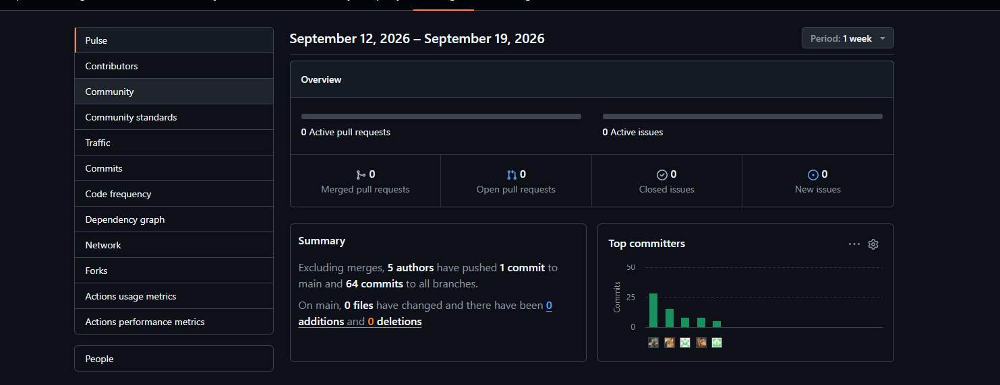
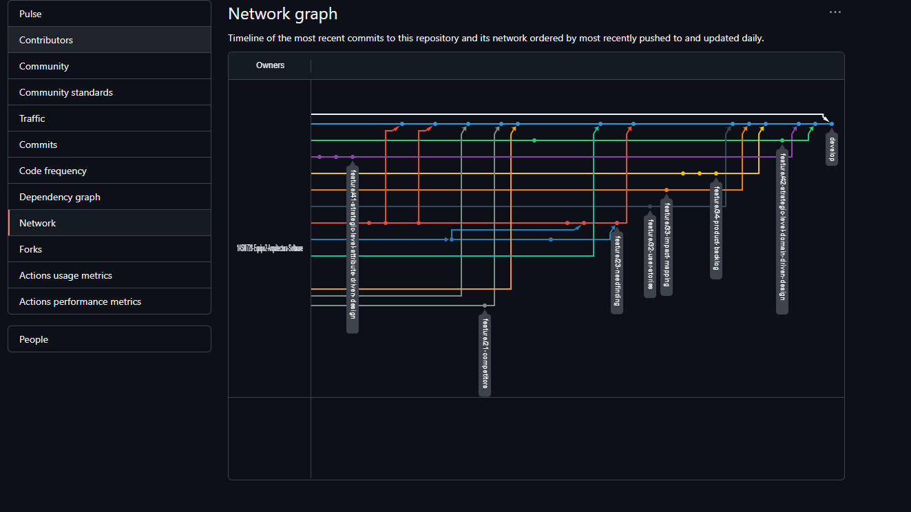

# Project Report Collaboration Insights

**Enlace del Repositorio:** [Repositorio de Informes - Equipo 2](https://github.com/1ASI0728-Equipo2-Arquitectura-Software/smartpalm-report)

En esta sección el equipo describe cómo se desarrollaron las actividades de elaboración del informe y presenta las capturas en imagen de los analíticos de colaboración y commits realizados en GitHub por los miembros del equipo.

## TB1

Para la elaboración del TB1, el equipo adoptó el flujo de trabajo **GitFlow** y la convención de **Conventional Commits**. El repositorio se organizó con una carpeta por capítulo y sección (`10-chapter-1-introduction`, `20-chapter-2-requirements-elicitation`, `30-chapter-3-requirements-specification` y `40-chapter-4-strategic-level-software-design`), de modo que cada integrante trabajara en una rama `feature/NN-nombre-seccion` creada a partir de `develop`. Cada aporte se integró mediante Pull Requests revisados por el equipo, lo que redujo los conflictos al mantener los archivos de cada sección separados.

La colaboración se organizó por secciones y quedó reflejada en los commits del repositorio:

- **Muñoz Vilcapoma, Mauricio Rigoberto** (`Mauricio Muñoz Vilcapoma`) creó el repositorio y la estructura base del informe, y desarrolló el Capítulo I (Startup Profile, Solution Profile y Segmentos objetivo) y parte del Capítulo III (User Stories y Product Backlog).
- **Rojas Reategui, Victor Manuel** (`VRojas1603`) desarrolló el Capítulo II (análisis competitivo, estrategias y tácticas, y las entrevistas) y el Impact Mapping del Capítulo III.
- **Conde Isla, Camila Alessandra** (`camilac07`) desarrolló el Ubiquitous Language, el registro de la entrevista a un ingeniero agrónomo y los mapas AS-IS y TO-BE.
- **Ramirez Cabrera, Kenyi Efrain** (`Kenyi15upc`) desarrolló el EventStorming y el Candidate Context Discovery del Capítulo IV.
- **Paucar Meneses, Jeremy Alión** (`asmip_10`) desarrolló la arquitectura de software del Capítulo IV (diagramas C4) y el front-matter del informe.

**Evidencias de Colaboración y Commits (GitHub):**

