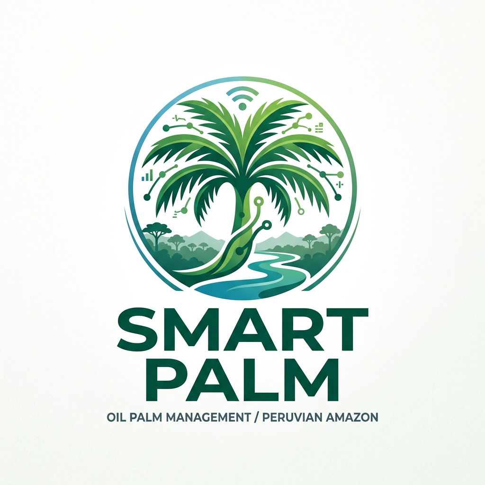
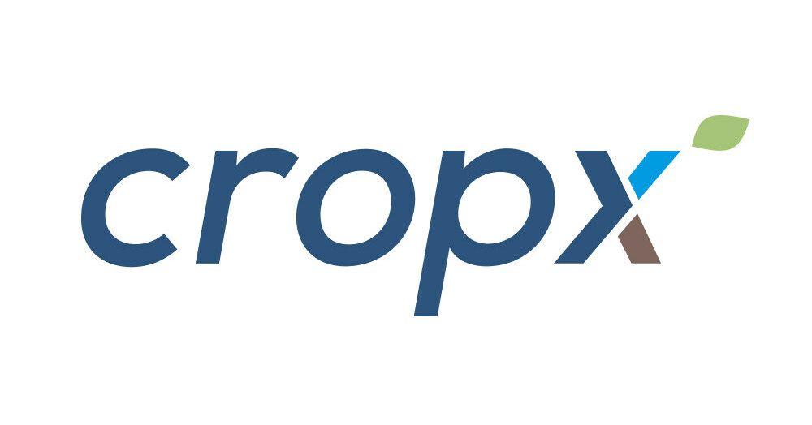
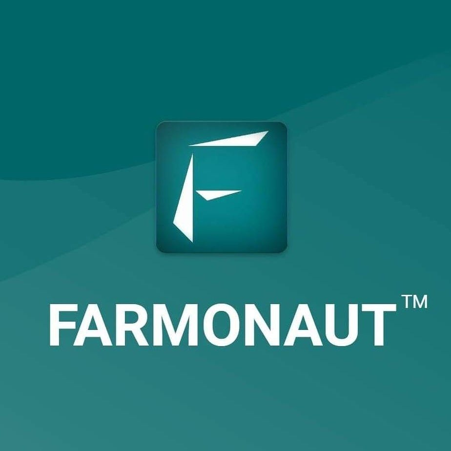

## 2.1 Competidores

### 2.1.1. Análisis competitivo

El objetivo de este análisis es identificar y evaluar las principales soluciones existentes en el mercado que compiten —de manera directa o indirecta— con Smart Palm, a fin de comprender el panorama competitivo, detectar las brechas que TempWise puede aprovechar y fundamentar las decisiones de posicionamiento de la startup. La pregunta central que guía este análisis es: ¿qué ofrecen las soluciones actuales de monitoreo agrícola y gestión de cultivos, y qué aspectos críticos del pequeño y mediano palmicultor amazónico peruano ninguna de ellas resuelve de manera contextualizada?

**¿Por qué llevar a cabo este análisis?** El objetivo de este análisis es investigar a detalle las características principales y las propuestas de valor que ofrecen otras empresas que tienen el objetivo de brindar una solución a nuestra misma problemática. Así, podremos encontrar una forma viable y consistente con la que podremos diferenciarnos de ellos.

**Competitive Analysis Landscape**

| Categoría | Aspecto | TempWise — Smart Palm | Trimble Agriculture | CropX | Farmonaut |
| :--- | :--- | :--- | :--- | :--- | :--- |
| — | Nombre de la StartUp |  |  |  |  |
| Perfil | Overview | Startup peruana de AgTech fundada en 2026. Plataforma SaaS de monitoreo IoT especializada en palma aceitera para la Amazonia peruana. Integra dispositivo IoT de campo, app móvil y plataforma web, con motor de IA calibrado para condiciones amazónicas locales. | Empresa estadounidense líder global en tecnología de agricultura de precisión. Ofrece soluciones de guidance, mapeo, control de aplicación de insumos y gestión de datos para grandes operaciones mecanizadas. | Startup de origen israelí con operaciones globales. Ofrece sensores de suelo inalámbricos y plataforma cloud de análisis agronómico con datos de humedad, temperatura y análisis satelital. | Startup de origen indio con presencia en más de 100 países. Monitoreo satelital de cultivos, análisis NDVI y gestión agronómica vía suscripción por hectáreas, sin hardware IoT en campo. |
| Perfil | Ventaja competitiva — ¿Qué valor ofrece a los clientes? | Especialización exclusiva en palma aceitera amazónica con parámetros calibrados para condiciones edafoclimáticas locales, cobertura offline vía edge computing y LoRaWAN, y modelo de precios accesible para el pequeño productor. | Portafolio tecnológico robusto con respaldo de marca global. Integración con maquinaria agrícola de alta gama. | Sensores de suelo de alta precisión con IA para recomendaciones de riego. Instalación simple y resultados probados en múltiples cultivos. | Bajo costo de entrada al no requerir hardware. Acceso desde dispositivo móvil con cobertura satelital global. |
| Perfil de Marketing | Mercado objetivo | Pequeños y medianos palmicultores amazónicos (5–100 ha) e ingenieros agrónomos con operaciones en Ucayali, San Martín y Loreto, Perú. | Grandes operaciones agrícolas mecanizadas en América del Norte, Europa y Oceanía. | Medianos y grandes productores de cultivos de alto valor (viticultura, horticultura, fruticultura) en mercados con infraestructura tecnológica desarrollada. | Agricultores de pequeña y mediana escala en mercados emergentes de Asia, África y América Latina sin acceso a hardware costoso. |
| Perfil de Marketing | Estrategias de marketing | Alianzas con cooperativas palmicultoras (COCEPU, ASPASH), instituciones como el INIA y MIDAGRI, y programas del PNUD. Marketing directo en ferias agrícolas regionales y canales digitales orientados al agrónomo. | Marketing B2B en ferias agrícolas internacionales. Red global de distribuidores y revendedores. | Marketing digital y alianzas con distribuidores de insumos agrícolas. Modelo freemium con conversión a suscripción. | Marketing digital SEO/SEM intensivo. Modelo freemium con tier gratuito. Comunidad activa en redes sociales. |
| Perfil del Producto | Productos y servicios | Dispositivo IoT de campo (sensores de humedad, temperatura, pH, conductividad, módulo de imagen), app móvil para el dueño del cultivo, plataforma web para el ingeniero agrónomo, motor de IA con recomendaciones para palma aceitera amazónica. | Sistemas de guiado GPS, controladores de aplicación variable de insumos, plataformas de gestión de datos agrícolas, sensores y drones. | Sensores inalámbricos de suelo, plataforma cloud de análisis de humedad, recomendaciones de riego basadas en IA, integración con sistemas de riego automatizado. | Aplicación web y móvil de monitoreo satelital, análisis NDVI, predicción de rendimiento, gestión de actividades agrícolas, sin hardware físico. |
| Perfil del Producto | Precios y costos | Modelo SaaS por suscripción escalonada: Plan Semilla (hasta 10 ha), Plan Cosecha (10–50 ha), Plan Palma Pro (50+ ha). Sin tier gratuito. Período de prueba de 30 días. Hardware incluido o en arrendamiento según plan. | Alto costo de adquisición de hardware. Licencias anuales desde varios miles de dólares. Orientado a operaciones con alto capital. | Costo del kit de sensores más suscripción mensual. Desde aprox. USD 500 por kit de instalación. | Modelo freemium con tier gratuito. Suscripciones de pago por hectáreas desde aprox. USD 30/mes para 100 ha. |
| Perfil del Producto | Canales de distribución (Web y/o Móvil) | App Store / Google Play, plataforma web, venta directa a cooperativas y productores en la región amazónica peruana. | Distribuidores autorizados globales, tiendas especializadas en agricultura de precisión, integración con fabricantes de maquinaria. | Distribuidores de insumos agrícolas, alianzas con fabricantes de sistemas de riego, venta directa online. | Acceso web y app móvil. Sin distribuidores físicos. API disponible para integradores. |
| Análisis SWOT | Fortalezas | Especialización contextualizada en palma aceitera amazónica. Operación offline con edge computing. Integración del dueño y el agrónomo en un mismo sistema. Modelo de precios escalable. | Marca global de alta confianza. Portafolio completo e integrado. Soporte técnico internacional. | Sensores de alta precisión validados. IA eficiente para riego. Facilidad de instalación. | Sin hardware, costo de entrada muy bajo. Cobertura satelital global. Interfaz simple y accesible. |
| Análisis SWOT | Debilidades | Startup en etapa inicial, sin base instalada de usuarios ni historial de credibilidad en el mercado. Dependencia del desarrollo del prototipo IoT. | Costo inaccesible para pequeños productores. No diseñado para conectividad limitada de la Amazonia. Complejidad de uso. | Sin especialización en palma aceitera. Dependencia de conectividad para transmisión de datos. Precio elevado para mercados emergentes. | Sin sensores IoT en campo: datos solo satelitales, limitando la precisión a nivel de planta. No opera offline. |
| Análisis SWOT | Oportunidades | Política pública favorable (MIDAGRI 2026). Crecimiento del sector palmicultor amazónico. Alianzas con INIA, PNUD y cooperativas regionales. | Expansión hacia operaciones agroindustriales de gran escala en mercados emergentes. | Ingreso a mercados de América Latina con foco en cultivos de alto valor. | Alianzas con programas de desarrollo agrícola en mercados emergentes de América Latina. |
| Análisis SWOT | Amenazas | Posible entrada de competidores genéricos con mayor capital. Resistencia al cambio tecnológico del productor tradicional. Riesgo de conectividad en zonas remotas. | Soluciones emergentes de bajo costo que desplazan su propuesta en mercados en desarrollo. | Nuevos entrantes con sensores más económicos y plataformas más simples. | Plataformas que integren datos satelitales e IoT en campo a bajo costo, cubriendo su principal debilidad. |
