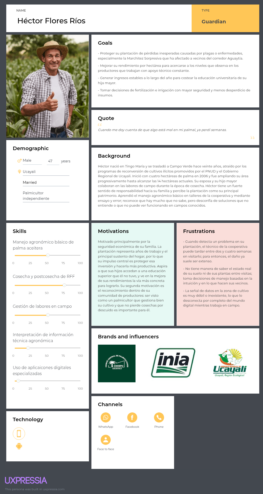
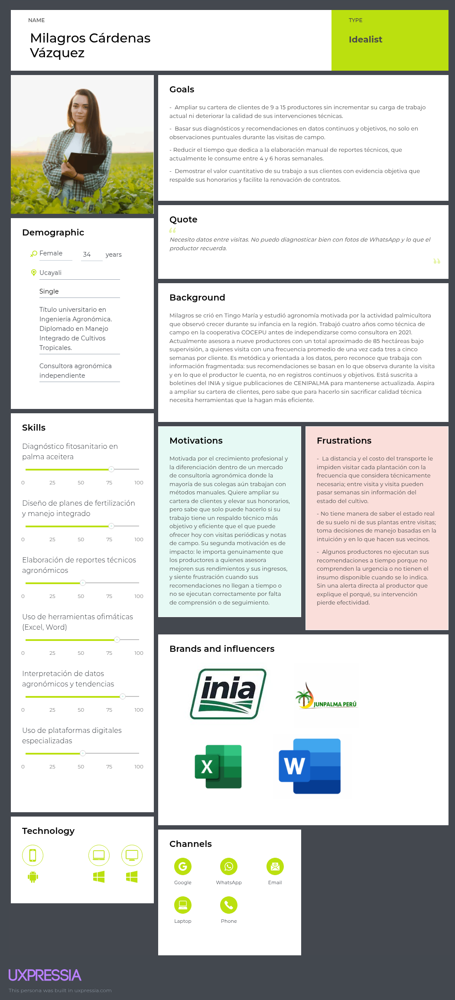

### 2.3.1. User Personas

Los User Personas se elaboran en UXPressia y sus capturas se incluyen en esta sección. Se elabora una ficha por cada segmento objetivo, derivada del análisis de las entrevistas realizadas y de la información recolectada en las secciones anteriores.

#### User Persona — Segmento 1: Dueño del Cultivo de Palma Aceitera

#### User Persona — Segmento 2: Ingeniero Agrónomo

