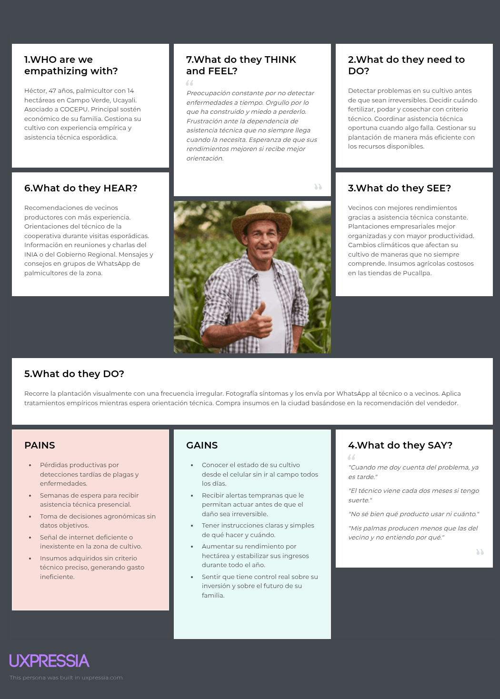
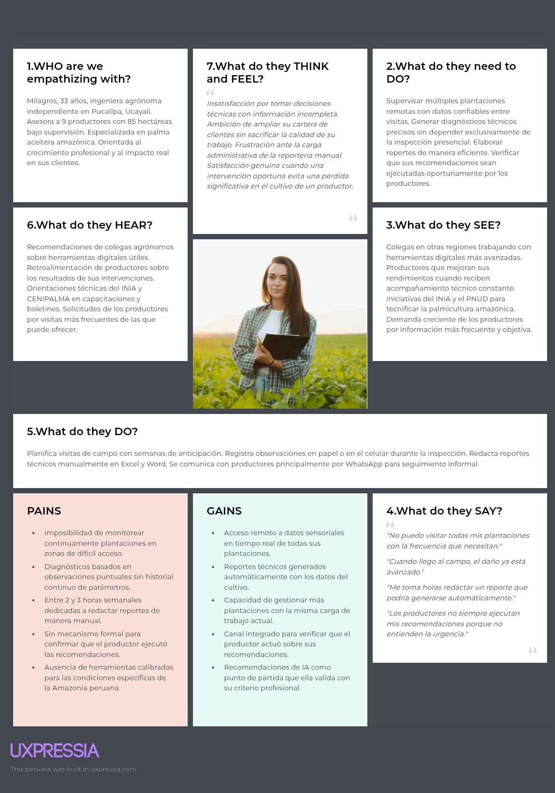

### 2.3.3. Empathy Mapping

En esta sección el equipo resume el proceso de elaboración y presenta las capturas de los Empathy Maps realizados en UXPressia, para cada uno de los User Personas identificados.

**Segmento Objetivo 1: Dueño del Cultivo de Palma Aceitera**

**Segmento Objetivo 2: Ingeniero Agrónomo**

