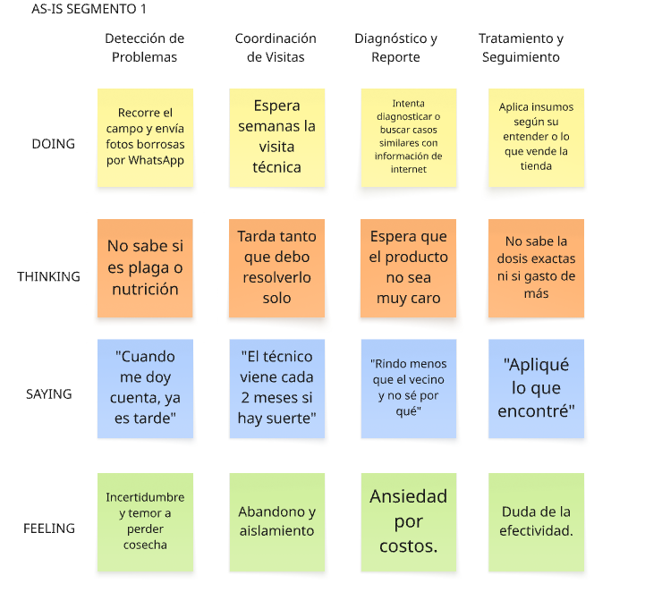
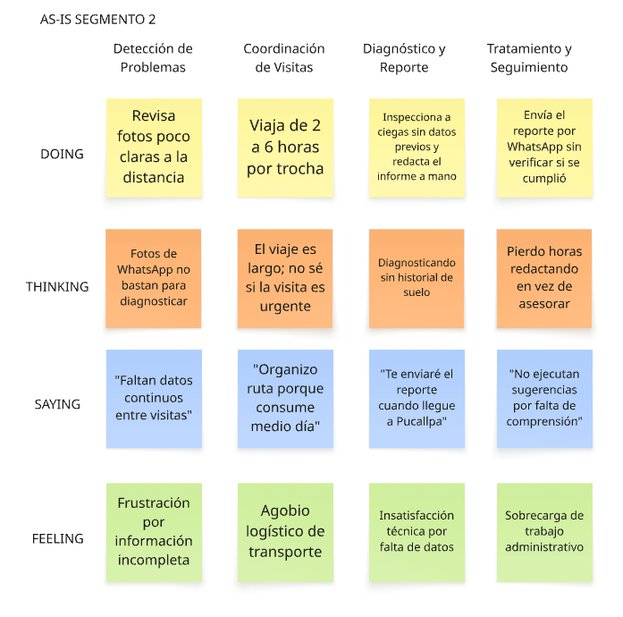

### 2.3.4. As-Is Scenario Mapping

El As-Is Scenario Mapping se elaboró para cada User Persona con el fin de representar el recorrido actual de cada segmento sin la solución de SmartPalm. El proceso siguió las etapas de preparación, lluvia de ideas individual de los integrantes del equipo, revisión conjunta, identificación y nombramiento de las fases del recorrido como columnas, y etiquetado de las áreas positivas, negativas y por explorar (blank areas) de cada etapa. Cada mapa organiza las fases del recorrido en columnas y las filas Doing, Thinking, Saying y Feeling.

#### As-Is Scenario Map — User Persona 1: Dueño del Cultivo

El siguiente mapa ilustra el recorrido actual del dueño del cultivo, desde la detección de problemas en su plantación hasta el tratamiento y seguimiento, evidenciando la incertidumbre y el aislamiento que enfrenta ante la falta de información oportuna.

#### As-Is Scenario Map — User Persona 2: Ingeniero Agrónomo

El siguiente mapa representa el ciclo actual de supervisión del ingeniero agrónomo, desde la detección de problemas hasta el envío del reporte, evidenciando las limitaciones logísticas y la falta de datos continuos entre visitas.

