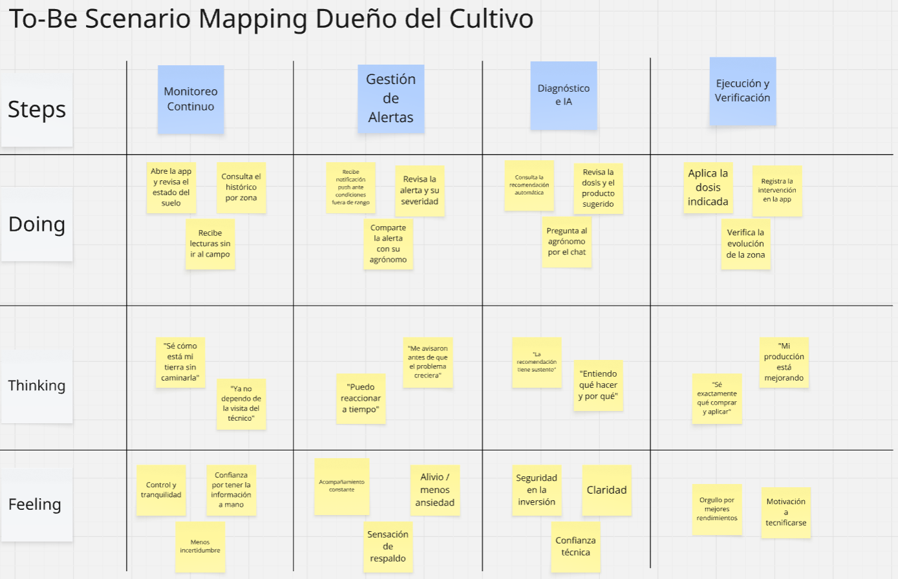
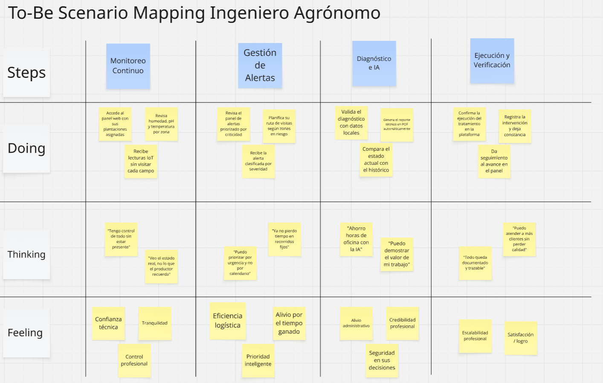

## 3.1. To-Be Scenario Mapping

El To-Be Scenario Mapping se elaboró en Miro para cada User Persona, con el fin de representar el recorrido futuro de cada segmento con SmartPalm en funcionamiento. El proceso siguió las etapas de preparación, lluvia de ideas individual, revisión conjunta, identificación y nombramiento de las fases del recorrido como columnas, y comparación con el As-Is Scenario Mapping para identificar los cambios que habilita la solución. Cada mapa organiza las fases del recorrido en columnas y las filas Doing, Thinking y Feeling.

#### To-Be Scenario Map — User Persona 1: Dueño del Cultivo

El siguiente mapa ilustra el recorrido futuro del dueño del cultivo con SmartPalm: pasa de una gestión reactiva a un monitoreo continuo, con alertas oportunas, recomendaciones sustentadas en datos y verificación de resultados, ganando control y tranquilidad sobre su inversión.

#### To-Be Scenario Map — User Persona 2: Ingeniero Agrónomo

El siguiente mapa representa el recorrido futuro del ingeniero agrónomo con SmartPalm: supervisa sus plantaciones en tiempo real, prioriza sus visitas por criticidad, automatiza la generación de reportes técnicos y logra ampliar su cartera de clientes sin perder calidad técnica.

