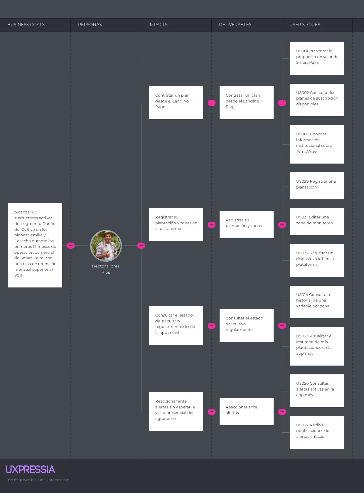
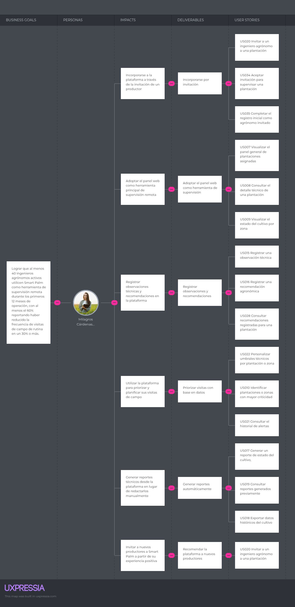

## 3.3. Impact Mapping

En esta sección se presenta el Impact Mapping, una técnica que permite visualizar y comprender las relaciones entre los objetivos de negocio, los actores involucrados, los impactos esperados, los entregables y las User Stories que los habilitan. Los mapas se elaboraron en UXPressia, con una ficha por cada segmento objetivo.

#### Segmento Objetivo 1: Dueño del Cultivo

**Business Goal:** Alcanzar 80 suscriptores activos del segmento Dueño del Cultivo en los planes Semilla y Cosecha durante los primeros 12 meses de operación comercial de SmartPalm, con una tasa de retención mensual superior al 80%.

#### Segmento Objetivo 2: Ingeniero Agrónomo

**Business Goal:** Lograr que al menos 40 ingenieros agrónomos activos utilicen SmartPalm como herramienta de supervisión remota durante los primeros 12 meses de operación, con al menos el 60% reportando haber reducido la frecuencia de visitas de rutina de campo en un 30% o más.

