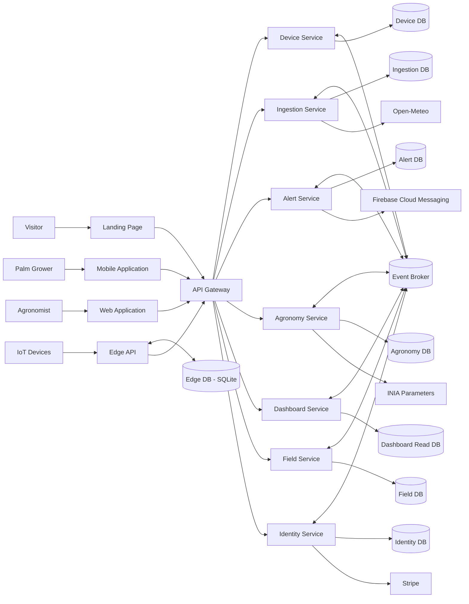

### 4.1.4. Architectural Design Decisions

El equipo ejecutó el QAW en las etapas de presentación del negocio, presentación técnica, identificación y consolidación de escenarios, votación, refinamiento y evaluación de alternativas. Los escenarios **QAS-01**, **QAS-02**, **QAS-03**, **QAS-04** y **QAS-06** recibieron la prioridad más alta porque una falla en ellos compromete directamente la detección temprana, la confianza en los datos o el aislamiento de clientes.

ADD se aplicó de forma iterativa. En cada iteración se tomó un subconjunto de drivers, se propusieron tácticas y patrones, se evaluaron sus trade-offs y se registró una decisión. La arquitectura resultante no replica el monolito modular del proyecto original: distribuye las responsabilidades según los siete bounded contexts definidos en el reporte nuevo.

#### Iteración 1: continuidad del monitoreo en campo

**Drivers:** CON-03, QAS-01, QAS-02, QAS-03, FD-03 y FD-04.

Se evaluó dónde capturar, validar y evaluar las lecturas. Una solución exclusivamente cloud simplificaba el despliegue, pero no respondía a la conectividad intermitente. El almacenamiento solo en el dispositivo reducía infraestructura, aunque limitaba capacidad, administración y actualización de umbrales. La alternativa edge-cloud permite una respuesta local inmediata y una sincronización controlada.

| Driver ID | Título de Driver | Cloud centralizado | Buffer solo en dispositivo | Edge-cloud con Store-and-Forward |
|---|---|---|---|---|
| QAS-01, QAS-03 | Continuidad e integridad offline | **Pro:** una sola fuente de procesamiento. **Con:** deja de operar sin Internet. | **Pro:** captura independiente de la nube. **Con:** almacenamiento y control limitados por dispositivo. | **Pro:** SQLite centraliza temporalmente la zona, soporta 72 h e idempotencia. **Con:** agrega despliegue y observabilidad en campo. |
| QAS-02, FD-04 | Evaluación oportuna de umbrales | **Pro:** reglas siempre centralizadas. **Con:** la latencia y disponibilidad dependen de Internet. | **Pro:** respuesta inmediata. **Con:** actualizar reglas en todo el firmware es costoso. | **Pro:** evaluación <= 2 s y umbrales sincronizables en Edge API. **Con:** requiere versionar y reconciliar configuración. |

**Decisión AD-01:** adoptar **Edge Computing + Store-and-Forward**. El Sensor Firmware conserva un buffer corto; el Edge API autentica, normaliza y evalúa lecturas; Edge DB usa SQLite para mantener hasta 72 horas; y un sincronizador transfiere lotes idempotentes al Ingestion Service. Los umbrales se versionan en nube y el edge conserva la última versión válida si no puede actualizarlos.

#### Iteración 2: descomposición y comunicación entre dominios

**Drivers:** CON-01, CON-02, CON-04, QAS-06, QAS-07, FD-02 y FD-06.

Se comparó conservar el monolito modular, usar microservicios con llamadas REST encadenadas o combinar microservicios con eventos. El monolito ofrecía menor complejidad inicial, pero contradice el modelo solicitado y no permite escalar la ingesta de forma independiente. Las cadenas REST distribuidas crean acoplamiento temporal en la ruta crítica. La publicación de eventos separa productores y consumidores y absorbe picos.

| Driver ID | Título de Driver | Monolito modular | Microservicios síncronos | Microservicios orientados a eventos |
|---|---|---|---|---|
| CON-01, QAS-07 | Evolución por bounded context | **Pro:** desarrollo y transacciones simples. **Con:** despliegue y escalado conjuntos; no satisface el constraint. | **Pro:** despliegue independiente y contratos explícitos. **Con:** acoplamiento temporal entre servicios. | **Pro:** despliegue independiente y bajo acoplamiento entre dominios. **Con:** consistencia eventual y mayor exigencia operativa. |
| QAS-02, QAS-06 | Ruta crítica y picos de telemetría | **Pro:** llamadas internas rápidas. **Con:** escala toda la aplicación. | **Pro:** interacción directa y comprensible. **Con:** una caída intermedia bloquea toda la cadena. | **Pro:** cola, backpressure y escalado focalizado. **Con:** exige idempotencia, reintentos y DLQ. |

**Decisión AD-02:** implementar **siete microservicios alineados con los bounded contexts**. El flujo de telemetría publica eventos versionados en RabbitMQ con entrega al menos una vez, consumidores idempotentes, reintentos acotados y dead-letter queue. Las operaciones de comando que requieren confirmación inmediata y las consultas usan REST mediante el API Gateway. No se habilitan transacciones distribuidas; los procesos que atraviesan contextos alcanzan consistencia eventual.

#### Iteración 3: propiedad y consistencia de datos

**Drivers:** CON-02, QAS-03, QAS-04, QAS-07 y FD-01.

Una base compartida facilitaría consultas y joins, pero volvería ficticios los límites de los microservicios. Un esquema por servicio dentro del mismo motor reduce costo académico manteniendo propiedad lógica. La persistencia políglota completa ofrece especialización, aunque agrega operación innecesaria para la primera versión.

| Driver ID | Título de Driver | Base de datos compartida | Database per Service en PostgreSQL | Persistencia políglota por servicio |
|---|---|---|---|---|
| CON-02, QAS-07 | Autonomía de servicios | **Pro:** consultas y transacciones directas. **Con:** fuerte acoplamiento y cambios coordinados. | **Pro:** propiedad clara, migraciones independientes y operación conocida. **Con:** consultas cruzadas requieren API o eventos. | **Pro:** tecnología óptima por carga. **Con:** mayor costo operativo y de conocimiento. |
| QAS-04 | Aislamiento de datos | **Pro:** administración central. **Con:** credenciales o consultas erróneas amplían el impacto. | **Pro:** credenciales y esquema por servicio reducen el radio de impacto. **Con:** requiere gobierno de datos distribuidos. | **Pro:** máximo aislamiento físico posible. **Con:** observabilidad y respaldo heterogéneos. |

**Decisión AD-03:** aplicar **Database per Service** con PostgreSQL administrado y una `DATABASE_URL` exclusiva por microservicio. El Edge API conserva SQLite porque debe funcionar desconectado. Cada servicio realiza sus migraciones y no comparte tablas. La identidad de una lectura y los identificadores de correlación viajan en los contratos para soportar idempotencia y trazabilidad.

#### Iteración 4: consultas consolidadas y rendimiento

**Drivers:** FD-01, QAS-05, QAS-06 y CON-02.

El dashboard necesita datos de sensores, alertas, recomendaciones e inspecciones. Consultar todos los servicios en cada solicitud mantiene datos inmediatos, pero aumenta latencia y disponibilidad compuesta. Compartir sus tablas viola la propiedad de datos. Una proyección de lectura alimentada por eventos acepta consistencia eventual a cambio de respuestas estables.

| Driver ID | Título de Driver | API Composition síncrona | Lectura directa de bases ajenas | Proyección CQRS materializada |
|---|---|---|---|---|
| FD-01, QAS-05 | Dashboard consolidado | **Pro:** datos recientes sin duplicación. **Con:** fan-out, latencia y fallos en cascada. | **Pro:** joins rápidos. **Con:** rompe Database per Service y contratos. | **Pro:** consulta local <= 3 s y servicios fuente desacoplados. **Con:** datos eventualmente consistentes y reconstrucción de proyección. |

**Decisión AD-04:** usar **CQRS en el lado de lectura**. Dashboard Service consume eventos de los servicios fuente y mantiene una proyección propia optimizada para Palm Grower y Agronomist. Cada vista muestra la marca de tiempo de última actualización. La proyección puede reconstruirse reproduciendo eventos o ejecutando una resincronización controlada desde APIs internas.

#### Iteración 5: acceso, seguridad e integraciones externas

**Drivers:** QAS-04, QAS-08, CON-06, CON-07, CON-09 y FD-07.

Se evaluó exponer cada servicio, centralizar toda la lógica en un gateway o combinar gateway liviano con políticas de autorización en profundidad. También se revisó si las integraciones externas debían compartirse como utilidades o quedar en el contexto propietario.

| Driver ID | Título de Driver | Servicios expuestos directamente | Gateway con toda la lógica | Gateway + autorización en profundidad |
|---|---|---|---|---|
| QAS-04, CON-06 | Control de acceso | **Pro:** menos infraestructura. **Con:** superficie pública amplia y políticas repetidas. | **Pro:** política centralizada. **Con:** cuello de botella y lógica de dominio fuera de su contexto. | **Pro:** punto de entrada único y validación contextual en cada servicio. **Con:** políticas coordinadas en dos niveles. |
| QAS-08, CON-07 | Aislamiento de terceros | **Pro:** integración libre desde cualquier servicio. **Con:** dependencias duplicadas y fallos propagados. | **Pro:** un único punto técnico. **Con:** gateway acoplado a proveedores de negocio. | **Pro:** adaptador/ACL en el servicio propietario, con circuit breaker local. **Con:** requiere contratos internos explícitos. |

**Decisión AD-05:** usar **API Gateway** con YARP para validación inicial de JWT, rate limiting y enrutamiento, y mantener la autorización de rol, tenant y recurso dentro de cada servicio. Identity Service emite identidades y gestiona Stripe; Alert Service es dueño de FCM; Agronomy Service encapsula los parámetros del INIA mediante ACL; e Ingestion Service encapsula Open-Meteo. Cada adaptador usa timeout, reintentos limitados y circuit breaker.

#### Resumen de decisiones

| Decisión | Patrones y tácticas adoptadas | Drivers satisfechos | Trade-off aceptado |
|---|---|---|---|
| AD-01 | Edge Computing, Store-and-Forward, caché de última configuración válida | QAS-01, QAS-02, QAS-03, CON-03 | Operación y actualización de componentes en campo |
| AD-02 | Microservices, Event-Driven Architecture, Retry, DLQ, consumidores idempotentes | CON-01, CON-04, QAS-02, QAS-06, QAS-07 | Consistencia eventual y observabilidad distribuida |
| AD-03 | Database per Service, identificadores de correlación | CON-02, QAS-03, QAS-04, QAS-07 | Sin joins ni transacciones directas entre contextos |
| AD-04 | CQRS, materialized view | FD-01, QAS-05, QAS-06 | Duplicación controlada y datos eventualmente consistentes |
| AD-05 | API Gateway, Defense in Depth, ACL, Circuit Breaker | QAS-04, QAS-08, CON-06, CON-07, CON-09 | Mayor gobierno de contratos y políticas |

#### Initial High-Level Solution Architecture View

La siguiente vista resume la solución obtenida en las iteraciones de ADD. Su propósito es mostrar responsabilidades y estilos de comunicación, no reemplazar los diagramas C4 detallados de la sección 4.3.

La vista hace explícitos cuatro principios: todo acceso de las aplicaciones pasa por el API Gateway; el edge mantiene autonomía y almacenamiento local; cada microservicio posee sus datos; y el Event Broker desacopla la ruta crítica y alimenta la proyección del dashboard. Las relaciones detalladas, tecnologías y nodos de despliegue se desarrollan posteriormente en los diagramas System Landscape, Context, Container y Deployment.

#### Reglas transversales derivadas

- Todos los comandos, lecturas y eventos incluyen `correlationId`; la telemetría incluye además un `readingId` globalmente único.
- Los eventos son inmutables y versionados. Los cambios compatibles agregan campos opcionales; un cambio incompatible crea una nueva versión.
- Cada consumidor registra los mensajes procesados antes de producir efectos no idempotentes.
- Los servicios publican health checks y métricas de latencia, errores, profundidad de cola, reintentos y mensajes enviados a DLQ.
- Ninguna credencial de proveedor externo se distribuye fuera del microservicio propietario.
- El estado eventual se comunica en la interfaz mediante hora de actualización y estados pendientes cuando corresponda.
