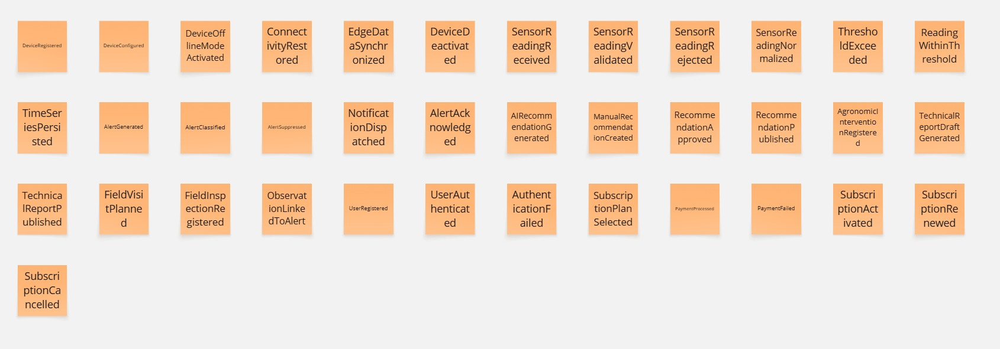
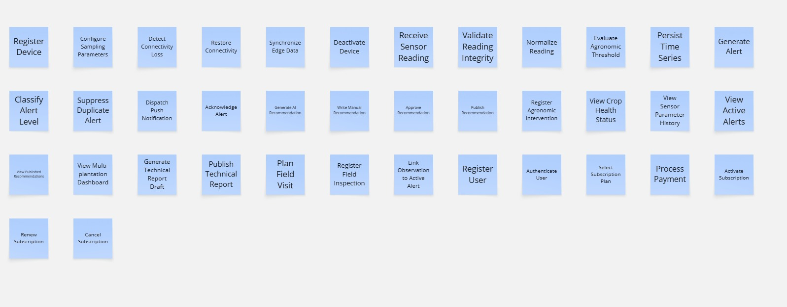
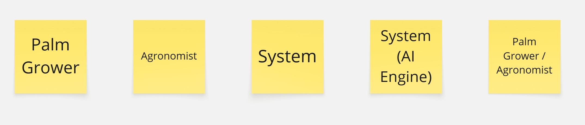

## 4.2 Strategic-Level Domain-Driven Design

El diseño estratégico de Smart Palm aplica Domain-Driven Design como marco de referencia para descomponer el dominio del negocio en contextos delimitados cohesivos, establecer sus relaciones estructurales y definir la arquitectura de software que los soporta. El proceso parte del modelado realizado mediante Big Picture EventStorming en el Capítulo II y avanza hacia una descomposición de nivel de diseño que sustenta las decisiones de arquitectura del backend, el frontend web y el dispositivo IoT que conforman la plataforma.

### 4.2.1 EventStorming

La sesión de Design-Level EventStorming se realizó sobre el dominio modelado previamente en el Big Picture EventStorming, profundizando en los flujos de comandos, políticas, agregados y vistas de lectura para cada subdominio identificado. La sesión tuvo una duración aproximada de noventa minutos y permitió refinar los siete bounded contexts candidatos, identificar las políticas de negocio críticas y establecer las dependencias entre contextos. Se utilizó Miro como herramienta de trabajo colaborativo.

El proceso se estructuró en tres fases. En la primera se identificaron y refinaron los Domain Events del sistema, formulados en tiempo pasado. En la segunda se asociaron los Commands que desencadenan cada evento, los Actors que los ejecutan y los External Systems que participan. En la tercera los eventos se agruparon en bounded contexts con límites derivados de los cambios de estado del proceso de negocio.

Los actores identificados en el tablero son tres: Palm Grower, que ejecuta acciones desde la plataforma web como usuario propietario del cultivo; Agronomist, que ejecuta acciones desde la plataforma web como usuario técnico supervisor; y System, que representa los procesos automáticos que ocurren sin intervención humana directa.

#### Eventos

#### Comandos

#### Actores principales

#### URL

El event storming se realizo en Miro mediante el siguiente url:
[Miro Board](https://miro.com/app/board/uXjVHdJ_3Wo=/?share_link_id=547546845690)
