#### 4.2.2 Candidate Context Discovery

La sesión de Candidate Context Discovery se realizó sobre el tablero de Design-Level EventStorming en Miro. El proceso consistió en recorrer la línea temporal de eventos de izquierda a derecha aplicando la técnica *look-for-pivotal-events*, identificando aquellos eventos que señalan un cambio de responsabilidad entre partes del dominio: lo que ocurre antes del evento pertenece a un contexto distinto de lo que ocurre después.

Complementariamente, se aplicó la técnica *start-with-value* para validar que los contextos identificados como Core Domain concentraban las capacidades de mayor valor para el negocio: el procesamiento del dato sensorial, la recomendación agronómica calibrada para palma aceitera amazónica y la gestión técnica de campo del Agronomist.

##### Eventos pivote identificados

**`DeviceRegistered`**
Marca el límite entre la gestión del ciclo de vida del dispositivo físico y el procesamiento de los datos que ese dispositivo produce. Todo lo relacionado con registrar y configurar el dispositivo pertenece a un contexto; todo lo relacionado con recibir y procesar sus lecturas pertenece a otro.

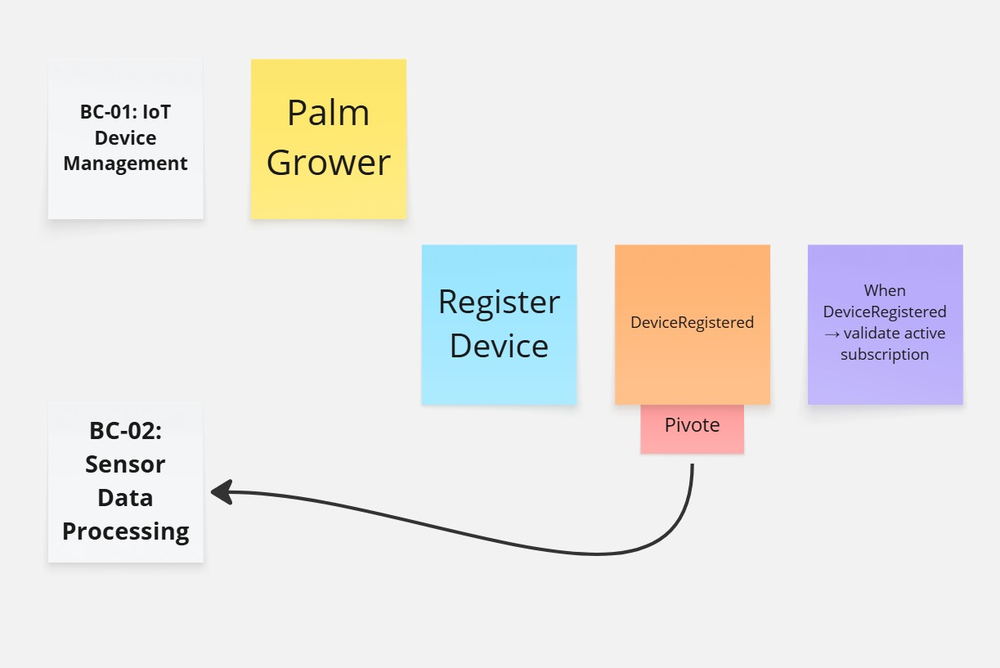

**`ThresholdExceeded`**
Marca el límite entre el procesamiento de datos sensoriales y la gestión de alertas. Es el evento de mayor impacto operativo porque desencadena la respuesta hacia los usuarios.

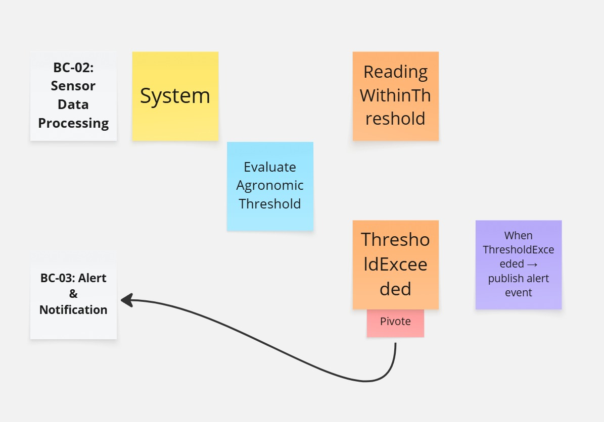

**`AlertAcknowledged`**
Marca el límite entre la gestión de alertas y la generación de recomendaciones agronómicas. Una alerta reconocida puede o no derivar en una recomendación — esa decisión pertenece a un contexto distinto con su propia lógica.

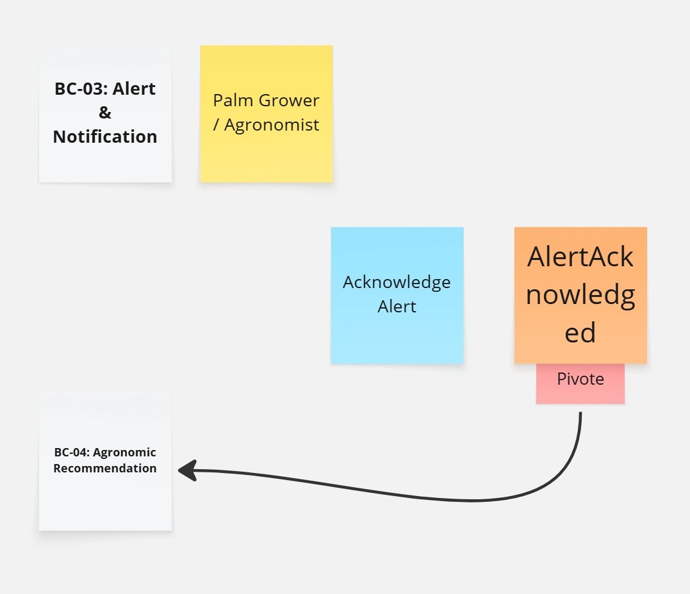

**`RecommendationPublished`**
Marca el límite entre la generación de recomendaciones y su consumo para visualización. Una vez publicada, la recomendación pasa a ser un dato de solo lectura para el frontend.

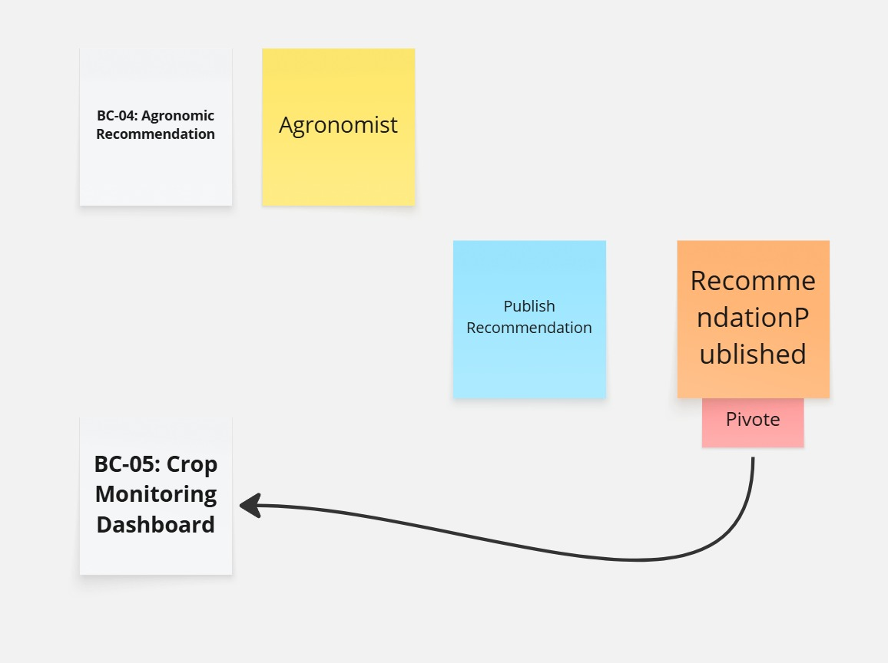

**`FieldInspectionRegistered`**
Marca el límite entre la gestión de la supervisión técnica del Agronomist y la generación de recomendaciones derivadas de esa inspección. La inspección pertenece al dominio del trabajo de campo; la recomendación que genera pertenece al dominio agronómico.

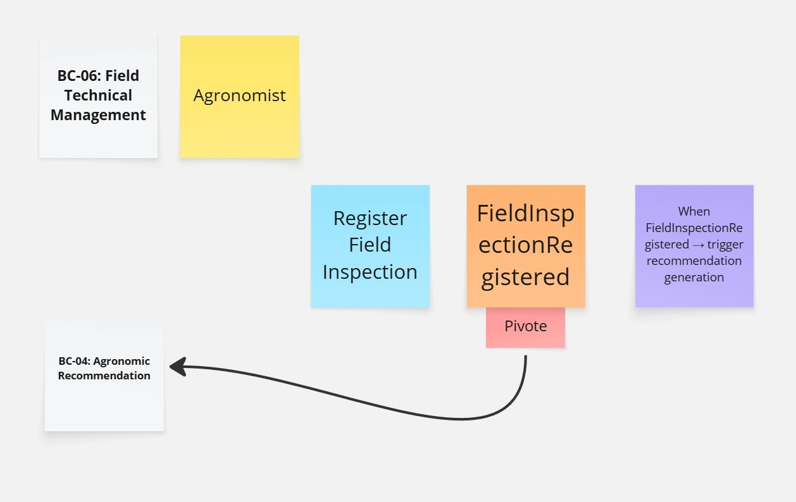

**`SubscriptionActivated`**
Marca el límite entre la gestión comercial del usuario y el inicio de la operación del sistema. La activación de la suscripción habilita directamente el registro del dispositivo IoT en BC-01, a partir del cual el resto del sistema entra en operación de forma natural.

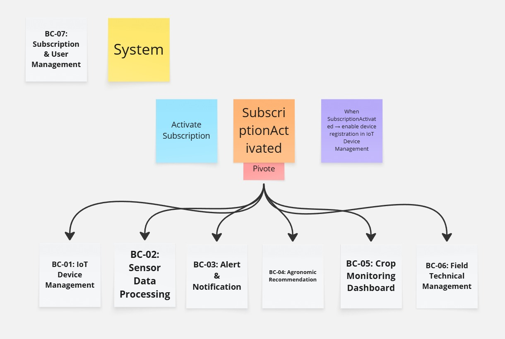

##### Bounded contexts resultantes

| ID    | Bounded Context                  | Clasificación      | Responsabilidad central |
|-------|----------------------------------|--------------------|-------------------------|
| BC-01 | IoT Device Management            | Core Domain        | Ciclo de vida del dispositivo IoT en campo y operación offline mediante edge computing. |
| BC-02 | Sensor Data Processing           | Core Domain        | Recepción, validación, normalización y evaluación agronómica de lecturas sensoriales. |
| BC-03 | Alert & Notification             | Supporting Domain  | Generación, clasificación y despacho de alertas por umbral agronómico superado. |
| BC-04 | Agronomic Recommendation         | Core Domain        | Generación, aprobación y publicación de recomendaciones agronómicas por IA y por el Agronomist. |
| BC-05 | Crop Monitoring Dashboard        | Supporting Domain  | Vistas de lectura consolidadas del estado del cultivo para Palm Grower y Agronomist en la plataforma web. |
| BC-06 | Field Technical Management       | Core Domain        | Ciclo de supervisión técnica del Agronomist: visitas, inspecciones e intervenciones agronómicas. |
| BC-07 | Subscription & User Management   | Generic Subdomain  | Autenticación, autorización, perfiles y gestión de planes de suscripción. |

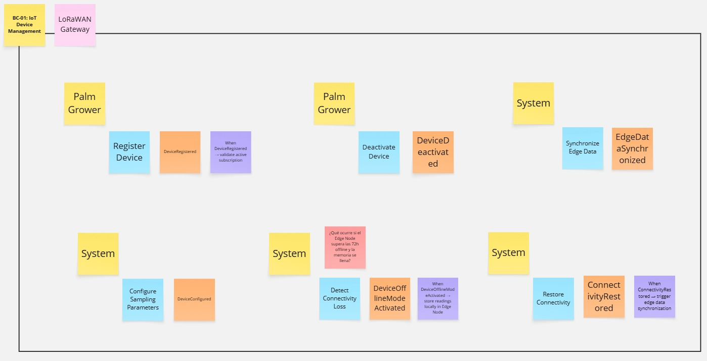
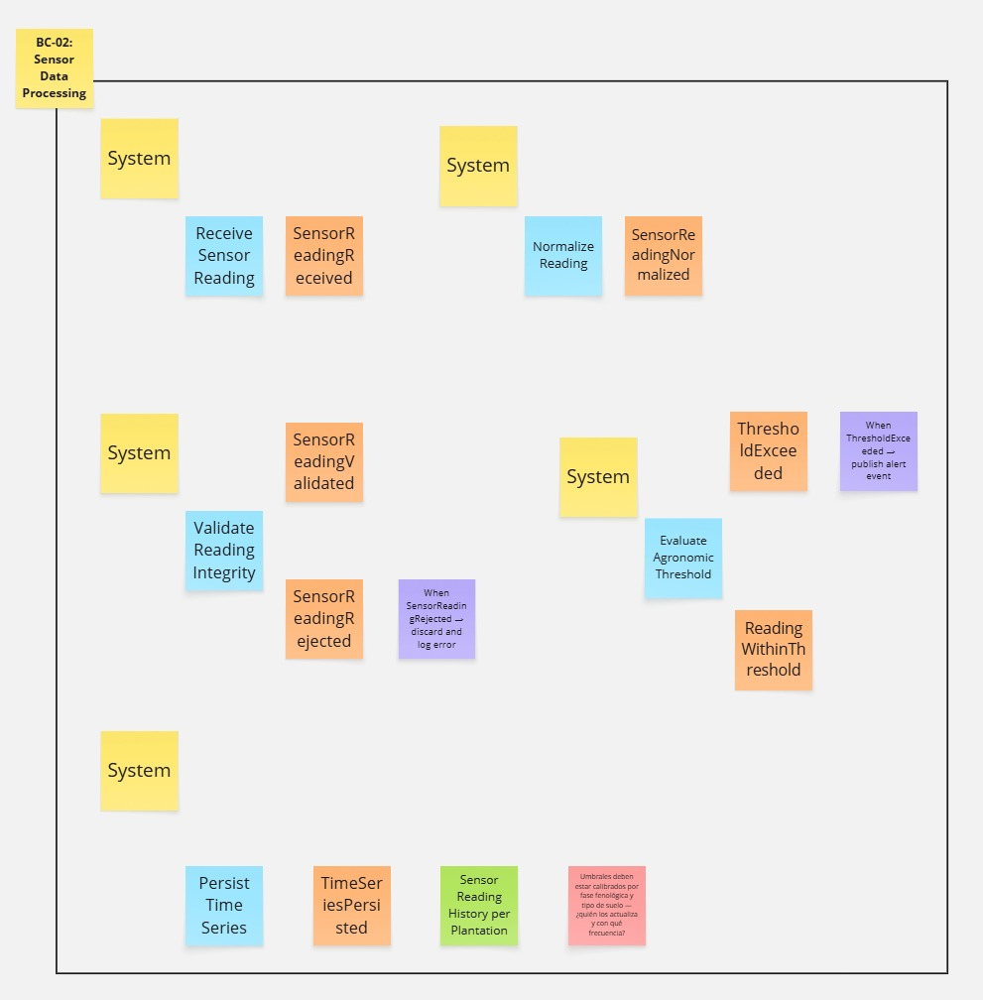
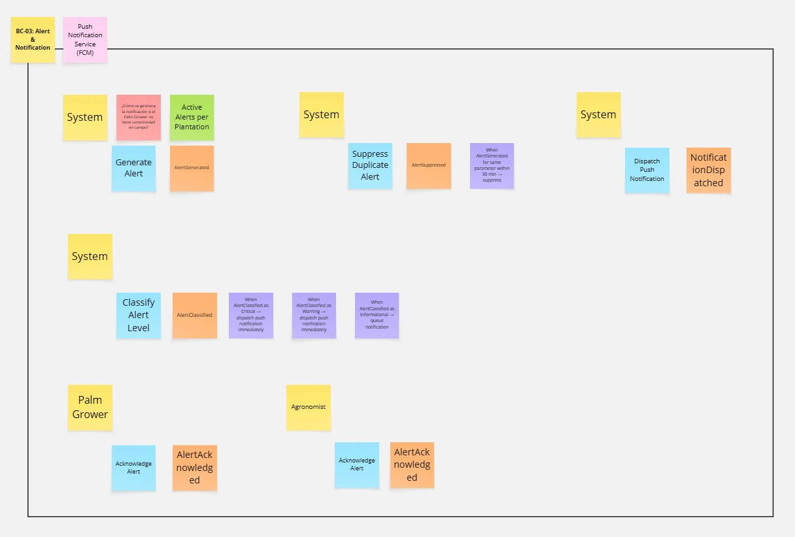
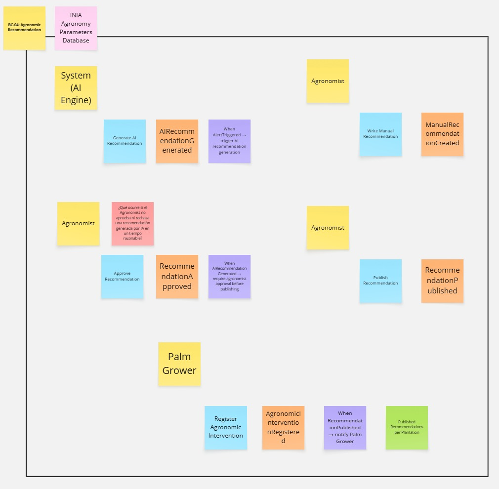
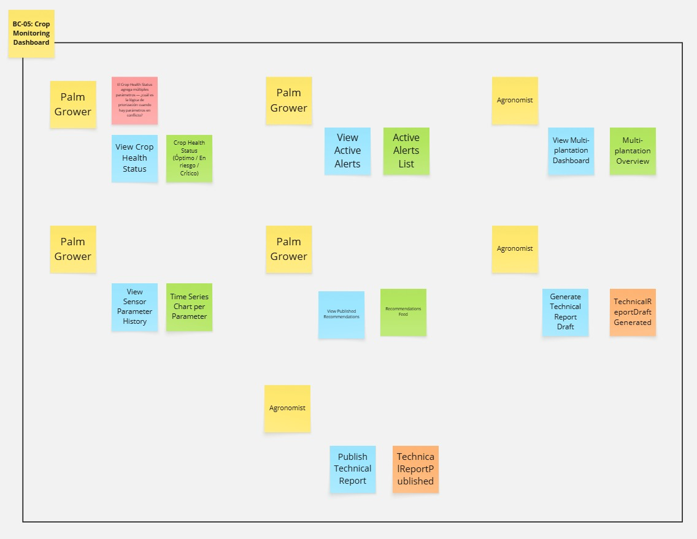
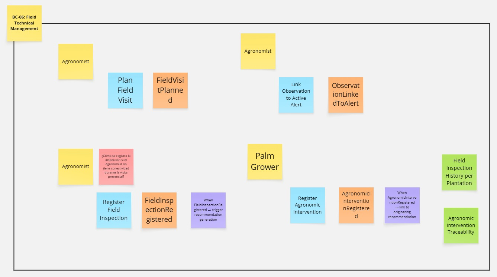
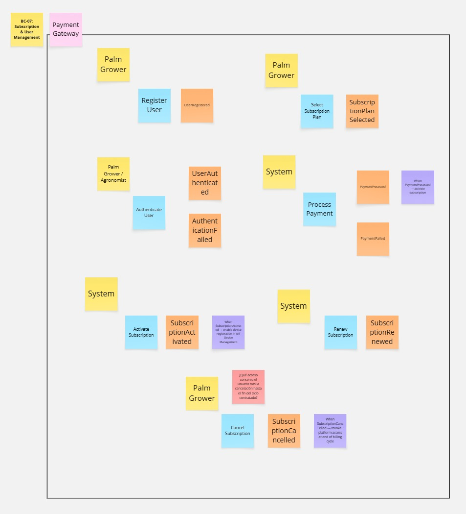