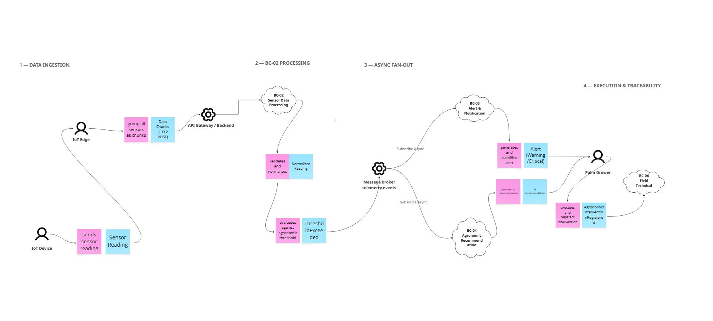
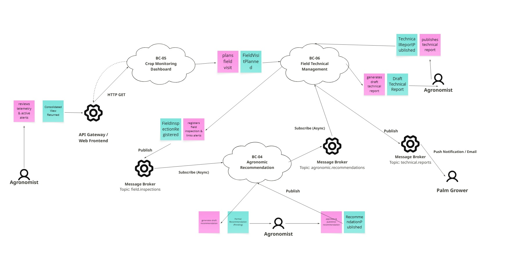
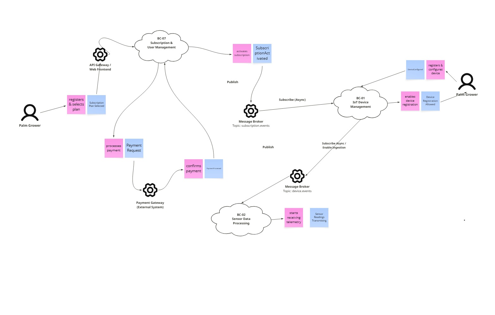

#### 4.2.3 Domain Message Flows Modeling.

El modelado de flujos de mensajes entre bounded contexts se realizó mediante la técnica de Domain Storytelling, con el objetivo de visualizar cómo los contextos colaboran para resolver los casos de uso más críticos del negocio de Smart Palm. Se modelaron tres flujos principales que cubren los escenarios de mayor valor para los dos segmentos de usuario.

##### Flujo 1 — Detección de condición de riesgo y generación de recomendación

El IoT Device registra la lectura sensorial (`Sensor Reading`) y la envía al nodo IoT Edge, el cual agrupa las lecturas en bloques de datos (`Data Chunks`). Estos paquetes son transmitidos vía HTTP POST a través del API Gateway / Backend hacia el microservicio BC-02 Sensor Data Processing.

En BC-02, la lectura es validada y normalizada (`Normalized Reading`). Acto seguido, BC-02 evalúa el dato contra los umbrales agronómicos calibrados para palma aceitera amazónica; al detectar una anomalía, emite de forma asíncrona el evento `ThresholdExceeded` hacia el Message Broker (Topic: `telemetry.events`).

El evento es consumido asincrónicamente (`Subscribe Async`) por dos microservicios en paralelo (`Fan-Out`):

BC-03 Alert & Notification: Genera y clasifica la alerta por severidad (`Alert Warning/Critical`), despachándola como notificación push al Palm Grower y como alerta en plataforma para el Agronomist.

BC-04 Agronomic Recommendation: Genera una recomendación automática basada en IA (`AI Recommendation Pending Approval`). El Agronomist revisa y aprueba esta recomendación para ponerla a disposición del Palm Grower.

Finalmente, el Palm Grower ejecuta la acción correctiva en campo y registra la intervención agronómica, emitiendo el evento `AgronomicInterventionRegistered` hacia BC-06 Field Technical Management, cerrando de forma integral el ciclo de trazabilidad.

---

#### Flujo 2 — Ciclo de supervisión del Agronomist y gestión técnica basada en eventos

El Agronomist accede a la plataforma a través del API Gateway / Web Frontend para consultar el microservicio BC-05 Crop Monitoring Dashboard, revisando de manera sincrónica (HTTP GET) la visión consolidada del historial de parámetros sensoriales y las alertas activas. Con estos insumos, el Agronomist planifica la visita técnica y posteriormente registra la inspección de campo en BC-06 Field Technical Management, vinculando sus observaciones directas a las alertas activas correspondientes.

Al completarse el registro, BC-06 publica de forma asíncrona el evento `FieldInspectionRegistered` en el Message Broker (Topic: `field.inspections`). El microservicio BC-04 Agronomic Recommendation, suscrito a este tópico, reacciona al evento generando automáticamente un borrador de recomendación agrícola. El Agronomist revisa, aprueba y publica dicha recomendación, lo que desencadena la emisión del evento `RecommendationPublished` hacia el Message Broker (Topic: `agronomic.recommendations`).

Finalmente, BC-06 Field Technical Management (suscrito asíncronamente al tópico de recomendaciones) reacciona consumiendo la recomendación aprobada para consolidar y generar automáticamente el borrador del reporte técnico final. Una vez que el Agronomist lo revisa y publica, BC-06 emite el evento `TechnicalReportPublished` hacia el Message Broker (Topic: `technical.reports`), notificando de manera automática al Palm Grower mediante canales de notificación (Push / Email).

---

##### Flujo 3 — Activación de suscripción e inicio de operación

Un Palm Grower accede a través del API Gateway / Web Frontend para registrarse y seleccionar un plan de suscripción en el microservicio BC-07 Subscription & User Management. BC-07 procesa la transacción correspondiente de forma sincrónica con el Payment Gateway (External System). Una vez confirmada la pasarela de pagos, BC-07 activa la suscripción y emite el evento asíncrono `SubscriptionActivated` al Message Broker (Topic: `subscription.events`).

El microservicio BC-01 IoT Device Management, suscrito a este tópico, reacciona consumiendo `SubscriptionActivated` y habilita el perfil para el registro de dispositivos IoT del usuario. El Palm Grower efectúa el aprovisionamiento de su hardware en BC-01, lo que desencadena la emisión del evento `DeviceConfigured` hacia el Message Broker (Topic: `device.events`). Con el dispositivo en estado activo, el nodo IoT inicia la transmisión continua de telemetría directamente hacia BC-02 Sensor Data Processing (o vía API Gateway/Edge), dejando operativo y en marcha el Flujo 1.

---