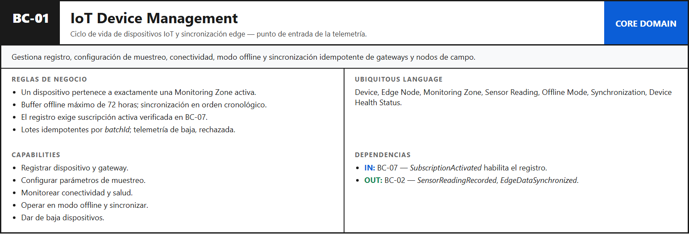
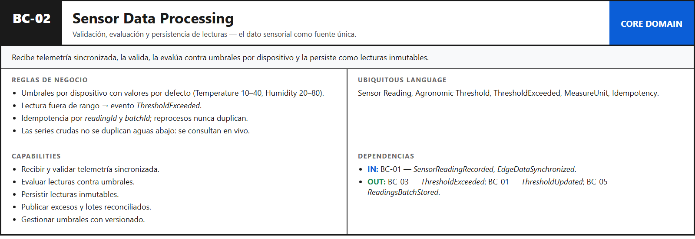
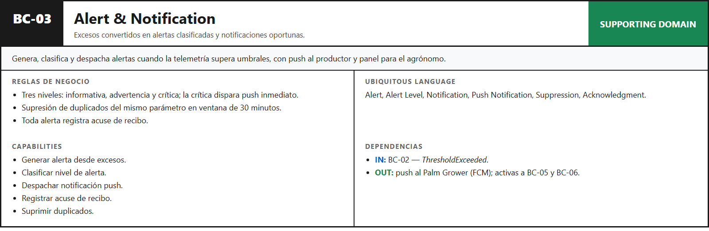
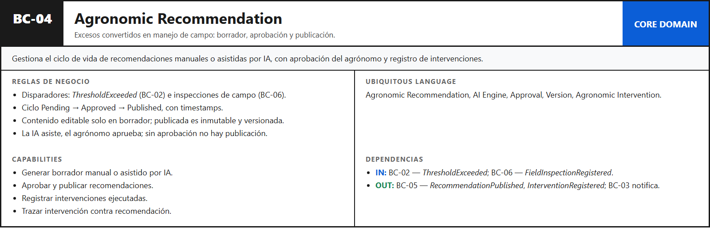
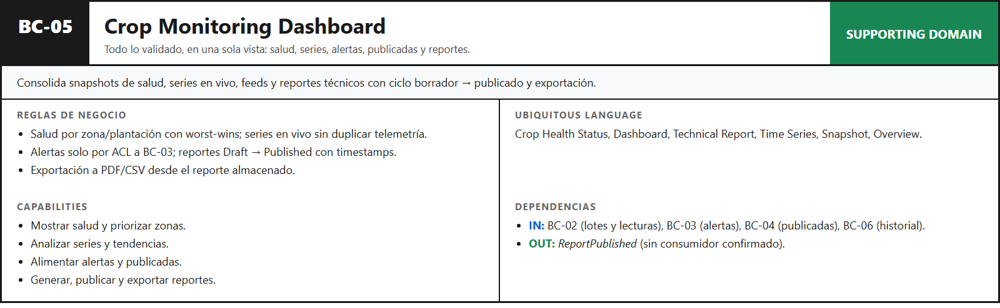
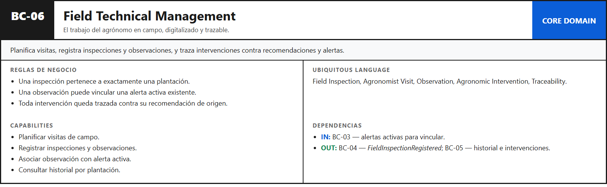
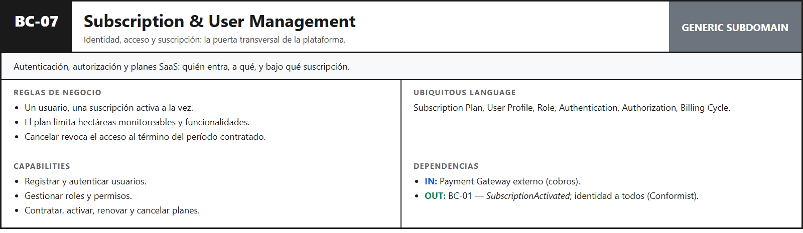

#### 4.1.1.3 Bounded Context Canvases.

A continuación se presentan los Bounded Context Canvases de los siete bounded contexts, elaborados con proceso iterativo por contexto en orden de importancia: definición del panorama, destilación de reglas de negocio y captura de Ubiquitous Language, análisis de capabilities, captura de dependencias y crítica de diseño. El vocabulario (eventos, roles, dependencias) es el canónico del Capítulo V.

##### BC-01: IoT Device Management

Core Domain y punto de entrada de la telemetría: el canvas fija una sola zona por dispositivo, buffer de 72 horas y registro condicionado a suscripción activa.

##### BC-02: Sensor Data Processing

Core Domain del dato: el canvas fija umbrales por dispositivo, evaluación por lectura e idempotencia total, sin duplicar series aguas abajo.

##### BC-03: Alert & Notification

Supporting Domain de respuesta oportuna: el canvas fija tres niveles, push en crítica y supresión de duplicados en ventana de 30 minutos.

##### BC-04: Agronomic Recommendation

Core Domain de valor agronómico: el canvas fija disparadores reales (`ThresholdExceeded` de BC-02 e inspecciones de BC-06), ciclo con aprobación y publicada inmutable.

##### BC-05: Crop Monitoring Dashboard

Supporting Domain de consumo: el canvas fija read-model con reportes versionados, series en vivo sin duplicación y alertas por ACL.

##### BC-06: Field Technical Management

Core Domain del trabajo del agrónomo en campo: el canvas fija inspección por plantación, vínculo observación-alerta y trazabilidad de intervenciones.

##### BC-07: Subscription & User Management

Generic Subdomain transversal: el canvas fija una suscripción activa por usuario, límites por plan e identidad para todos los contextos.

