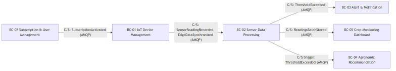
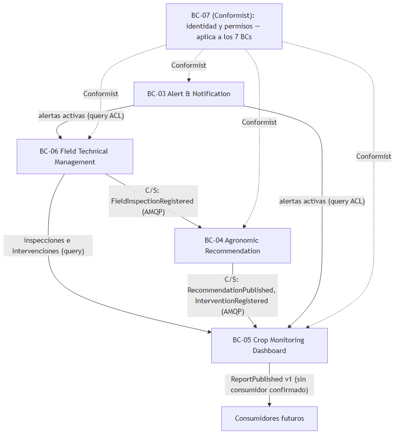

### 4.2.5. Context Mapping.

El Context Mapping define las relaciones estructurales entre los siete bounded contexts de Smart Palm. El proceso consistió en revisar las dependencias identificadas en los Bounded Context Canvases, discutir alternativas (¿qué pasaría si movemos este capability a otro bounded context? ¿si partimos un bounded context en dos? ¿si duplicamos una funcionalidad para romper una dependencia?) y determinar el patrón de relación más adecuado para cada par, considerando acoplamiento, dirección del flujo y transporte real (AMQP/RabbitMQ con Outbox; nunca HTTP directo entre BCs). Los nombres de eventos son los del vocabulario canónico del Capítulo V.

#### Mapa 1: flujo de telemetría (BC-07 → BC-01 → BC-02 → consumidores)

Se lee de izquierda a derecha siguiendo el dato: la suscripción habilita el registro (BC-07 → BC-01, `SubscriptionActivated`), el campo sincroniza lecturas (BC-01 → BC-02, `SensorReadingRecorded` + `EdgeDataSynchronized`), y el dato evaluado se ramifica a alertas (BC-03, `ThresholdExceeded`), dashboard (BC-05, `ReadingsBatchStored`) y borradores de recomendación (BC-04, trigger `ThresholdExceeded`). Todo Customer/Supplier: el productor manda, el consumidor no controla formato ni frecuencia.

#### Mapa 2: integración, gobierno y consumo

BC-06 dispara recomendaciones de campo (`FieldInspectionRegistered` → BC-04) y alimenta trazabilidad al dashboard; BC-04 publica aprobadas e intervenciones (BC-05); las alertas llegan a BC-05 y BC-06 por query ACL a BC-03 (integración por eventos pendiente de definición en dicho contexto). `ReportPublished` queda declarado sin consumidor confirmado. BC-07 cruza todo como Conformist (identidad y permisos, sin control del modelo). Además rigen Shared Kernel (`SensorType`, `MeasureUnit` compartidos entre BC-01/02/04/05) y ACL (feeds de BC-05, AI Engine en BC-04).

#### Relaciones identificadas

**BC-07 → BC-01: Customer/Supplier**
Subscription & User Management provee la confirmación de suscripción activa que BC-01 requiere antes de registrar un dispositivo. Comunicación por evento `SubscriptionActivated` (AMQP).

**BC-01 → BC-02: Customer/Supplier**
BC-01 produce lecturas y lotes sincronizados (`SensorReadingRecorded`, `EdgeDataSynchronized` por AMQP). BC-02 consume sin control sobre formato ni frecuencia.

**BC-02 → BC-03: Customer/Supplier**
BC-02 publica `ThresholdExceeded`. BC-03 lo consume para generar alertas, sin control sobre su producción.

**BC-02 → BC-05: Customer/Supplier**
BC-02 publica `ReadingsBatchStored`; BC-05 recomputa snapshots. Las series crudas se consultan por ACL, nunca se duplican.

**BC-02 → BC-04: Customer/Supplier (trigger)**
BC-02 publica `ThresholdExceeded`; BC-04 lo usa como disparador de borradores.

**BC-03 → BC-05 / BC-03 → BC-06: ACL por query**
Alertas activas e historial vía ACL a BC-03. Sin eventos inventados.

**BC-06 → BC-04: Customer/Supplier**
BC-06 publica `FieldInspectionRegistered` como disparador de recomendaciones de campo.

**BC-06 → BC-05: Customer/Supplier**
Inspecciones e intervenciones para trazabilidad del dashboard.

**BC-04 → BC-05: Customer/Supplier**
BC-04 publica `RecommendationPublished` e `InterventionRegistered` para el feed.

**BC-07 → todos los contextos: Conformist**
Todos consumen identidad y permisos de BC-07 sin poder modificar su modelo.

**Shared Kernel**: `SensorType` (BC-01, BC-02, BC-04 y BC-05) y `MeasureUnit` (BC-02 y BC-05). **ACL**: feeds de BC-05 y AI Engine en BC-04.
