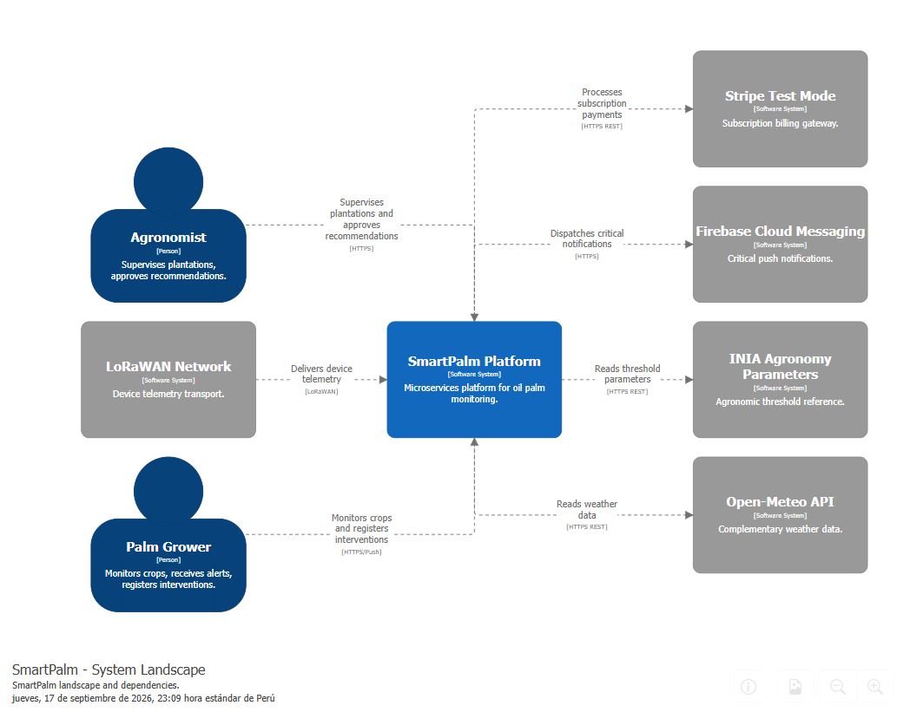

#### 4.3.1. Software Architecture System Landscape Diagram

El diagrama identifica a dos usuarios principales: el **Palm Grower** (monitorea sus cultivos, recibe alertas críticas y ejecuta intervenciones agronómicas) y el **Agronomist** (supervisa plantaciones, registra inspecciones de campo y aprueba recomendaciones agronómicas), quienes interactúan con **SmartPalm Platform**. La plataforma es un sistema de microservicios (un desplegable por bounded context, Database per Service) con comunicación asíncrona en la ruta crítica vía broker y rutas síncronas de control/lectura vía API Gateway. Utiliza sistemas externos: **Stripe (Test Mode)** para la facturación de suscripciones (solo BC-07), **Firebase Cloud Messaging** para notificaciones push críticas (solo BC-03), **INIA Agronomy Parameters** para la calibración de umbrales (vía ACL en BC-04), **Open-Meteo API** para datos meteorológicos complementarios (vía ACL en BC-02) y la red **LoRaWAN Network** para el transporte de los dispositivos en zonas con conectividad limitada. Diagrama generado con Structurizr (vista System Landscape).

