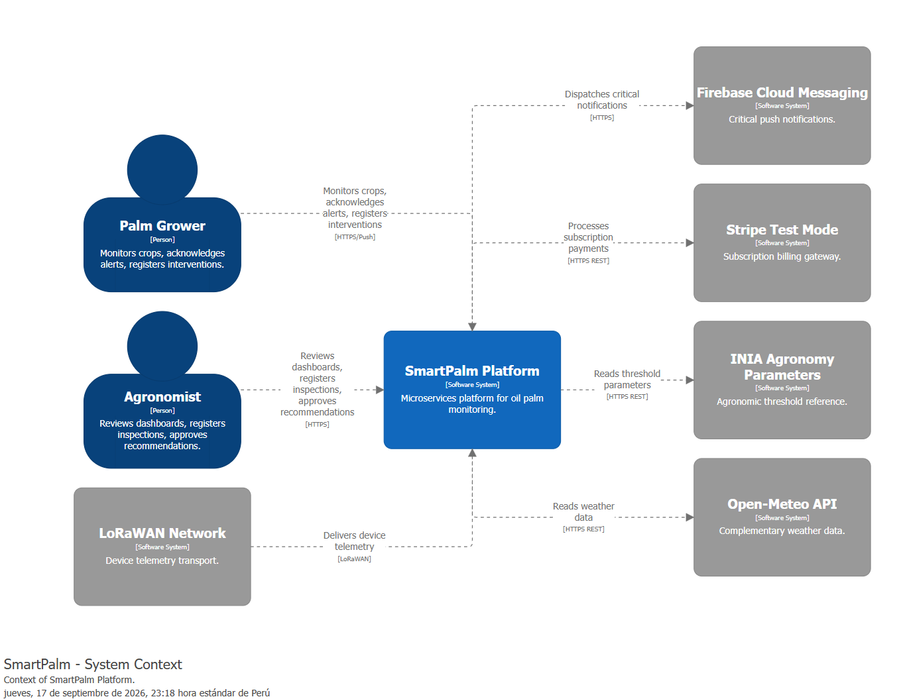

#### 4.3.2. Software Architecture Context Level Diagrams

Este diagrama contextualiza cómo el sistema **SmartPalm Platform** se integra en su entorno y qué actores externos (personas o sistemas) interactúan con él. Destaca los flujos de información cruciales: el **monitoreo** de cultivos por el **Palm Grower** y el **Agronomist**, la **telemetría** de dispositivos vía red **LoRaWAN Network**, las **alertas** críticas vía **Firebase Cloud Messaging**, la **facturación** vía **Stripe (Test Mode)** y la **calibración** con **INIA Agronomy Parameters** y **Open-Meteo API**. A diferencia del Landscape, aquí el sistema se muestra con su límite explícito y sin detalle interno (los 7 microservicios se abren en el Container Diagram).

