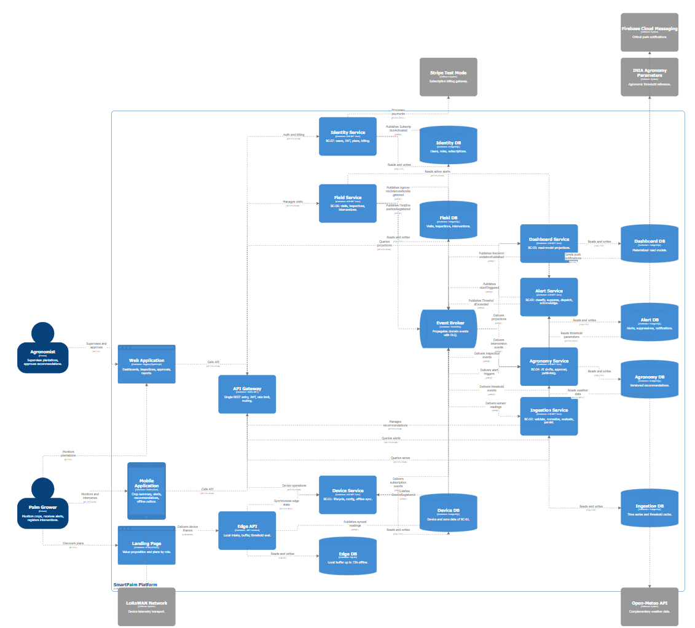

#### 4.3.3. Software Architecture Container Level Diagrams

El diagrama descompone **SmartPalm Platform** en sus contenedores: los actores **Palm Grower** y **Agronomist** consumen la **Mobile Application**, la **Web Application** y el **Landing Page**, que llegan a los microservicios solo vía **API Gateway** (YARP, JWT, rate limit). Cada bounded context es un servicio desplegable con su base de datos propia (Database per Service): **Device Service**, **Ingestion Service**, **Alert Service**, **Agronomy Service**, **Dashboard Service** (proyección de solo lectura), **Field Service** y **Identity Service**. La ruta crítica viaja asíncrona por el **Event Broker** (RabbitMQ, AMQP) con los eventos `DeviceRegistered`, `ThresholdExceeded`, `AlertTriggered`, `FieldInspectionRegistered`, `AgronomicInterventionRegistered`, `RecommendationPublished` y `SubscriptionActivated`; el control y las lecturas son REST síncrono. En campo, el **Edge API** con su **Edge DB** (SQLite, buffer 72h) publica lecturas sincronizadas y recibe tramas vía red **LoRaWAN Network**. Los servicios externos (**Stripe (Test Mode)**, **Firebase Cloud Messaging**, **INIA Agronomy Parameters**, **Open-Meteo API**) solo los toca su servicio dueño.

