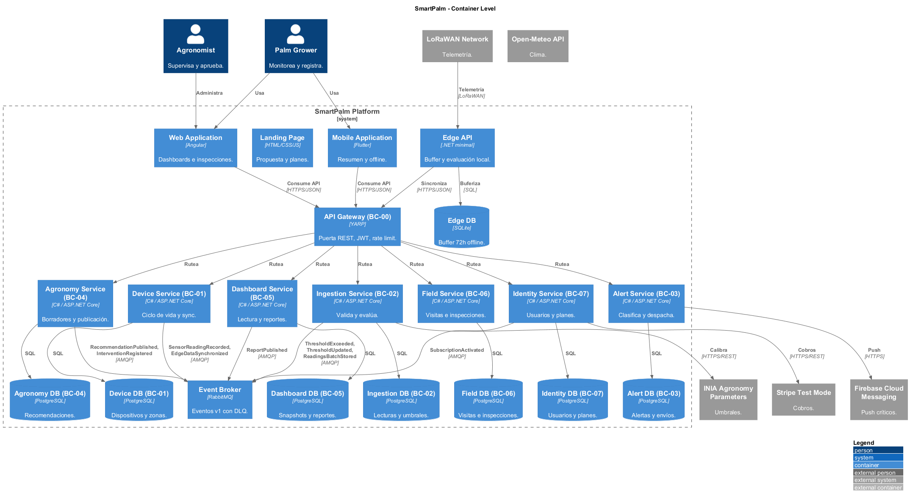

#### 4.3.3. Software Architecture Container Level Diagrams

El diagrama descompone **SmartPalm Platform** en sus contenedores: los actores **Palm Grower** y **Agronomist** consumen la **Mobile Application**, la **Web Application** y el **Landing Page**, que llegan a los microservicios solo vía **API Gateway** (YARP, JWT, rate limit). Cada bounded context es un servicio desplegable con su base de datos propia (Database per Service), rotulado con su BC: **Device Service (BC-01)**, **Ingestion Service (BC-02)**, **Alert Service (BC-03)**, **Agronomy Service (BC-04)**, **Dashboard Service (BC-05)**, **Field Service (BC-06)** e **Identity Service (BC-07)**. La ruta crítica viaja asíncrona por el **Event Broker** (RabbitMQ, AMQP) con eventos versionados v1 del vocabulario canónico del Capítulo V: `SensorReadingRecorded`, `EdgeDataSynchronized`, `ThresholdExceeded`, `ThresholdUpdated`, `ReadingsBatchStored`, `RecommendationPublished`, `InterventionRegistered`, `ReportPublished` y `SubscriptionActivated`; el control y las lecturas son REST síncrono. En campo, el **Edge API** con su **Edge DB** (SQLite, buffer 72h) publica lotes sincronizados y recibe tramas vía red **LoRaWAN Network**. Los servicios externos (**Stripe (Test Mode)**, **Firebase Cloud Messaging**, **INIA Agronomy Parameters**, **Open-Meteo API**) solo los toca su servicio dueño.

