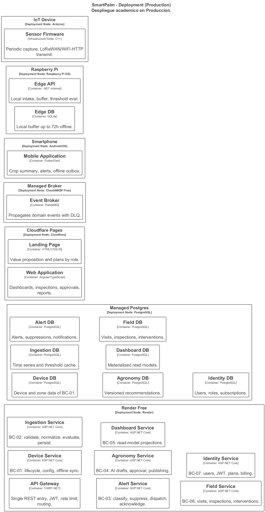

#### 4.3.4. Software Architecture Deployment Diagrams

El diagrama de despliegue muestra dónde corre cada contenedor en el ambiente de producción académico (tiers gratuitos): el **Landing Page** y la **Web Application** en **Cloudflare Pages** (CDN, HTTPS); el **API Gateway** y los 7 microservicios en **Render Free** (Docker por servicio, con sleep aceptado para la demo); las 7 bases de datos lógicas en un **Managed Postgres** gratuito (`DATABASE_URL_*` propia por servicio); el **Event Broker** en **CloudAMQP Free** (RabbitMQ con DLQ); la **Mobile Application** en el **Smartphone** del productor (con outbox offline); el **Edge API** con su **Edge DB** (SQLite, buffer de 72h) en la **Raspberry Pi** solar del campo; y el **Sensor Firmware** (C++) en el **IoT Device** Arduino que transmite por LoRaWAN/WiFi-HTTP. Cada servicio despliega y escala de forma independiente (el Ingestion Service con más réplicas por ser la ruta crítica).

