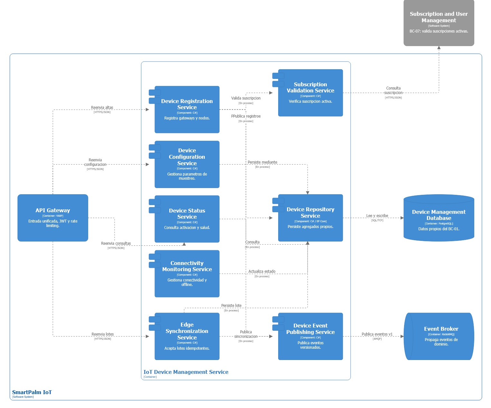
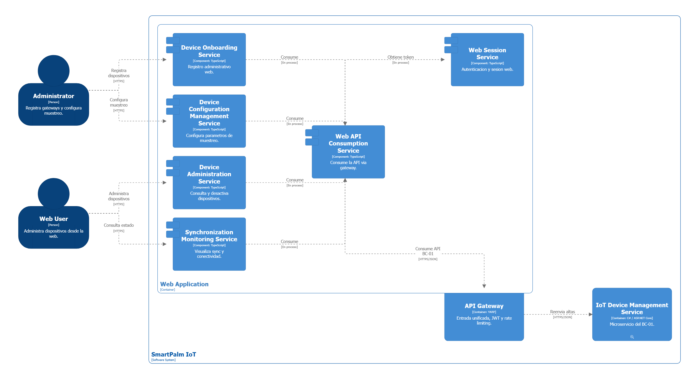
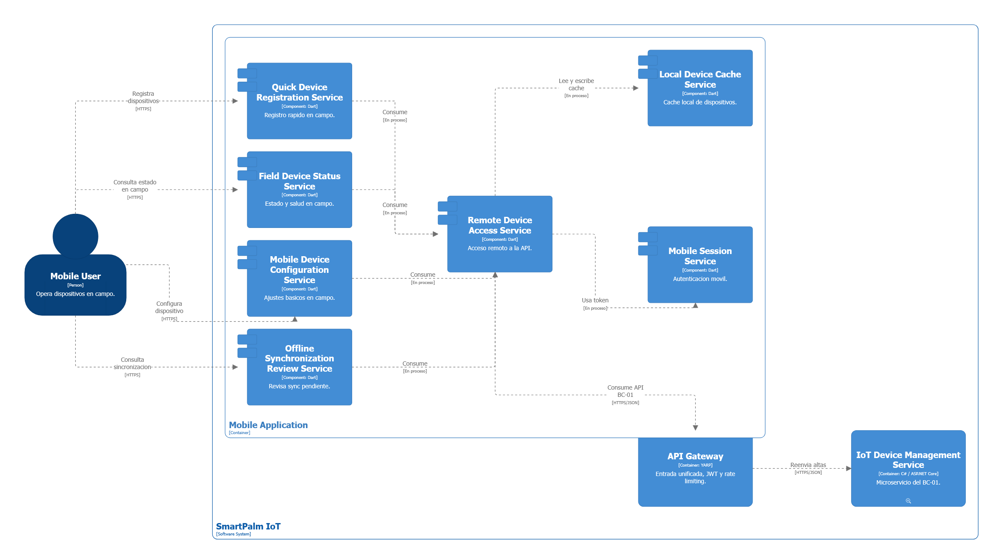
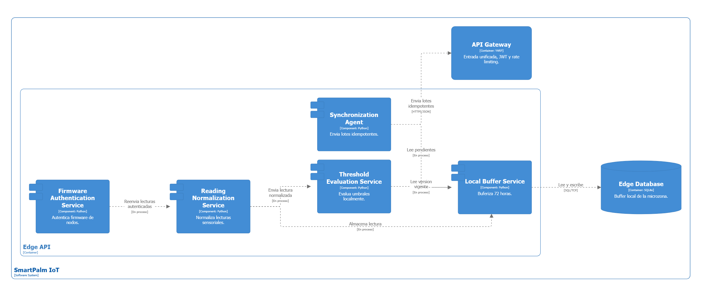

## 5.1. Bounded Context: IoT Device Management.

El bounded context **IoT Device Management** gestiona el ciclo de vida de los dispositivos IoT de SmartPalm y constituye el punto de entrada de toda la telemetría de campo a la plataforma: sin un dispositivo registrado y con suscripción activa no hay lecturas, y sin lecturas no operan el procesamiento (BC-02), las alertas (BC-03) ni el monitoreo (BC-05). Por eso es un Core Domain y se despliega como **microservicio independiente** con base de datos propia, capaz de evolucionar y escalar al ritmo de la ingesta sin arrastrar al resto de la solución.

Esta sección detalla su diseño táctico en el orden en que se construye y se lee: primero el modelo de dominio con sus reglas (5.1.1), luego la superficie HTTP que lo expone (5.1.2), la orquestación de los flujos (5.1.3), la materialización en persistencia y mensajería (5.1.4), y finalmente las vistas de arquitectura que lo verifican visualmente (5.1.6 y 5.1.7). Las capacidades cubiertas son seis: registrar dispositivos, configurar parámetros de muestreo, monitorear conectividad y salud, operar en modo offline, sincronizar datos acumulados y dar de baja dispositivos.

### 5.1.1. Domain Layer.

La Domain Layer concentra el núcleo del dominio: el agregado `EdgeDevice`, la entidad `IotDevice`, value objects, enumeraciones, interfaces de repositorio y de servicios de dominio, además de los commands, queries y eventos de integración que estructuran las operaciones del bounded context.

El agregado se delimita por gateway y microzona para que el registro, la sincronización y la baja sean una sola unidad de consistencia: ningún nodo existe fuera de su gateway y ninguna operación atraviesa agregados. La identidad combina un Guid generable sin conexión con la MAC como identidad de campo, y la configuración viaja como value object inmutable para que ningún cambio parcial deje al gateway en estado intermedio. El diccionario se lee ficha por ficha —categoría, propósito, atributos y métodos— y todo lo que aparece en los diagramas de 5.1.6 y 5.1.7 sale de aquí, sin elementos de más.

##### 1. EdgeDevice

| Campo | Detalle |
|---|---|
| **Nombre** | EdgeDevice |
| **Categoría** | Entity / Aggregate Root |
| **Propósito** | Gateway edge de una microzona: ciclo de vida, conectividad, configuración de muestreo y sincronización. Toda `IotDevice` se gobierna a través de este agregado. |

**Atributos**

| Nombre | Tipo de dato | Visibilidad | Descripción |
|---|---|---|---|
| Id | Guid | private | Identificador único, generable offline sin coordinación. |
| MacAddress | string | private | Identidad de campo del gateway. Única, obligatoria. |
| MonitoringZoneId | Guid | private | Microzona activa asociada. Regla: exactamente una. |
| SamplingConfiguration | DeviceConfiguration | private | Value object con parámetros de muestreo vigentes. |
| LastConnectivityCheckAt | DateTime | private | Último heartbeat recibido. |
| LastSyncAt | DateTime | private | Última sincronización completada. |
| CreatedAt | DateTime | private | Fecha de registro. |
| IsConnected | bool | public | Calculada: tiempo desde `LastConnectivityCheckAt` dentro del umbral. |

**Métodos**

| Nombre | Tipo de retorno | Visibilidad | Descripción |
|---|---|---|---|
| Register | void | public | Estado inicial al primer registro, con suscripción verificada. |
| UpdateSamplingConfiguration | void | public | Reemplaza el value object previa validación de rangos. |
| ReportConnectivity | void | public | Actualiza `LastConnectivityCheckAt`. |
| EnterOfflineMode | void | public | Activa modo offline al expirar el umbral de conectividad. |
| RestoreConnectivity | void | public | Sale de offline al recibir heartbeat o sincronización. |
| SynchronizeData | void | public | Actualiza `LastSyncAt` tras aceptar un lote idempotente. |
| Decommission | void | public | Baja del gateway y sus nodos; su telemetría se rechaza. |

---

##### 2. IotDevice

| Campo | Detalle |
|---|---|
| **Nombre** | IotDevice |
| **Categoría** | Entity (hija del agregado `EdgeDevice`) |
| **Propósito** | Nodo sensor individual bajo un edge gateway. Sin identidad global fuera del agregado. |

**Atributos**

| Nombre | Tipo de dato | Visibilidad | Descripción |
|---|---|---|---|
| Id | Guid | private | Identificador único. |
| MacAddress | string | private | Identidad de campo. Única dentro del agregado. |
| Status | ActivationStatus | private | Active / Inactive / Decommissioned. |
| HealthStatus | DeviceHealthStatus | private | Healthy / Warning / Critical. |
| CreatedAt | DateTime | private | Fecha de registro. |

**Métodos**

| Nombre | Tipo de retorno | Visibilidad | Descripción |
|---|---|---|---|
| Register | void | public | Alta bajo el agregado. |
| Decommission | void | public | Baja lógica; su telemetría se rechaza. |

---

##### 3. DeviceConfiguration

| Campo | Detalle |
|---|---|
| **Nombre** | DeviceConfiguration |
| **Categoría** | Value Object (inmutable, parte del agregado `EdgeDevice`) |
| **Propósito** | Parámetros de muestreo y transmisión de la microzona. Persistido como tipo propio en la fila del gateway. |

**Atributos**

| Nombre | Tipo de dato | Visibilidad | Descripción |
|---|---|---|---|
| SamplingIntervalMinutes | int | private | Período de muestreo. Rango válido: 1–1440. |
| TransmissionMode | string | private | `Realtime` \| `Batched`. |
| RetryPolicy | string | private | Política de reintento de envío. |
| MaxOfflineStorageHours | int | private | Tope de buffer offline. Fijo en 72, no parametrizable. |

**Métodos**

| Nombre | Tipo de retorno | Visibilidad | Descripción |
|---|---|---|---|
| Validate | bool | public | Verifica rangos antes de reemplazar el value object. |

---

##### 4. SensorType

| Campo | Detalle |
|---|---|
| **Nombre** | SensorType |
| **Categoría** | Enumeration |
| **Propósito** | Tipos de sensor soportados por los nodos. |

**Valores**

| Nombre | Descripción |
|---|---|
| Temperature | Temperatura ambiental o del suelo. |
| Humidity | Humedad relativa ambiental o del suelo. |
| Pressure | Presión atmosférica. |
| Luminosity | Luminosidad. |
| GasResistance | Resistencia de gas. |
| Voltage | Voltaje eléctrico. |
| Current | Corriente eléctrica. |
| Power | Potencia eléctrica. |
| Speed | Velocidad. |
| Direction | Dirección u orientación. |

---

##### 5. ConnectivityStatus

| Campo | Detalle |
|---|---|
| **Nombre** | ConnectivityStatus |
| **Categoría** | Enumeration |
| **Propósito** | Estado de conectividad del gateway. |

**Valores**

| Nombre | Descripción |
|---|---|
| Connected | Heartbeat dentro del umbral. |
| Disconnected | Umbral expirado, sin datos recientes. |
| OfflineMode | Operando con buffer local. |

---

##### 6. DeviceHealthStatus

| Campo | Detalle |
|---|---|
| **Nombre** | DeviceHealthStatus |
| **Categoría** | Enumeration |
| **Propósito** | Salud del dispositivo. |

**Valores**

| Nombre | Descripción |
|---|---|
| Healthy | Operación normal. |
| Warning | Degradación (batería baja, pérdidas parciales). |
| Critical | Fuera de servicio / requiere intervención. |

---

##### 7. ActivationStatus

| Campo | Detalle |
|---|---|
| **Nombre** | ActivationStatus |
| **Categoría** | Enumeration |
| **Propósito** | Estado administrativo del dispositivo. |

**Valores**

| Nombre | Descripción |
|---|---|
| Active | En operación. |
| Inactive | Pausado temporalmente. |
| Decommissioned | Dado de baja; telemetría rechazada. |

---

##### 8. IEdgeDeviceRepository

| Campo | Detalle |
|---|---|
| **Nombre** | IEdgeDeviceRepository |
| **Categoría** | Repository (interfaz, contrato del agregado) |
| **Propósito** | Persistencia del agregado `EdgeDevice` en la base de datos propia del microservicio. |

**Métodos**

| Nombre | Tipo de retorno | Visibilidad | Descripción |
|---|---|---|---|
| AddAsync | Task | public | Agrega un agregado nuevo. |
| FindByIdAsync | Task\<EdgeDevice?\> | public | Busca por `Id`. Retorna `null` si no existe. |
| FindByMacAddressAsync | Task\<EdgeDevice?\> | public | Busca por `MacAddress`. Retorna `null` si no existe. |
| Update | void | public | Marca el agregado como modificado. |
| Remove | void | public | Elimina el agregado. |
| ListAsync | Task\<IEnumerable\<EdgeDevice\>\> | public | Todos los gateways registrados. |

---

##### 9. IIotDeviceRepository

| Campo | Detalle |
|---|---|
| **Nombre** | IIotDeviceRepository |
| **Categoría** | Repository (interfaz) |
| **Propósito** | Acceso a `IotDevice` siempre a través del agregado. |

**Métodos**

| Nombre | Tipo de retorno | Visibilidad | Descripción |
|---|---|---|---|
| FindByMacAddressAsync | Task\<IotDevice?\> | public | Busca por `MacAddress`. Retorna `null` si no existe. |
| ListByEdgeDeviceAsync | Task\<IEnumerable\<IotDevice\>\> | public | Nodos de un gateway. |

---

##### 10. IDeviceStatusCommandService

| Campo | Detalle |
|---|---|
| **Nombre** | IDeviceStatusCommandService |
| **Categoría** | Domain Service (interfaz) |
| **Propósito** | Contrato del servicio que procesa comandos de registro, configuración, baja y sincronización. |

**Métodos**

| Nombre | Tipo de retorno | Visibilidad | Descripción |
|---|---|---|---|
| Handle(RegisterEdgeDeviceCommand) | Task | public | Comando de alta de gateway. |
| Handle(RegisterIotDeviceCommand) | Task | public | Comando de alta de nodo bajo un gateway. |
| Handle(UpdateSamplingConfigurationCommand) | Task | public | Comando de configuración de muestreo. |
| Handle(DecommissionDeviceCommand) | Task | public | Comando de baja de nodo. |
| Handle(DecommissionEdgeDeviceCommand) | Task | public | Comando de baja de gateway en cascada. |
| Handle(EdgeSynchronizationCommand) | Task | public | Comando de sincronización de lote idempotente. |
| Handle(ReportConnectivityCommand) | Task | public | Comando de heartbeat. |

---

##### 11. IDeviceStatusQueryService

| Campo | Detalle |
|---|---|
| **Nombre** | IDeviceStatusQueryService |
| **Categoría** | Domain Service (interfaz) |
| **Propósito** | Contrato del servicio de consultas de estado, registro y configuración. |

**Métodos**

| Nombre | Tipo de retorno | Visibilidad | Descripción |
|---|---|---|---|
| Handle(ConnectivityStatusQuery) | Task\<EdgeDevice\> | public | Estado de conectividad por MAC. |
| Handle(GatewayDevicesQuery) | Task\<Tuple\<EdgeDevice, List\<IotDevice\>\>\> | public | Nodos del gateway. |
| Handle(ListEdgeGatewaysQuery) | Task\<IEnumerable\<EdgeDevice\>\> | public | Todos los gateways registrados. |
| Handle(SamplingConfigurationQuery) | Task\<DeviceConfiguration\> | public | Configuración vigente, la que el edge debe aplicar. |

---

##### 12. IEdgeSynchronizationService + EdgeSynchronizationService

| Campo | Detalle |
|---|---|
| **Nombre** | IEdgeSynchronizationService / EdgeSynchronizationService |
| **Categoría** | Domain Service (interfaz + implementación) |
| **Propósito** | Ordenar cronológicamente las lecturas acumuladas. |
| **Método** | `OrderChronologically` → lista ordenada por `MeasuredAt` ascendente. |

---

##### 13. Commands

Objetos inmutables que encapsulan intención de cambio. Todos viajan con `CorrelationId` para trazabilidad e idempotencia.

| Nombre | Parámetros | Descripción |
|---|---|---|
| RegisterEdgeDeviceCommand | EdgeDeviceMac, MonitoringZoneId, CorrelationId | Alta de gateway. |
| RegisterIotDeviceCommand | EdgeDeviceMac, IotDeviceMac, CorrelationId | Alta de nodo bajo un gateway. |
| UpdateSamplingConfigurationCommand | EdgeDeviceMac, SamplingConfiguration, CorrelationId | Configuración de muestreo. |
| DecommissionDeviceCommand | IotDeviceMac, CorrelationId | Baja de nodo. |
| DecommissionEdgeDeviceCommand | EdgeDeviceMac, CorrelationId | Baja de gateway y sus nodos. |
| EdgeSynchronizationCommand | EdgeDeviceMac, BatchId, Readings[], CorrelationId | Sincronización de lote idempotente. |
| ReportConnectivityCommand | EdgeDeviceMac, CheckedAt, CorrelationId | Heartbeat de conectividad. |

---

##### 14. Queries

Objetos inmutables de solo lectura.

| Nombre | Parámetros | Descripción |
|---|---|---|
| ConnectivityStatusQuery | mac | Estado de conectividad por MAC. |
| GatewayDevicesQuery | EdgeDeviceMac | Nodos del gateway. |
| ListEdgeGatewaysQuery | — | Todos los gateways registrados. |
| SamplingConfigurationQuery | EdgeDeviceMac | Configuración vigente. |

---

##### 15. Eventos de integración

Eventos versionados sobre RabbitMQ con entrega al menos una vez; los consumidores son idempotentes y existe dead-letter queue. Publicados por BC-01:

| Nombre | Versión | Cuándo | Contenido mínimo |
|---|---|---|---|
| EdgeDeviceRegistered | v1 | Alta de gateway confirmada. | edgeId, mac, zoneId, correlationId |
| IotDeviceRegistered | v1 | Alta de nodo confirmada. | deviceId, mac, edgeMac, zoneId, correlationId |
| EdgeDataSynchronized | v1 | Lote aceptado. | edgeMac, batchId, readingsCount, correlationId |
| SensorReadingRecorded | v1 | Por lectura aceptada, en lote o en tiempo real. | readingId, deviceMac, sensorType, measuredAt, value, correlationId |
| DeviceDecommissioned | v1 | Baja confirmada. | deviceMac/edgeMac, correlationId |

BC-01 consume `SubscriptionActivated` (BC-07), que habilita el registro de dispositivos de la suscripción.

---

### 5.1.2. Interface Layer.

Punto de entrada HTTP del microservicio. Todo el tráfico pasa por el API Gateway: los usuarios con JWT según rol y los dispositivos con identidad validada. Todos los endpoints requieren autenticación. Los controllers delegan en Application mediante assemblers que convierten entre recursos y commands o queries.

El gateway es la única puerta: concentra autenticación por rol para personas y validación de identidad para dispositivos, de modo que ningún endpoint quede anónimo. Los controllers son deliberadamente delgados —validan forma, convierten y delegan— para que las reglas vivan en dominio y aplicación, no en HTTP. Los resources son los contratos versionables de la API y los assemblers los traducen en ambas direcciones sin que el dominio conozca detalles web.

##### 1. EdgeGatewaysController

| Campo | Detalle |
|---|---|
| **Nombre** | EdgeGatewaysController |
| **Categoría** | Controller |
| **Ruta base** | `api/v1/edge-gateways` (vía API Gateway) |
| **Propósito** | Ciclo de vida de gateways: registro, configuración, estado y sincronización. |

**Métodos**

| Nombre | Verbo HTTP | Ruta | Auth | Tipo de retorno | Descripción |
|---|---|---|---|---|---|
| RegisterEdgeDevice | POST | `/` | JWT-Admin | 201 Created | Alta de gateway. |
| UpdateSamplingConfiguration | PATCH | `/{mac}/configuration` | JWT-Admin | 200 OK | Reemplazo de configuración. |
| DecommissionEdgeDevice | DELETE | `/{mac}` | JWT-Admin | 204 No Content | Baja lógica del gateway. |
| ListEdgeGateways | GET | `/` | JWT-User | 200 OK | Todos los gateways. |
| GetSamplingConfiguration | GET | `/{mac}/configuration` | Device | 200 OK | Configuración vigente para aplicar en campo. |
| GetConnectivityStatus | GET | `/{mac}/connectivity` | JWT-User | 200 OK | Estado de conectividad y salud. |
| GetGatewayDevices | GET | `/{mac}/devices` | JWT-User | 200 OK | Nodos del gateway. |
| SynchronizeEdgeData | POST | `/{mac}/synchronizations` | Device | 202 Accepted | Lote idempotente; procesamiento asíncrono. |
| ReportConnectivity | POST | `/{mac}/heartbeats` | Device | 202 Accepted | Heartbeat de conectividad. |

##### 2. IotDevicesController

| Campo | Detalle |
|---|---|
| **Nombre** | IotDevicesController |
| **Categoría** | Controller |
| **Ruta base** | `api/v1/iot-devices` (vía API Gateway) |
| **Propósito** | Operaciones directas sobre nodos. |

**Métodos**

| Nombre | Verbo HTTP | Ruta | Auth | Tipo de retorno | Descripción |
|---|---|---|---|---|---|
| RegisterIotDevice | POST | `/` | JWT-Admin | 201 Created | Alta de nodo (`{edgeMac, iotMac}`). |
| GetIotDevice | GET | `/{mac}` | JWT-User | 200 OK | Detalle del nodo. |
| DecommissionIotDevice | DELETE | `/{mac}` | JWT-Admin | 204 No Content | Baja lógica del nodo. |

##### 3. Resources

Records inmutables de petición y respuesta.

| Nombre | Campos | Descripción |
|---|---|---|
| EdgeDeviceRegistrationResource | edgeMac, monitoringZoneId | Solicitud de alta de gateway. |
| IotDeviceRegistrationResource | edgeMac, iotMac | Solicitud de alta de nodo. |
| SamplingConfigurationResource | samplingIntervalMinutes, transmissionMode, retryPolicy | Solicitud de configuración. |
| EdgeSynchronizationResource | batchId, readings[], syncedAt | Lote de sincronización; lecturas `{readingId, deviceMac, sensorType, measuredAt, value}`. |
| HeartbeatResource | checkedAt | Heartbeat de conectividad. |
| ConnectivityStatusResource | mac, connectivity, health, lastSyncAt | Respuesta de estado. |
| GatewayDevicesResource | gatewayMac, devices[] | Respuesta con nodos y estados. |

##### 4. Assemblers

Clases estáticas que transforman entre recursos y objetos de dominio.

| Nombre | Método | Descripción |
|---|---|---|
| RegisterEdgeDeviceCommandFromResourceAssembler | ToCommandFromResource(EdgeDeviceRegistrationResource) | Alta de gateway. |
| RegisterIotDeviceCommandFromResourceAssembler | ToCommandFromResource(edgeMac, IotDeviceRegistrationResource) | Alta de nodo. |
| UpdateSamplingConfigurationCommandFromResourceAssembler | ToCommandFromResource(mac, SamplingConfigurationResource) | Configuración. |
| EdgeSynchronizationCommandFromResourceAssembler | ToCommandFromResource(gatewayMac, EdgeSynchronizationResource) | Sincronización. |
| ReportConnectivityCommandFromResourceAssembler | ToCommandFromResource(mac, HeartbeatResource) | Heartbeat. |
| ConnectivityStatusQueryFromResourceAssembler | ToQueryFromResource(edgeMac) | Query de estado. |
| GatewayDevicesQueryFromResourceAssembler | ToQueryFromResource(edgeMac) | Query de nodos. |
| SamplingConfigurationQueryFromResourceAssembler | ToQueryFromResource(mac) | Query de configuración. |
| ConnectivityStatusResourceFromAggregateAssembler | ToResourceFromAggregate(EdgeDevice) | Respuesta de estado. |
| GatewayDevicesResourceFromAggregateAssembler | ToResourceFromAggregate(EdgeDevice, List\<IotDevice\>) | Respuesta de nodos. |

### 5.1.3. Application Layer.

Orquesta los flujos de negocio: recibe commands y queries, recupera agregados, aplica reglas, persiste mediante Unit of Work y publica eventos con Outbox transaccional (misma transacción del cambio, con relay al broker).

La capa separa escritura y lectura: los comandos validan (MAC única, suscripción activa contra BC-07, lote no repetido, lecturas dentro de 72 horas) antes de mutar, y cada mutación confirmada deja su evento en el Outbox dentro de la misma transacción, lo que garantiza que ningún cambio quede sin publicar ni ningún evento sin cambio. Las queries solo leen agregados ya calculados. El handler de `SubscriptionActivated` cierra el Flujo 2: sin ese evento, el registro permanece bloqueado.

##### 1. DeviceCommandService

| Campo | Detalle |
|---|---|
| **Nombre** | DeviceCommandService |
| **Categoría** | Command Service |
| **Propósito** | Flujos de registro, configuración, baja y sincronización. |
| **Atributos** | `uow: IUnitOfWork`, `edgeDeviceRepository`, `iotDeviceRepository`, `outbox: IOutboxWriter`. |

**Métodos (Handle)**

| Nombre | Descripción |
|---|---|
| Handle(RegisterEdgeDeviceCommand) | MAC no registrada y suscripción activa verificada contra BC-07: crea el agregado, persiste y publica `EdgeDeviceRegistered`. |
| Handle(RegisterIotDeviceCommand) | Gateway existente y activo, nodo inexistente: crea el `IotDevice`, persiste y publica `IotDeviceRegistered`. |
| Handle(UpdateSamplingConfigurationCommand) | Gateway existente: valida el value object, reemplaza y persiste. |
| Handle(DecommissionDeviceCommand) | Nodo existente: baja lógica, persiste y publica `DeviceDecommissioned`. |
| Handle(DecommissionEdgeDeviceCommand) | Gateway y nodos: baja lógica en cascada. |
| Handle(EdgeSynchronizationCommand) | Gateway existente: `BatchId` ya procesado (verificado en `SyncBatchStore`) se responde como éxito sin duplicar; rechaza lecturas con `MeasuredAt` anterior a 72 horas; ordena, persiste y publica `EdgeDataSynchronized` más un `SensorReadingRecorded` por lectura. |
| Handle(ReportConnectivityCommand) | Actualiza el heartbeat del agregado. |

Duplicados se rechazan con `409` e inexistentes con `404`.

##### 2. DeviceQueryService

| Campo | Detalle |
|---|---|
| **Nombre** | DeviceQueryService |
| **Categoría** | Query Service |
| **Propósito** | Lecturas de estado, registro y configuración, sin mutación. |

**Métodos**

| Nombre | Tipo de retorno | Visibilidad | Descripción |
|---|---|---|---|
| Handle(ConnectivityStatusQuery) | Task\<EdgeDevice\> | public | Gateway por MAC con estado calculado. |
| Handle(GatewayDevicesQuery) | Task\<Tuple\<EdgeDevice, List\<IotDevice\>\>\> | public | Gateway y sus nodos con estados. |
| Handle(ListEdgeGatewaysQuery) | Task\<IEnumerable\<EdgeDevice\>\> | public | Todos los gateways registrados. |
| Handle(SamplingConfigurationQuery) | Task\<DeviceConfiguration\> | public | Configuración vigente del gateway. |

##### 3. SubscriptionActivatedHandler

| Campo | Detalle |
|---|---|
| **Nombre** | SubscriptionActivatedHandler |
| **Categoría** | Event Handler (RabbitMQ) |
| **Propósito** | Consume `SubscriptionActivated` (BC-07) de forma idempotente por `correlationId` y habilita el registro de dispositivos de la suscripción. |

### 5.1.4. Infrastructure Layer.

Materialización del microservicio con persistencia y mensajería propias: base de datos exclusiva con migraciones propias y cero tablas compartidas.

La base propia es lo que hace real el límite del bounded context: el servicio evoluciona, migra y escala sin coordinar esquemas con nadie, y ninguna consulta cruza a tablas ajenas. La mensajería sale por Outbox con relay para que la publicación sobreviva caídas, y la seguridad se aplica en el borde (identidad de dispositivo) antes de tocar dominio. Todo lo que vive en campo —Edge API, SQLite, firmware— queda deliberadamente fuera del microservicio e interactúa solo por contratos HTTP y eventos.

##### 1. DeviceManagementDbContext

| Campo | Detalle |
|---|---|
| **Nombre** | DeviceManagementDbContext |
| **Categoría** | DbContext propio del microservicio (PostgreSQL, `DATABASE_URL` exclusiva) |
| **Propósito** | Acceso a datos del BC-01. El propio contexto actúa como Unit of Work (`SaveChanges` transaccional junto al Outbox). |
| **Tablas** | `edge_devices` (con `DeviceConfiguration` como tipo propio), `iot_devices`, `sync_batches` (`batch_id` único), `connectivity_logs`, `outbox_messages`. snake_case, únicos en `mac_address` y `batch_id`. |

##### 2. EdgeDeviceRepository + IotDeviceRepository

Implementan las interfaces de dominio con Entity Framework Core sobre el contexto propio, con búsqueda por dirección MAC. Sin dependencias de acceso a datos fuera del servicio.

##### 3. RabbitMqEventPublisher + OutboxRelay

| Campo | Detalle |
|---|---|
| **Nombre** | RabbitMqEventPublisher / OutboxRelay |
| **Categoría** | Messaging (publisher + relay) |
| **Propósito** | Publicar eventos versionados (exchange por tipo, dead-letter queue). El relay drena `outbox_messages` y confirma la publicación; los consumidores son idempotentes por `readingId`, `batchId` y `correlationId`. |

##### 4. DeviceIdentityValidator

| Campo | Detalle |
|---|---|
| **Nombre** | DeviceIdentityValidator |
| **Categoría** | Security (infraestructura) |
| **Propósito** | Validar la identidad de cada dispositivo en sincronizaciones y heartbeats con el secreto aprovisionado al registrarlo. La telemetría de MAC desconocida o dada de baja se rechaza con `401/403`. |

##### 5. Interoperación Edge

El Edge API (Raspberry Pi + SQLite) es la contraparte de campo: autentica el firmware, normaliza lecturas, evalúa umbrales con la última versión válida, almacena hasta 72 horas y envía lotes idempotentes a `POST /synchronizations`. La propagación de umbrales y configuración hacia el edge se coordina con los bounded contexts de procesamiento y recomendación (BC-02/BC-04).

##### 6. Stores operativos

| Campo | Detalle |
|---|---|
| **Nombre** | SyncBatchStore / ConnectivityLogStore |
| **Categoría** | Persistencia operativa (infraestructura) |
| **Propósito** | `SyncBatchStore` registra `sync_batches` por `batch_id` único en la misma transacción del lote. `ConnectivityLogStore` anexa `connectivity_logs` por heartbeat como auditoría; el estado vivo permanece en el agregado. |

### 5.1.6. Bounded Context Software Architecture Component Level Diagrams.

Un diagrama por cada container que toca el bounded context. El microservicio descompone en registro, configuración, estado, conectividad, sincronización, validación de suscripción (contra BC-07), repositorio (a Postgres propio) y publicación de eventos (a RabbitMQ), todo detrás del API Gateway.

Se leen siguiendo el flujo de datos: la entrada siempre es el gateway, los servicios colaboran en proceso hacia el repositorio o el publicador, y las salidas son la base propia, el broker o el sistema externo. Cada vista recorta exactamente un container con sus vecinos: nada de lo que no participa aparece, y nada de lo que participa falta.

La aplicación web administra dispositivos y configuración consumiendo la API vía gateway con sesión autenticada. Se lee de izquierda a derecha: el administrador y el usuario entran por los servicios de la aplicación, todos convergen en el consumo centralizado con sesión, y de ahí al gateway y al microservicio.

La aplicación móvil opera en campo (registro rápido, estado, configuración, revisión de sincronización) con caché local y acceso remoto vía gateway. El flujo espeja al web con dos apoyos de campo: caché local para la intermitencia y revisión de sincronización pendiente; el acceso remoto es el único que sale al gateway.

El Edge API en campo autentica el firmware, normaliza lecturas, evalúa umbrales con la versión vigente, buferiza 72 horas en SQLite y envía lotes idempotentes. Se lee como procesa el campo de arriba hacia abajo: autenticar, normalizar, evaluar, buferizar y enviar; si la conexión cae, todo lo anterior sigue funcionando con la última versión vigente.

