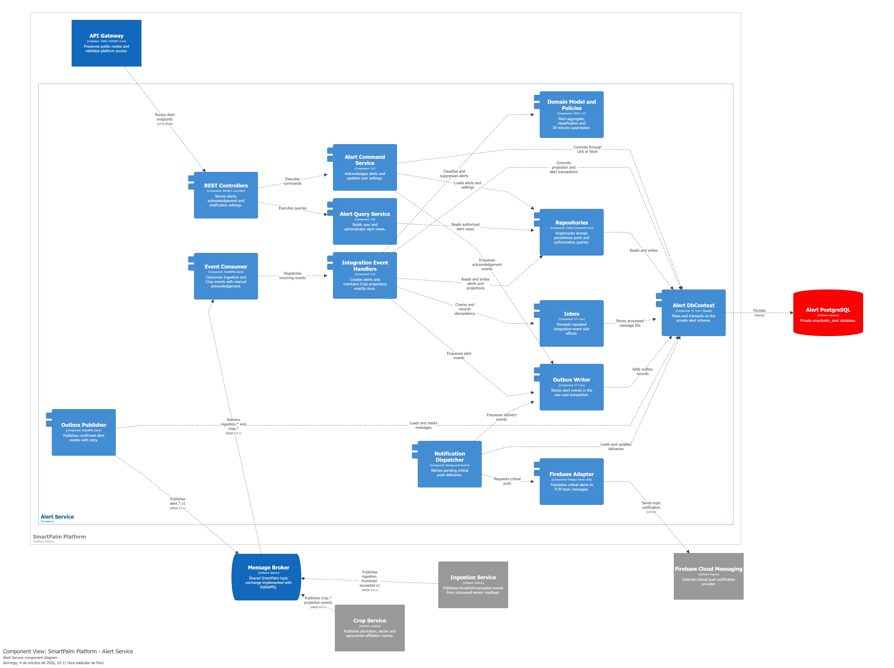

## 5.3.5. Bounded Context Software Architecture Component Level Diagrams

Aqui se presenta el diagrama C4 de componentes del container AlertService. Se lee de izquierda a derecha: el API Gateway enruta solicitudes HTTP hacia los controllers; estos delegan mutaciones a `AlertCommandService` y lecturas a `AlertQueryService`. Los comandos consultan repositorios, confirman cambios mediante `AlertDbContext` como Unit of Work y escriben eventos de reconocimiento en Outbox.

En paralelo, IngestionService y CropService publican sus eventos hacia el **Message Broker** implementado con RabbitMQ. `IntegrationEventConsumer` los entrega a `IntegrationEventHandlers`, que ejecuta la comprobación Inbox dentro de su transacción, aplica las políticas de clasificación y duplicidad, mantiene proyecciones y encola eventos salientes. `OutboxPublisher` publica eventos `alert.*.v1`; `NotificationDispatcher` recupera entregas pendientes, registra sus cambios y solicita el envío al adaptador Firebase. PostgreSQL es exclusivamente propiedad de AlertService y Firebase permanece como sistema externo.

**Comunicación externa.** Las flechas IngestionService → Message Broker → AlertService y CropService → Message Broker → AlertService expresan mensajería asíncrona; no representan llamadas HTTP directas ni acceso a las bases de datos de esos bounded contexts. La forma de cilindro identifica el broker compartido, no una base de datos de AlertService.

| Componente | Responsabilidad principal |
|---|---|
| REST Controllers | Traducir HTTP y JWT en commands y queries. |
| Alert Command/Query Services | Coordinar reconocimientos, settings y vistas autorizadas. |
| Integration Event Handlers | Procesar eventos de Ingestion/Crop de forma idempotente. |
| Inbox / Outbox | Evitar reprocesamiento y garantizar publicación confiable. |
| Notification Dispatcher / Firebase Adapter | Entregar alertas críticas por FCM y registrar resultados. |

## 5.3.6. Bounded Context Software Architecture Code Level Diagrams

### 5.3.6.1. Bounded Context Domain Layer Class Diagrams

### 5.3.6.2. Bounded Context Database Design Diagram
