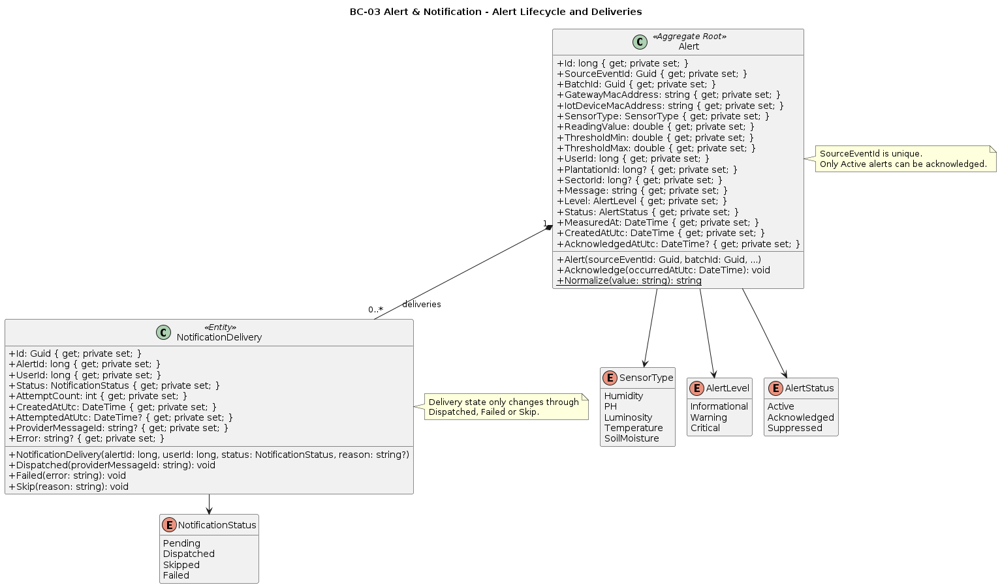
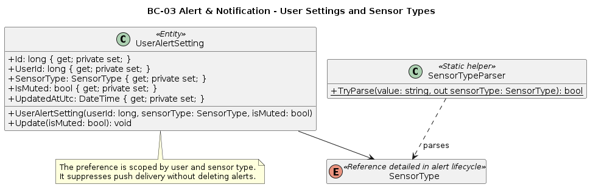
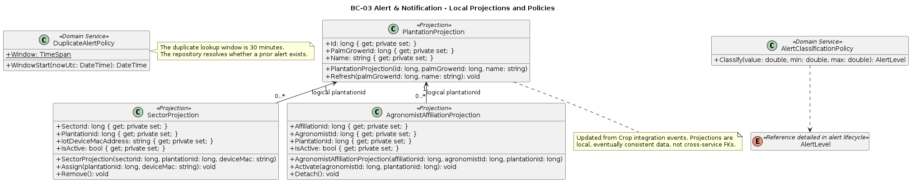
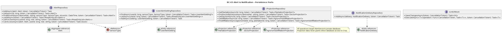
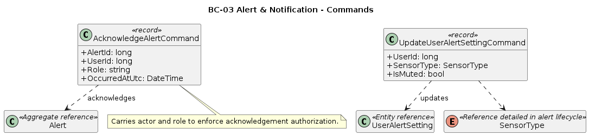
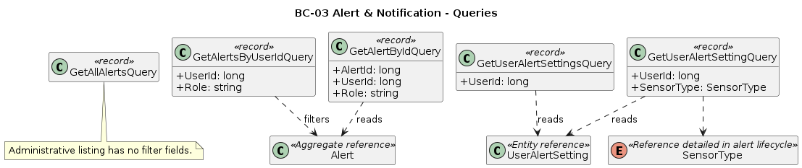
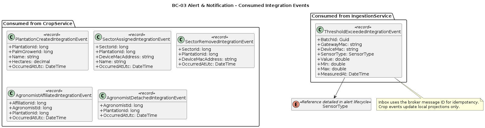
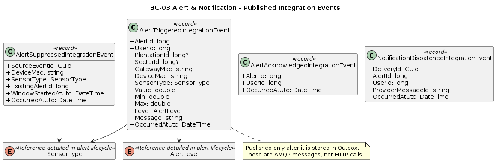
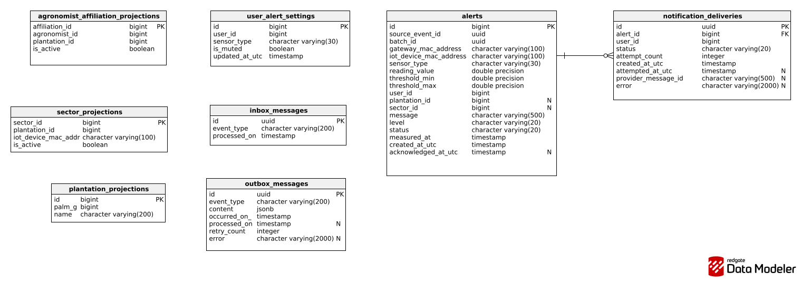

## 5.3.5. Bounded Context Software Architecture Component Level Diagrams

Aqui se presenta el diagrama C4 de componentes del container AlertService. Se lee de izquierda a derecha: el API Gateway enruta solicitudes HTTP hacia los controllers; estos delegan mutaciones a `AlertCommandService` y lecturas a `AlertQueryService`. Los comandos consultan repositorios, confirman cambios mediante `AlertDbContext` como Unit of Work y escriben eventos de reconocimiento en Outbox.

En paralelo, IngestionService y CropService publican sus eventos hacia el **Message Broker** implementado con RabbitMQ. `IntegrationEventConsumer` los entrega a `IntegrationEventHandlers`, que ejecuta la comprobación Inbox dentro de su transacción, aplica las políticas de clasificación y duplicidad, mantiene proyecciones y encola eventos salientes. `OutboxPublisher` publica eventos `alert.*.v1`; `NotificationDispatcher` recupera entregas pendientes, registra sus cambios y solicita el envío al adaptador Firebase. PostgreSQL es exclusivamente propiedad de AlertService y Firebase permanece como sistema externo.

**Comunicación externa.** Las flechas IngestionService → Message Broker → AlertService y CropService → Message Broker → AlertService expresan mensajería asíncrona; no representan llamadas HTTP directas ni acceso a las bases de datos de esos bounded contexts. La forma de cilindro identifica el broker compartido, no una base de datos de AlertService.

| Componente | Responsabilidad principal |
|---|---|
| REST Controllers | Traducir HTTP y JWT en commands y queries. |
| Alert Command/Query Services | Coordinar reconocimientos, settings y vistas autorizadas. |
| Integration Event Handlers | Procesar eventos de Ingestion/Crop de forma idempotente. |
| Inbox / Outbox | Evitar reprocesamiento y garantizar publicación confiable. |
| Notification Dispatcher / Firebase Adapter | Entregar alertas críticas por FCM y registrar resultados. |

### 5.3.6.1. Bounded Context Domain Layer Class Diagrams

- Detalla `Alert`, `NotificationDelivery`, estados, tipos sensoriales y la composición `Alert 1 — 0..N NotificationDelivery`, con sus invariantes de reconocimiento y despacho.

---
 

- Detalla la preferencia de silenciamiento por usuario y sensor, junto con el parser del tipo sensorial.

---
 

- Presenta las proyecciones recibidas de Crop y las políticas de clasificación y duplicidad, distinguiendo asociaciones lógicas de FKs físicas.

---
 

- Presenta repositorios y `IUnitOfWork` con las operaciones que persisten agregados, preferencias, entregas y proyecciones privadas. |

---
 

- Presenta los dos commands de reconocimiento y actualización de preferencias, con sus tipos de dominio de destino. |

---
 

- Presenta las cinco queries de alertas y configuraciones del usuario. |

---
 

- Presenta el evento consumido desde Ingestion y los cinco eventos de Crop que alimentan el modelo local mediante Inbox. |

---
 

- Presenta los cuatro eventos emitidos por Alert mediante Outbox después de confirmar la transacción local. 

---
 

### 5.3.6.2. Bounded Context Database Design Diagram

El diagrama representa el esquema físico PostgreSQL de AlertService, derivado de sus migraciones EF Core. Incluye alertas, preferencias de usuario, entregas de notificaciones, proyecciones locales de Crop, Inbox y Outbox. La única FK física de negocio es notification_deliveries.alert_id → alerts.id; las referencias a usuario, plantación y sector no son FKs entre microservicios.

