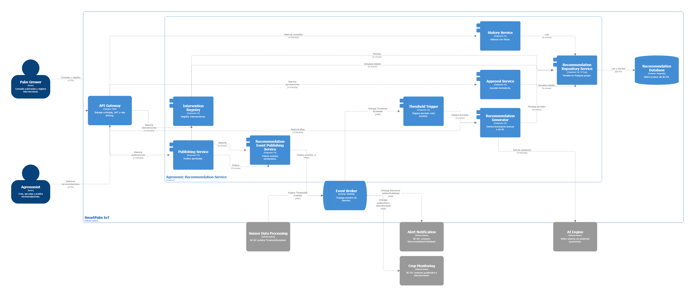
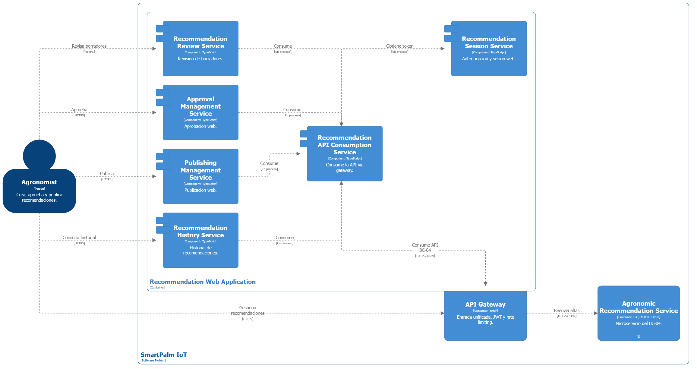
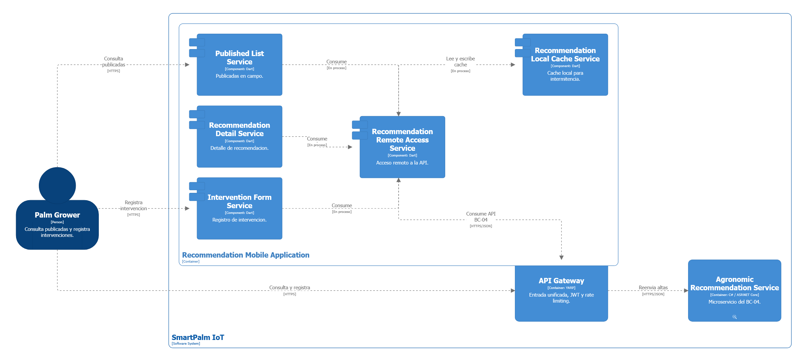
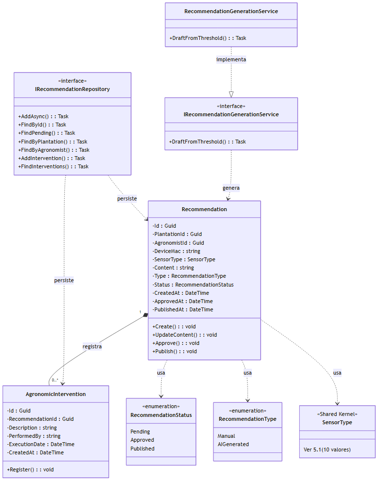
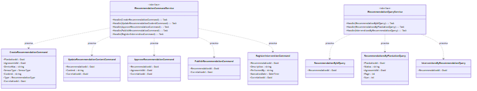
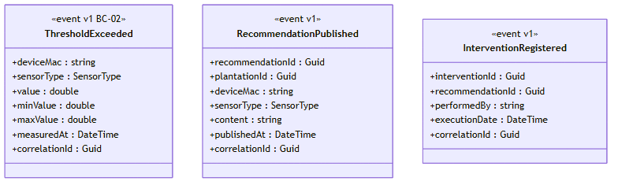
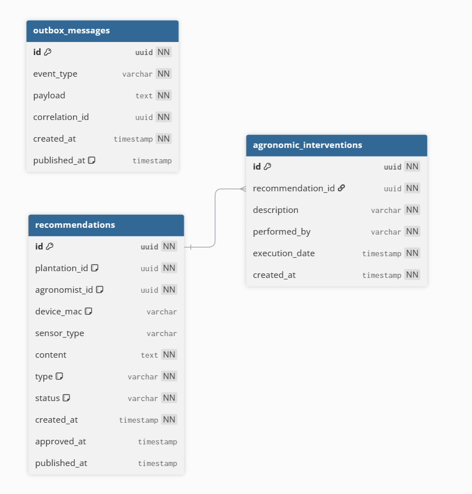

## 5.4. Bounded Context: Agronomic Recommendation.

El bounded context **Agronomic Recommendation** gestiona el ciclo de vida de las recomendaciones agronómicas —borrador, aprobada, publicada— y el registro de las intervenciones que el productor ejecuta en campo: convierte la telemetría ya evaluada (BC-02) en acción agronómica, que luego notifican las alertas (BC-03) y muestra el monitoreo (BC-05). Sin recomendaciones aprobadas no hay manejo que notificar ni avance que monitorear. Por eso se despliega como **microservicio independiente** con base de datos propia, capaz de evolucionar su flujo de aprobación y su integración con IA sin arrastrar al resto de la solución.

Esta sección detalla su diseño táctico en el orden en que se construye y se lee: primero el modelo de dominio con sus reglas (5.4.1), luego la superficie HTTP que lo expone (5.4.2), la orquestación de los flujos (5.4.3), la materialización en persistencia y mensajería (5.4.4), y finalmente las vistas de arquitectura que lo verifican visualmente (5.4.6 y 5.4.7). Las capacidades cubiertas son cinco: generar borradores manuales o asistidos por IA, aprobar y publicar con timestamps, consultar historial con filtros, registrar intervenciones del productor y versionar el contenido editable solo en borrador. El trigger de generación entra por evento desde BC-02; la gestión del ciclo de vida es HTTP por API Gateway.

### 5.4.1. Domain Layer.

La Domain Layer concentra el núcleo del dominio: el agregado `Recommendation`, la entidad `AgronomicIntervention`, las enumeraciones de estado y tipo, las interfaces de repositorio y de servicios, el servicio de generación, además de los commands, queries y eventos de integración que estructuran las operaciones del bounded context.

El agregado se delimita por recomendación: cada `Recommendation` es una unidad de consistencia con su ciclo Pending → Approved → Published, y ninguna intervención existe fuera de su recomendación. El contenido solo se edita en borrador; una vez aprobada, la recomendación es inmutable (si cambia el criterio, se crea una nueva). El diccionario se lee ficha por ficha —categoría, propósito, atributos y métodos— y todo lo que aparece en los diagramas de 5.4.6 y 5.4.7 sale de aquí, sin elementos de más. `SensorType` no se redefine: se referencia el shared kernel de 5.1 para tipificar la variable que originó la recomendación.

##### 1. Recommendation

| Campo | Detalle |
|---|---|
| **Nombre** | Recommendation |
| **Categoría** | Entity / Aggregate Root |
| **Propósito** | Propuesta de manejo para el cultivo, generada por agrónomo o asistida por IA, con ciclo de aprobación y publicación. |

**Atributos**

| Nombre | Tipo de dato | Visibilidad | Descripción |
|---|---|---|---|
| Id | Guid | private | Identificador único, generable offline sin coordinación. |
| PlantationId | Guid | private | Plantación objetivo. Referencia lógica a BC-06, sin FK. |
| AgronomistId | Guid | private | Agrónomo responsable. Referencia lógica a BC-07, sin FK. |
| DeviceMac | string | private | Nodo cuyo exceso originó el borrador. Referencia lógica a BC-01. |
| SensorType | SensorType | private | Variable que originó el borrador (shared kernel 5.1). |
| Content | string | private | Detalle técnico. Editable solo en Pending. |
| Type | RecommendationType | private | Manual o asistida por IA. |
| Status | RecommendationStatus | private | Pending / Approved / Published. |
| CreatedAt | DateTime | private | Fecha de generación del borrador. |
| ApprovedAt | DateTime | private | Fecha de aprobación. Nula hasta aprobar. |
| PublishedAt | DateTime | private | Fecha de publicación. Nula hasta publicar. |

**Métodos**

| Nombre | Tipo de retorno | Visibilidad | Descripción |
|---|---|---|---|
| Create | void | public | Alta en estado Pending. |
| UpdateContent | void | public | Reemplaza el contenido; solo en Pending. |
| Approve | void | public | Pending → Approved; registra `ApprovedAt`. |
| Publish | void | public | Approved → Published; registra `PublishedAt`. |

---

##### 2. RecommendationStatus

| Campo | Detalle |
|---|---|
| **Nombre** | RecommendationStatus |
| **Categoría** | Enumeration |
| **Propósito** | Estados del ciclo de vida. El rechazo se modela no aprobando: el borrador expira sin publicar. |

**Valores**

| Nombre | Descripción |
|---|---|
| Pending | Borrador pendiente de aprobación. |
| Approved | Aprobada por el agrónomo, aún no visible. |
| Published | Publicada y visible para el productor. |

---

##### 3. RecommendationType

| Campo | Detalle |
|---|---|
| **Nombre** | RecommendationType |
| **Categoría** | Enumeration |
| **Propósito** | Origen de la recomendación. |

**Valores**

| Nombre | Descripción |
|---|---|
| Manual | Creada manualmente por un agrónomo. |
| AIGenerated | Borrador asistido por el AI Engine y validado por agrónomo. |

---

##### 4. AgronomicIntervention

| Campo | Detalle |
|---|---|
| **Nombre** | AgronomicIntervention |
| **Categoría** | Entity (hija del agregado `Recommendation`) |
| **Propósito** | Acción ejecutada en campo por el productor tras recibir una recomendación publicada. Sin identidad fuera del agregado. |

**Atributos**

| Nombre | Tipo de dato | Visibilidad | Descripción |
|---|---|---|---|
| Id | Guid | private | Identificador único. |
| RecommendationId | Guid | private | Recomendación base. FK real, misma base. |
| Description | string | private | Descripción de la intervención realizada. |
| PerformedBy | string | private | Nombre de quien la ejecutó. |
| ExecutionDate | DateTime | private | Fecha real de ejecución. |
| CreatedAt | DateTime | private | Fecha de registro en el sistema. |

**Métodos**

| Nombre | Tipo de retorno | Visibilidad | Descripción |
|---|---|---|---|
| Register | void | public | Alta bajo el agregado, solo sobre recomendación Published. |

---

##### 5. IRecommendationRepository

| Campo | Detalle |
|---|---|
| **Nombre** | IRecommendationRepository |
| **Categoría** | Repository (interfaz, contrato del agregado) |
| **Propósito** | Persistencia y consulta de recomendaciones e intervenciones en la base de datos propia del microservicio. |

**Métodos**

| Nombre | Tipo de retorno | Visibilidad | Descripción |
|---|---|---|---|
| AddAsync | Task | public | Agrega una recomendación nueva. |
| FindByIdAsync | Task\<Recommendation?\> | public | Busca por `Id`. Retorna `null` si no existe. |
| FindPendingAsync | Task\<IEnumerable\<Recommendation\>\> | public | Borradores pendientes de aprobación. |
| FindByPlantationAsync | Task\<IEnumerable\<Recommendation\>\> | public | Por plantación, con filtro opcional por estado. |
| FindByAgronomistAsync | Task\<IEnumerable\<Recommendation\>\> | public | Por agrónomo responsable. |
| AddInterventionAsync | Task | public | Agrega una intervención bajo el agregado. |
| FindInterventionsByRecommendationAsync | Task\<IEnumerable\<AgronomicIntervention\>\> | public | Intervenciones de una recomendación. |

---

##### 6. IRecommendationCommandService

| Campo | Detalle |
|---|---|
| **Nombre** | IRecommendationCommandService |
| **Categoría** | Domain Service (interfaz) |
| **Propósito** | Contrato del servicio que procesa el ciclo de vida e intervenciones. |

**Métodos**

| Nombre | Tipo de retorno | Visibilidad | Descripción |
|---|---|---|---|
| Handle(CreateRecommendationCommand) | Task | public | Alta en Pending. |
| Handle(UpdateRecommendationContentCommand) | Task | public | Edición solo en Pending. |
| Handle(ApproveRecommendationCommand) | Task | public | Pending → Approved. |
| Handle(PublishRecommendationCommand) | Task | public | Approved → Published; publica `RecommendationPublished`. |
| Handle(RegisterInterventionCommand) | Task | public | Alta de intervención; publica `InterventionRegistered`. |

---

##### 7. IRecommendationQueryService

| Campo | Detalle |
|---|---|
| **Nombre** | IRecommendationQueryService |
| **Categoría** | Domain Service (interfaz) |
| **Propósito** | Contrato del servicio de consultas. |

**Métodos**

| Nombre | Tipo de retorno | Visibilidad | Descripción |
|---|---|---|---|
| Handle(RecommendationByIdQuery) | Task\<Recommendation?\> | public | Por `Id`. Retorna `null` si no existe. |
| Handle(RecommendationsByPlantationQuery) | Task\<IEnumerable\<Recommendation\>\> | public | Por plantación con filtros y paginación. |
| Handle(InterventionsByRecommendationQuery) | Task\<IEnumerable\<AgronomicIntervention\>\> | public | Intervenciones de una recomendación. |

---

##### 8. IRecommendationGenerationService + RecommendationGenerationService

| Campo | Detalle |
|---|---|
| **Nombre** | IRecommendationGenerationService / RecommendationGenerationService |
| **Categoría** | Domain Service (interfaz + implementación) |
| **Propósito** | Generar el borrador ante un exceso: manual directo o asistido por el AI Engine con fallback a manual ante timeout. |
| **Método** | `DraftFromThreshold` → borrador en Pending con origen citado. |

---

##### 9. Commands

Objetos inmutables que encapsulan intención de cambio. Todos viajan con `CorrelationId` para trazabilidad e idempotencia.

| Nombre | Parámetros | Descripción |
|---|---|---|
| CreateRecommendationCommand | PlantationId, AgronomistId, DeviceMac, SensorType, Content, Type, CorrelationId | Alta en Pending. |
| UpdateRecommendationContentCommand | RecommendationId, Content, CorrelationId | Edición solo en Pending. |
| ApproveRecommendationCommand | RecommendationId, AgronomistId, CorrelationId | Pending → Approved. |
| PublishRecommendationCommand | RecommendationId, CorrelationId | Approved → Published. |
| RegisterInterventionCommand | RecommendationId, Description, PerformedBy, ExecutionDate, CorrelationId | Alta de intervención. |

---

##### 10. Queries

Objetos inmutables de solo lectura.

| Nombre | Parámetros | Descripción |
|---|---|---|
| RecommendationByIdQuery | RecommendationId | Una recomendación. |
| RecommendationsByPlantationQuery | PlantationId, Status (opcional), AgronomistId (opcional), Page, Size | Historial con filtros. |
| InterventionsByRecommendationQuery | RecommendationId | Intervenciones de una recomendación. |

---

##### 11. Eventos de integración

BC-04 consume un evento v1 de BC-02 y publica dos propios, todos sobre RabbitMQ con entrega al menos una vez; los consumidores son idempotentes y existe dead-letter queue.

Consumido (BC-02):

| Nombre | Versión | Cuándo | Contenido mínimo |
|---|---|---|---|
| ThresholdExceeded | v1 | Lectura fuera de rango. | deviceMac, sensorType, value, minValue, maxValue, measuredAt, correlationId |

Publicados (BC-04):

| Nombre | Versión | Cuándo | Contenido mínimo |
|---|---|---|---|
| RecommendationPublished | v1 | Publicación confirmada. | recommendationId, plantationId, deviceMac, sensorType, content, publishedAt, correlationId |
| InterventionRegistered | v1 | Intervención registrada. | interventionId, recommendationId, performedBy, executionDate, correlationId |

---

### 5.4.2. Interface Layer.

Punto de entrada HTTP del microservicio. Todo el tráfico pasa por el API Gateway: agrónomos y administradores con JWT según rol para gestionar el ciclo de vida, y productores para consultar publicadas y registrar intervenciones. Todos los endpoints requieren autenticación. Los controllers delegan en Application mediante assemblers que convierten entre recursos y commands o queries.

El gateway es la única puerta: concentra autenticación por rol de modo que ningún endpoint quede anónimo. Los controllers son deliberadamente delgados —validan forma, convierten y delegan— para que las reglas vivan en dominio y aplicación, no en HTTP. Los resources son los contratos versionables de la API y los assemblers los traducen en ambas direcciones sin que el dominio conozca detalles web.

##### 1. RecommendationsController

| Campo | Detalle |
|---|---|
| **Nombre** | RecommendationsController |
| **Categoría** | Controller |
| **Ruta base** | `api/v1/recommendations` (vía API Gateway) |
| **Propósito** | Ciclo de vida completo e intervenciones. |

**Métodos**

| Nombre | Verbo HTTP | Ruta | Auth | Tipo de retorno | Descripción |
|---|---|---|---|---|---|
| GetRecommendationById | GET | `/{id}` | JWT-User | 200 OK | Detalle de una recomendación. |
| GetRecommendations | GET | `/` | JWT-User | 200 OK | Por `plantationId`, filtrable por `status` y `agronomistId`, con paginado. |
| CreateRecommendation | POST | `/` | JWT-Agronomist | 201 Created | Alta en Pending. |
| UpdateRecommendationContent | PATCH | `/{id}/content` | JWT-Agronomist | 200 OK | Edición solo en Pending. |
| ApproveRecommendation | POST | `/{id}/approve` | JWT-Agronomist | 200 OK | Pending → Approved. |
| PublishRecommendation | POST | `/{id}/publish` | JWT-Agronomist | 200 OK | Approved → Published. |
| RegisterIntervention | POST | `/{id}/interventions` | JWT-User | 201 Created | Alta de intervención (solo sobre Published). |
| GetInterventionsByRecommendationId | GET | `/{id}/interventions` | JWT-User | 200 OK | Intervenciones de una recomendación. |

##### 2. Resources

Records inmutables de petición y respuesta.

| Nombre | Campos | Descripción |
|---|---|---|
| CreateRecommendationResource | plantationId, agronomistId, deviceMac, sensorType, content, type | Solicitud de alta. |
| UpdateContentResource | content | Solicitud de edición. |
| InterventionResource | description, performedBy, executionDate | Solicitud de intervención. |
| RecommendationViewResource | id, plantationId, content, type, status, createdAt, approvedAt, publishedAt | Respuesta de recomendación. |
| InterventionViewResource | id, description, performedBy, executionDate | Respuesta de intervención. |

##### 3. Assemblers

Clases estáticas que transforman entre recursos y objetos de dominio.

| Nombre | Método | Descripción |
|---|---|---|
| CreateRecommendationCommandFromResourceAssembler | ToCommandFromResource(CreateRecommendationResource) | Alta. |
| UpdateContentCommandFromResourceAssembler | ToCommandFromResource(id, UpdateContentResource) | Edición. |
| RegisterInterventionCommandFromResourceAssembler | ToCommandFromResource(id, InterventionResource) | Intervención. |
| RecommendationByIdQueryFromResourceAssembler | ToQueryFromResource(id) | Query por id. |
| RecommendationsByPlantationQueryFromResourceAssembler | ToQueryFromResource(plantationId, status, agronomistId, page, size) | Query con filtros. |
| RecommendationViewResourceFromAggregateAssembler | ToResourceFromAggregate(Recommendation) | Respuesta. |

### 5.4.3. Application Layer.

Orquesta los flujos de negocio: recibe commands, queries y el evento trigger, recupera agregados, aplica reglas de ciclo de vida, persiste mediante Unit of Work y publica eventos con Outbox transaccional (misma transacción del cambio, con relay al broker).

La capa hace cumplir el ciclo: crear deja Pending, editar solo procede en Pending, aprobar exige Pending, publicar exige Approved, e intervenir exige Published. Cada transición confirmada deja su evento en el Outbox dentro de la misma transacción. Las queries solo leen estados ya calculados.

##### 1. RecommendationCommandService

| Campo | Detalle |
|---|---|
| **Nombre** | RecommendationCommandService |
| **Categoría** | Command Service |
| **Propósito** | Flujos del ciclo de vida e intervenciones. |
| **Atributos** | `uow: IUnitOfWork`, `recommendationRepository`, `generation: IRecommendationGenerationService`, `outbox: IOutboxWriter`. |

**Métodos (Handle)**

| Nombre | Descripción |
|---|---|
| Handle(CreateRecommendationCommand) | Crea el agregado en Pending y persiste. |
| Handle(UpdateRecommendationContentCommand) | Recomendación en Pending: reemplaza contenido y persiste; otro estado se rechaza con `409`. |
| Handle(ApproveRecommendationCommand) | Pending → Approved con `ApprovedAt`; persiste. |
| Handle(PublishRecommendationCommand) | Approved → Published con `PublishedAt`; persiste y publica `RecommendationPublished`. |
| Handle(RegisterInterventionCommand) | Recomendación en Published: crea la intervención, persiste y publica `InterventionRegistered`. |

Inexistentes se responden con `404`.

##### 2. RecommendationQueryService

| Campo | Detalle |
|---|---|
| **Nombre** | RecommendationQueryService |
| **Categoría** | Query Service |
| **Propósito** | Lecturas de recomendaciones e intervenciones, sin mutación. |

**Métodos**

| Nombre | Tipo de retorno | Visibilidad | Descripción |
|---|---|---|---|
| Handle(RecommendationByIdQuery) | Task\<Recommendation?\> | public | Una recomendación por `Id`. |
| Handle(RecommendationsByPlantationQuery) | Task\<IEnumerable\<Recommendation\>\> | public | Por plantación con filtros y paginación. |
| Handle(InterventionsByRecommendationQuery) | Task\<IEnumerable\<AgronomicIntervention\>\> | public | Intervenciones de una recomendación. |

##### 3. ThresholdExceededHandler

| Campo | Detalle |
|---|---|
| **Nombre** | ThresholdExceededHandler |
| **Categoría** | Event Handler (RabbitMQ) |
| **Propósito** | Consume `ThresholdExceeded` (BC-02) de forma idempotente por `correlationId` y delega en el generation service la creación del borrador. |

### 5.4.4. Infrastructure Layer.

Materialización del microservicio con persistencia y mensajería propias: base de datos exclusiva con migraciones propias y cero tablas compartidas.

La base propia es lo que hace real el límite del bounded context: el servicio evoluciona, migra y escala sin coordinar esquemas con nadie. La intervención referencia a su recomendación con FK real porque ambas viven en la misma base; plantación, agrónomo y dispositivo son Guid/MAC lógicos sin FK porque viven en otras bases. La mensajería sale por Outbox con relay para que la publicación sobreviva caídas, y la IA se consume como sistema externo falible con timeout y fallback a borrador manual.

##### 1. RecommendationDbContext

| Campo | Detalle |
|---|---|
| **Nombre** | RecommendationDbContext |
| **Categoría** | DbContext propio del microservicio (PostgreSQL, `DATABASE_URL` exclusiva) |
| **Propósito** | Acceso a datos del BC-04. El propio contexto actúa como Unit of Work (`SaveChanges` transaccional junto al Outbox). |
| **Tablas** | `recommendations`, `agronomic_interventions` (FK a recomendación), `outbox_messages`. snake_case. |

##### 2. RecommendationRepository

Implementa la interfaz de dominio con Entity Framework Core sobre el contexto propio, con búsqueda por plantación, estado y agrónomo. Sin dependencias de acceso a datos fuera del servicio.

##### 3. RabbitMqEventPublisher + OutboxRelay

| Campo | Detalle |
|---|---|
| **Nombre** | RabbitMqEventPublisher / OutboxRelay |
| **Categoría** | Messaging (publisher + relay) |
| **Propósito** | Publicar eventos versionados (exchange por tipo, dead-letter queue). El relay drena `outbox_messages` y confirma la publicación; los consumidores son idempotentes por `recommendationId`, `interventionId` y `correlationId`. |

##### 4. AIEngineClient

| Campo | Detalle |
|---|---|
| **Nombre** | AIEngineClient |
| **Categoría** | Integration (infraestructura) |
| **Propósito** | Cliente HTTP al AI Engine externo con timeout: ante falla o timeout, el generation service crea el borrador manual sin bloquear el flujo. |

### 5.4.6. Bounded Context Software Architecture Component Level Diagrams.

Un diagrama por cada container que toca el bounded context. El microservicio descompone en trigger de excesos, generación (manual o vía IA), aprobación, publicación, historial y registro de intervenciones, con repositorio a Postgres propio y publicación a RabbitMQ, todo detrás del API Gateway. BC-02 alimenta por eventos; BC-03 y BC-05 consumen; el AI Engine asiste como sistema externo.

Se leen siguiendo el flujo de datos: la entrada es el exceso de BC-02 o el agrónomo vía gateway, los componentes colaboran hacia el repositorio o el publicador, y las salidas son la base propia, el broker o los BCs consumidores. Cada vista recorta exactamente un container con sus vecinos: nada de lo que no participa aparece, y nada de lo que participa falta.

La aplicación web revisa borradores, aprueba, publica y consulta historial consumiendo la API vía gateway con sesión autenticada. Se lee de izquierda a derecha: el agrónomo entra por revisión, aprobación, publicación e historial, todos convergen en el consumo centralizado con sesión, y de ahí al gateway y al microservicio.

La aplicación móvil muestra publicadas y registra intervenciones en campo con caché local y acceso remoto vía gateway. El flujo espeja al web con el apoyo de campo: caché local para la intermitencia; el acceso remoto es el único que sale al gateway.

### 5.4.7. Bounded Context Software Architecture Code Level Diagrams.

Diagramas de detalle de implementación del bounded context, consistentes con el diccionario de la Domain Layer. Rige una sola regla para las tres láminas: diagrama y diccionario dicen exactamente lo mismo; ante cualquier diferencia, manda el diccionario.

#### 5.4.7.1. Bounded Context Domain Layer Class Diagrams.

Modelo estructural (agregado, entidad, enumeraciones, repositorio y servicio de generación), contratos con mensajes (servicios de comandos/consultas, commands y queries) y eventos de integración (consumido de BC-02 y publicados, todos v1). La primera lámina se lee del agregado hacia afuera —contención y usos—; la segunda, de los servicios hacia sus mensajes mediante la relación "procesa"; la tercera lista los tres eventos con sus payloads. `SensorType` figura como shared kernel definido en 5.1.

#### 5.4.7.2. Bounded Context Database Design Diagram.

Tablas, columnas, constraints y relaciones de la base de datos propia del microservicio. La intervención referencia a su recomendación con FK real porque comparten base; plantación, agrónomo y dispositivo son referencias lógicas sin FK porque viven en otras bases. El Outbox no referencia al dominio con claves foráneas porque los mensajes no son agregados.

