# 5.6. Bounded Context: Field Technical Management

El bounded context **Field Technical Management** registra el trabajo técnico efectuado en campo: visitas, inspecciones —también las capturadas sin conexión—, observaciones e intervenciones agronómicas. `SmartPalm.FieldService` es propietario exclusivo del esquema PostgreSQL `field`. Mantiene proyecciones locales de usuarios, suscripciones, plantaciones, sectores, afiliaciones, alertas y recomendaciones que se actualizan de manera idempotente a partir de eventos de Identity, Crop, Alert y Agronomy. Por tanto, no consulta ni comparte bases de datos externas.

## 5.6.1. Domain Layer

La **Domain Layer** encapsula el ciclo del trabajo de campo y sus reglas. Las raíces de agregado controlan sus propias transiciones de estado; la evidencia pertenece a la inspección; las proyecciones son datos mínimos de otros bounded contexts que permiten validar reglas sin acoplamiento de persistencia.

### 1. FieldVisit

| Campo | Detalle |
|---|---|
| **Nombre** | `FieldVisit` |
| **Categoría** | Aggregate Root |
| **Propósito** | Planificar y controlar el ciclo de una visita técnica a una plantación. |

**Atributos**

| Nombre | Tipo de dato | Visibilidad | Descripción |
|---|---|---|---|
| `Id` | `long` | public get, private set | Identificador persistente. |
| `PlantationId`, `AgronomistId` | `long` | public get, private set | Identificadores externos de la plantación y agrónomo responsable. |
| `ScheduledDate`, `ActualDate` | `DateOnly`, `DateOnly?` | public get, private set | Fecha planificada e inicio real. |
| `Status` | `VisitStatus` | public get, private set | Estado de la visita. |
| `Objectives`, `CancellationReason` | `string`, `string?` | public get, private set | Objetivo de la visita y motivo de cancelación. |
| `CreatedAtUtc`, `CompletedAtUtc` | `DateTime`, `DateTime?` | public get, private set | Auditoría de creación y cierre. |

**Métodos**

| Nombre | Parámetros | Retorno | Descripción e invariantes |
|---|---|---|---|
| `FieldVisit` | `plantationId`, `agronomistId`, `scheduledDate`, `objectives` | — | Exige IDs positivos, fecha actual o futura y objetivos no vacíos. |
| `Start` | — | `void` | Solo pasa de `Planned` a `InProgress` y registra la fecha real. |
| `Complete` | `hasInspections` | `void` | Solo completa una visita en progreso que posee al menos una inspección. |
| `Cancel` | `reason` | `void` | Solo cancela una visita planificada y exige un motivo. |

### 2. FieldInspection

| Campo | Detalle |
|---|---|
| **Nombre** | `FieldInspection` |
| **Categoría** | Aggregate Root |
| **Propósito** | Capturar una inspección de un sector, sus observaciones y vínculos con alertas; soporta sincronización offline. |

**Atributos**

| Nombre | Tipo de dato | Visibilidad | Descripción |
|---|---|---|---|
| `Id` | `long` | public get, private set | Identificador de la inspección. |
| `ClientReference` | `Guid` | public get, private set | Referencia única generada por el cliente para deduplicar capturas y reintentos. |
| `VisitId`, `SectorId`, `PlantationId`, `AgronomistId` | `long` | public get, private set | Contexto de la inspección. |
| `InspectedAtUtc`, `RegisteredAtUtc` | `DateTime` | public get, private set | Instante observado y registro en el servicio. |
| `SyncStatus` | `SyncStatus` | public get, private set | Estado `Synced` o `PendingSync`. |
| `Observations`, `AlertLinks` | colecciones de solo lectura | public get | Evidencia y enlaces lógicos a AlertService. |

**Métodos**

| Nombre | Parámetros | Retorno | Descripción e invariantes |
|---|---|---|---|
| `FieldInspection` | referencia de cliente, IDs, fecha, `offline` | — | Requiere referencia no vacía e IDs positivos; determina el estado inicial de sincronización. |
| `AddObservation` | descripción, categoría, severidad, fotos, fecha | `void` | Agrega una `FieldObservation` perteneciente a la inspección. |
| `LinkAlert` | `alertId` | `void` | Agrega solo IDs positivos aún no asociados. |
| `MarkSynced` | — | `void` | Marca una captura offline como sincronizada. |

### 3. AgronomicIntervention

| Campo | Detalle |
|---|---|
| **Nombre** | `AgronomicIntervention` |
| **Categoría** | Aggregate Root |
| **Propósito** | Registrar y revisar una acción agronómica trazable hacia una inspección o recomendación. |

**Atributos**

| Nombre | Tipo de dato | Visibilidad | Descripción |
|---|---|---|---|
| `Id`, `PlantationId`, `RegisteredBy` | `long` | public get, private set | Identidad y contexto principal. |
| `SectorId`, `OriginRecommendationId`, `OriginInspectionId` | `long?` | public get, private set | Referencias opcionales de granularidad y trazabilidad. |
| `PerformedBy`, `Description` | `string` | public get, private set | Ejecutante y descripción obligatoria. |
| `Type`, `Status` | `InterventionType`, `InterventionStatus` | public get, private set | Clasificación y resultado de revisión. |
| `ExecutedAtUtc`, `RegisteredAtUtc` | `DateTime` | public get, private set | Tiempos de ejecución y registro. |
| `VerificationNotes`, `VerifiedBy` | `string?`, `long?` | public get, private set | Evidencia de verificación o rechazo. |

**Métodos**

| Nombre | Parámetros | Retorno | Descripción e invariantes |
|---|---|---|---|
| `AgronomicIntervention` | plantación, origen, ejecutante, tipo, descripción y fecha | — | Requiere plantación, registrador, ejecutante y descripción válidos; inicia en `Registered`. |
| `Verify` | `agronomistId`, `notes` | `void` | Solo revisa una intervención aún registrada y exige notas. |
| `Reject` | `agronomistId`, `notes` | `void` | Mantiene las mismas precondiciones y la transición a `Rejected`. |

### 4. Entidades y proyecciones

| Nombre | Categoría | Atributos relevantes | Propósito y relaciones |
|---|---|---|---|
| `FieldObservation` | Entity | `Id`, `InspectionId`, `Description`, `Category`, `Severity`, `PhotoReferencesJson`, `ObservedAtUtc`. | Evidencia de `FieldInspection`; su constructor exige descripción y serializa fotos distintas/no vacías como JSON. |
| `InspectionAlertLink` | Entity | `InspectionId`, `AlertId`. | Enlace compuesto con una alerta externa; no crea una FK entre servicios. |
| `UserProjection` | Projection Entity | `UserId`, `Role`, `HasActiveSubscription`, `UpdatedAtUtc`. | Autoriza usuarios y agrónomos con hechos de Identity. |
| `PlantationProjection` | Projection Entity | `PlantationId`, `PalmGrowerId`, `Name`, `Active`, `UpdatedAtUtc`. | Verifica que una plantación exista y esté activa. |
| `SectorProjection` | Projection Entity | `SectorId`, `PlantationId`, `Name`, `Active`, `UpdatedAtUtc`. | Verifica la pertenencia del sector a la plantación. |
| `AgronomistAffiliationProjection` | Projection Entity | `AffiliationId`, `AgronomistId`, `PlantationId`, `Active`, `UpdatedAtUtc`. | Comprueba afiliación vigente para gestionar campo. |
| `AlertProjection` | Projection Entity | `AlertId`, `PlantationId?`, `SectorId?`, `Status`, `UpdatedAtUtc`. | Permite enlazar una alerta activa y del mismo sector. |
| `RecommendationProjection` | Projection Entity | `RecommendationId`, `AgronomistId`, `SectorId?`, `Content`, `Published`, `UpdatedAtUtc`. | Permite validar una recomendación como origen de intervención. |

### 5. Value objects

| Nombre | Categoría | Valores | Propósito |
|---|---|---|---|
| `VisitStatus` | Enum | `Planned`, `InProgress`, `Completed`, `Cancelled` | Restringe las transiciones de visita. |
| `SyncStatus` | Enum | `Synced`, `PendingSync` | Expresa el estado de captura. |
| `ObservationCategory` | Enum | `Phytosanitary`, `SoilCondition`, `PlantDevelopment`, `Irrigation`, `General` | Clasifica evidencia técnica. |
| `ObservationSeverity` | Enum | `Low`, `Medium`, `High` | Expresa su severidad. |
| `InterventionType` | Enum | `Fertilization`, `PestControl`, `IrrigationAdjustment`, `Pruning`, `SoilAmendment`, `Other` | Tipifica una intervención. |
| `InterventionStatus` | Enum | `Registered`, `Verified`, `Rejected` | Controla el resultado de revisión. |

### 6. Domain services, repositories y Unit of Work

| Nombre | Categoría | Métodos | Propósito |
|---|---|---|---|
| `FieldAccessPolicy` | Domain Service | `EnsureActiveFieldUser`, `EnsureAgronomist`, `EnsurePlantationAccess`. | Exige usuario existente y suscrito, rol `Agronomist` o `Administrator`, plantación activa y afiliación. |
| `InterventionTraceabilityService` | Domain Service | `Validate(intervention, recommendation, inspection)`. | Rechaza recomendaciones no publicadas, sectores incompatibles o una inspección de otra plantación. |
| `IFieldVisitRepository` | Repository port | `FindAsync`, `ListAsync`, `Add`. | Acceso a agenda y agregados de visita. |
| `IFieldInspectionRepository` | Repository port | `FindAsync`, `FindByClientReferenceAsync`, `AnyByVisitAsync`, `ListByPlantationAsync`, `Add`. | Persistencia e idempotencia de inspecciones. |
| `IInterventionRepository` | Repository port | `FindAsync`, listas por plantación/sector/recomendación, `Add`. | Persistencia e historial de intervenciones. |
| `IFieldProjectionRepository` | Repository port | búsquedas y `GetOrCreate*` de proyecciones y afiliaciones. | Puerto para información local recibida por eventos. |
| `IUnitOfWork` | Transaction port | `SaveChangesAsync`, `ExecuteAsync<T>`. | Agrupa estado de negocio y Outbox de forma atómica. |

### 7. Commands, queries y eventos de integración

Los *commands* y *queries* son records que transportan intención o criterios; no contienen reglas de negocio.

| Tipo | Parámetros reales | Propósito |
|---|---|---|
| `PlanVisitCommand` | plantación, agrónomo, fecha, objetivos | Planificar una visita. |
| `StartVisitCommand`, `CompleteVisitCommand` | visita, agrónomo | Iniciar o completar la visita. |
| `CancelVisitCommand` | visita, agrónomo, motivo | Cancelar una visita planificada. |
| `RegisterInspectionCommand` | `ClientReference`, visita, sector, agrónomo, observaciones, fecha, alertas, offline | Registrar una inspección de forma idempotente. |
| `SyncOfflineInspectionsCommand` | visita, agrónomo, lista de inspecciones | Sincronizar evidencia offline en lote. |
| `ObservationInput`, `AddObservationCommand` | datos de evidencia; inspección y observación | Añadir evidencia a una inspección. |
| `LinkInspectionToAlertCommand` | inspección, alerta | Asociar una alerta activa del mismo sector. |
| `RegisterInterventionCommand` | plantación, sector opcional, registrador, ejecutante, tipo, descripción, orígenes, fecha | Registrar una intervención trazable. |
| `VerifyInterventionCommand`, `RejectInterventionCommand` | intervención, agrónomo, notas | Decidir la revisión. |
| `GetVisitsByAgronomistQuery`, `GetVisitByIdQuery` | filtros de agenda; visita | Consultar agenda y detalle. |
| `GetInspectionByIdQuery`, `GetInspectionsByPlantationQuery` | inspección; plantación, sector y fechas | Consultar evidencia de campo. |
| `GetInterventionByIdQuery`, `GetInterventionsByPlantationQuery`, `GetInterventionsBySectorQuery`, `GetInterventionsByRecommendationQuery` | IDs y filtros | Recuperar historial de intervención. |
| `GetTraceabilityChainQuery` | plantación | Expresar una consulta de trazabilidad por plantación. |

| Evento | Campos principales | Rol |
|---|---|---|
| `FieldVisitPlannedIntegrationEvent`, `FieldVisitCompletedIntegrationEvent` | visita, plantación, agrónomo, hora; fecha planificada para el primero | Hechos publicados del ciclo de visita. |
| `FieldInspectionRegisteredIntegrationEvent` | inspección, `ClientReference`, visita, plantación, sector, agrónomo, fechas | Hecho publicado al registrar evidencia. |
| `AgronomicInterventionRegisteredIntegrationEvent` | intervención, plantación/sector, registrador, orígenes, tipo y ejecución | Hecho publicado de trazabilidad. |
| `AgronomicInterventionReviewedIntegrationEvent` | intervención, estado, agrónomo, hora | Resultado publicado de la revisión. |
| `UserCreatedIntegrationEvent`; `SubscriptionCreated/Activated/CancelledIntegrationEvent` | usuario, rol/estado y hora | Eventos consumidos para `UserProjection`. |
| `PlantationCreatedIntegrationEvent`; `SectorAssigned/RemovedIntegrationEvent`; `AgronomistAffiliated/DetachedIntegrationEvent` | IDs, datos de contexto y hora | Eventos consumidos desde Crop para proyecciones y acceso. |
| `AlertTriggeredIntegrationEvent`, `AlertAcknowledgedIntegrationEvent` | alerta, contexto de cultivo/lectura o usuario, hora | Eventos consumidos desde Alert. |
| `RecommendationPublishedIntegrationEvent` | recomendación, agrónomo, sector, contenido, versión, hora | Evento consumido desde Agronomy para trazabilidad. |

## 5.6.2. Interface Layer

La **Interface Layer** del bounded context **Field Technical Management** recibe solicitudes HTTP autenticadas y las transforma en *commands* o *queries*. Los controllers no exponen los agregados directamente: usan *resources* para los contratos HTTP y `FieldAssemblers` para las conversiones.

### 1. FieldVisitsController

| Campo | Detalle |
|---|---|
| **Nombre** | `FieldVisitsController` |
| **Categoría** | Controller REST |
| **Ruta base** | `api/field/visits` |
| **Autorización** | `[Authorize]` |
| **Propósito** | Planificar y controlar el ciclo de visitas técnicas. |

**Atributos**

| Nombre | Tipo de dato | Visibilidad | Descripción |
|---|---|---|---|
| `commands` | `IFieldVisitCommandService` | private primary-constructor parameter | Ejecuta cambios de visita. |
| `queries` | `IFieldVisitQueryService` | private primary-constructor parameter | Recupera agenda y detalle. |

**Métodos**

| Nombre | Verbo HTTP | Ruta | Tipo de retorno | Descripción |
|---|---|---|---|---|
| `PlanFieldVisit` | POST | `/api/field/visits` | `IActionResult` (`201 Created`) | Convierte `PlanVisitResource` en `PlanVisitCommand`. |
| `GetFieldVisitsByAgronomist` | GET | `/api/field/visits` | `IActionResult` (`200 OK`) | Filtra por agrónomo, plantación, estado y fechas. |
| `GetFieldVisitById` | GET | `/api/field/visits/{id}` | `IActionResult` (`200/404`) | Obtiene el detalle de una visita. |
| `StartFieldVisit` | PATCH | `/api/field/visits/{id}/start` | `IActionResult` (`200 OK`) | Inicia desde `VisitActionResource`. |
| `CompleteFieldVisit` | PATCH | `/api/field/visits/{id}/complete` | `IActionResult` (`200 OK`) | Completa una visita con evidencia. |
| `CancelFieldVisit` | PATCH | `/api/field/visits/{id}/cancel` | `IActionResult` (`200 OK`) | Cancela desde `CancelVisitResource`. |

### 2. FieldInspectionsController

| Campo | Detalle |
|---|---|
| **Nombre** | `FieldInspectionsController` |
| **Categoría** | Controller REST |
| **Ruta base** | `api/field` |
| **Autorización** | `[Authorize]` |
| **Propósito** | Registrar, sincronizar y consultar inspecciones y observaciones. |

**Atributos**

| Nombre | Tipo de dato | Visibilidad | Descripción |
|---|---|---|---|
| `commands` | `IFieldInspectionCommandService` | private primary-constructor parameter | Registra inspecciones y modifica su evidencia. |
| `queries` | `IFieldInspectionQueryService` | private primary-constructor parameter | Recupera inspecciones. |

**Métodos**

| Nombre | Verbo HTTP | Ruta | Tipo de retorno | Descripción |
|---|---|---|---|---|
| `RegisterFieldInspection` | POST | `/api/field/visits/{visitId}/inspections` | `IActionResult` (`201 Created`) | Registra una inspección y sus observaciones. |
| `SynchronizeOfflineInspections` | POST | `/api/field/visits/{visitId}/inspections/sync` | `IActionResult` (`200 OK`) | Sincroniza el lote representado por `SyncInspectionsResource`. |
| `GetFieldInspectionById` | GET | `/api/field/inspections/{id}` | `IActionResult` (`200/404`) | Obtiene una inspección con evidencia y alertas. |
| `GetFieldInspectionsByPlantation` | GET | `/api/field/plantations/{plantationId}/inspections` | `IActionResult` (`200 OK`) | Filtra por sector y periodo. |
| `AddInspectionObservation` | POST | `/api/field/inspections/{id}/observations` | `IActionResult` (`200 OK`) | Añade `AddObservationResource`. |
| `LinkInspectionToAlert` | POST | `/api/field/inspections/{id}/alerts` | `IActionResult` (`200 OK`) | Vincula una alerta desde `LinkAlertResource`. |

### 3. InterventionsController

| Campo | Detalle |
|---|---|
| **Nombre** | `InterventionsController` |
| **Categoría** | Controller REST |
| **Ruta base** | `api` |
| **Autorización** | `[Authorize]` |
| **Propósito** | Registrar, consultar y revisar intervenciones; conserva contratos heredados bajo `api/v1`. |

**Atributos**

| Nombre | Tipo de dato | Visibilidad | Descripción |
|---|---|---|---|
| `commands` | `IInterventionCommandService` | private primary-constructor parameter | Registra, verifica y rechaza intervenciones. |
| `queries` | `IInterventionQueryService` | private primary-constructor parameter | Consulta por ID, plantación, sector o recomendación. |
| `projections` | `IFieldProjectionRepository` | private primary-constructor parameter | Obtiene el sector de la proyección para la ruta compatible. |

**Métodos**

| Nombre | Verbo HTTP | Ruta | Tipo de retorno | Descripción |
|---|---|---|---|---|
| `RegisterIntervention` | POST | `/api/field/interventions` | `IActionResult` (`201 Created`) | Registra `RegisterFieldInterventionResource`. |
| `RegisterSectorIntervention` | POST | `/api/v1/sectors/{sectorId}/interventions` | `IActionResult` (`201 Created`) | Mantiene el contrato heredado y usa el claim JWT `sub`. |
| `GetAgronomicInterventionById` | GET | `/api/field/interventions/{id}` | `IActionResult` (`200/404`) | Retorna el recurso actual. |
| `GetLegacyAgronomicInterventionById` | GET | `/api/v1/interventions/{id}` | `IActionResult` (`200/404`) | Retorna la representación compatible. |
| `ListInterventionsByPlantation` | GET | `/api/field/plantations/{plantationId}/interventions` | `IActionResult` (`200 OK`) | Filtra por sector, tipo, estado y fechas. |
| `ListLegacyInterventionsByPlantation` | GET | `/api/v1/plantations/{plantationId}/interventions` | `IActionResult` (`200 OK`) | Lista con formato heredado. |
| `ListInterventionsBySector` | GET | `/api/v1/sectors/{sectorId}/interventions` | `IActionResult` (`200 OK`) | Lista intervenciones del sector. |
| `ListInterventionsByRecommendation` | GET | `/api/v1/recommendations/{recommendationId}/interventions` | `IActionResult` (`200 OK`) | Lista intervenciones originadas por recomendación. |
| `VerifyIntervention` | PATCH | `/api/field/interventions/{id}/verify` | `IActionResult` (`200 OK`) | Verifica con `ReviewInterventionResource`. |
| `RejectIntervention` | PATCH | `/api/field/interventions/{id}/reject` | `IActionResult` (`200 OK`) | Rechaza con `ReviewInterventionResource`. |

### 4. Resources y transformadores

| Nombre | Categoría | Propósito |
|---|---|---|
| `PlanVisitResource`, `VisitActionResource`, `CancelVisitResource` | Request resources | Transportan la planificación y los cambios de estado de visitas. |
| `RegisterInspectionResource`, `SyncInspectionsResource`, `SyncInspectionItemResource` | Request resources | Transportan capturas online u offline. |
| `ObservationInputResource`, `AddObservationResource`, `LinkAlertResource` | Request resources | Transportan evidencia y el identificador de una alerta. |
| `RegisterFieldInterventionResource`, `RegisterInterventionResource`, `ReviewInterventionResource` | Request resources | Soportan contrato actual, heredado y decisión de revisión. |
| `FieldVisitResource`, `FieldInspectionResource`, `FieldObservationResource`, `AgronomicInterventionResource`, `LegacyAgronomicInterventionResource` | Response resources | Exponen el estado necesario sin revelar entidades EF. |
| `FieldAssemblers` | Static assembler | Construye commands, convierte agregados a resources y analiza enums de consulta. |

## 5.6.3. Application Layer

La **Application Layer** coordina los casos de uso, aplica autorización sobre las proyecciones locales, invoca la lógica del agregado y persiste el cambio junto a su evento de salida. Los controllers no contienen reglas de transición.

| Nombre | Categoría | Dependencias y métodos | Responsabilidad |
|---|---|---|---|
| `FieldVisitCommandService` | Command Service | Repositorios de visita/inspección, UoW, Outbox y `FieldAuthorizationService`; cuatro `HandleAsync`. | Planifica, inicia, completa y cancela; publica eventos de planificación/completitud. |
| `FieldInspectionCommandService` | Command Service | Repositorios de visita, inspección y proyección, UoW, Outbox, autorización. | Deduplica por `ClientReference`, registra/sincroniza inspecciones, evidencia y alertas. |
| `InterventionCommandService` | Command Service | Repositorios, proyecciones, autorización, trazabilidad, UoW y Outbox. | Registra, verifica y rechaza intervenciones publicando los hechos correspondientes. |
| `FieldVisitQueryService` | Query Service | `IFieldVisitRepository`; dos `HandleAsync`. | Obtiene agenda y detalle sin modificar estado. |
| `FieldInspectionQueryService` | Query Service | `IFieldInspectionRepository`; dos `HandleAsync`. | Obtiene inspecciones por ID o plantación. |
| `InterventionQueryService` | Query Service | `IInterventionRepository`; cuatro `HandleAsync`. | Obtiene intervenciones por ID, plantación, sector o recomendación. |
| `FieldAuthorizationService` | Application Domain Service | `IFieldProjectionRepository`, `FieldAccessPolicy`; `EnsureAgronomistAccessAsync`, `EnsureFieldUserAccessAsync`. | Traduce reglas de acceso en consultas locales. |
| `IntegrationEventHandlers` | Event Handler | Proyecciones, `IInbox`, UoW; doce sobrecargas `HandleAsync` y `OnceAsync`. | Actualiza proyecciones de Identity, Crop, Alert y Agronomy de forma idempotente. |
| `IIntegrationEventWriter`, `IInbox` | Application ports | `Enqueue`; `HasProcessedAsync`, `MarkProcessed`. | Abstraen Outbox e Inbox del caso de uso. |

`OnceAsync` primero revisa si el `Guid` del mensaje existe en Inbox; de no existir, aplica el handler, marca el mensaje procesado y guarda la transacción. Una redelivery no vuelve a modificar la proyección.

## 5.6.4. Infrastructure Layer

La **Infrastructure Layer** implementa los puertos mediante EF Core, PostgreSQL y RabbitMQ. Cada tabla pertenece al servicio y los IDs de otros contextos se guardan solo como proyecciones locales.

| Nombre | Categoría | Implementación y responsabilidad |
|---|---|---|
| `FieldDbContext` | EF Core DbContext / `IUnitOfWork` | Mapea el esquema `field`, agrega `DbSet` de agregados, evidencia, proyecciones, Inbox y Outbox; `ExecuteAsync<T>` confirma o revierte la transacción. |
| `FieldVisitRepository` | EF repository | Implementa agenda y búsqueda de visitas. |
| `FieldInspectionRepository` | EF repository | Implementa búsquedas por ID, `ClientReference`, visita y plantación. |
| `InterventionRepository` | EF repository | Implementa filtros por plantación, sector y recomendación. |
| `FieldProjectionRepository` | EF repository | Materializa y consulta proyecciones locales. |
| `Inbox`, `InboxMessage` | Idempotency adapter / entity | Persiste IDs y tipos de eventos consumidos. |
| `IntegrationEventWriter`, `OutboxMessage`, `OutboxPublisher` | Outbox adapter, entity y hosted service | Registra `field.*.v1` en la transacción y publica con reintentos. |
| `IntegrationEventConsumer` | RabbitMQ consumer | Consume eventos de Identity, Crop, Alert y Agronomy, los despacha y confirma tras procesarlos. |
| `RabbitMqOptions` | Configuration options | Configura conexión, exchange y colas del broker. |
| `FieldDbContextFactory` | Design-time factory | Crea el DbContext para herramientas de migración desde configuración. |
| `FieldDatabaseInitializer` | Initializer | Aplica migraciones al arrancar. |
| `FieldDatabaseHealthCheck` | Health check | Comprueba la disponibilidad para readiness. |
| `DependencyInjection` | Composition root | Registra PostgreSQL con `UseSnakeCaseNamingConvention`, repositorios, servicios y hosted services. |

Las FK internas son `field_inspections.visit_id → field_visits.id`, `field_observations.inspection_id → field_inspections.id`, `inspection_alert_links.inspection_id → field_inspections.id` y `agronomic_interventions.origin_inspection_id → field_inspections.id` (nullable). Los IDs de usuario, plantación, sector, alerta y recomendación no son FKs cruzadas.

## 5.6.5. Bounded Context Software Architecture Component Level Diagrams

A continuación se muestra el diagrama C4 de componentes del container FieldService:

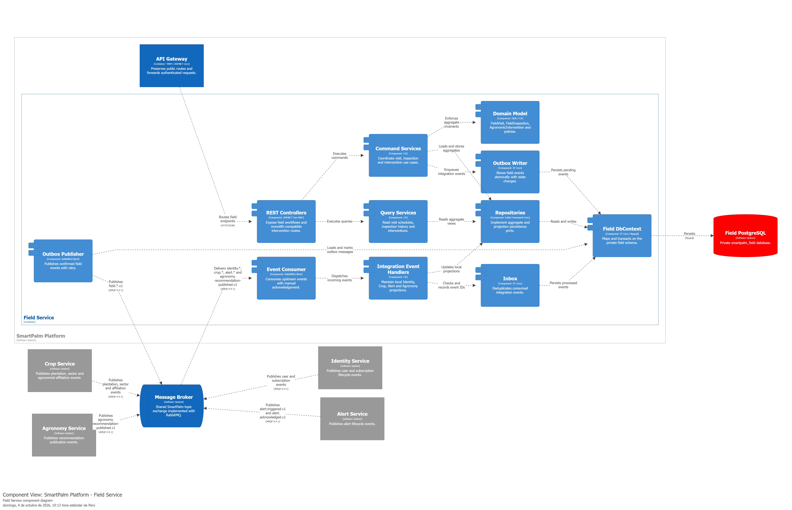

Presenta la entrada desde API Gateway, los controllers, command/query services, el modelo de dominio, repositorios, `FieldDbContext`, Inbox, Outbox y PostgreSQL.

**Comunicación externa.** IdentityService, CropService, AlertService y AgronomyService no invocan directamente a FieldService ni acceden a su base de datos. Publican eventos en el **Message Broker** (RabbitMQ); el `IntegrationEventConsumer` de FieldService los recibe por AMQP y delega en `IntegrationEventHandlers`. Esta decisión mantiene consistencia eventual de proyecciones y evita dependencias síncronas entre bounded contexts.

## 5.6.6. Bounded Context Software Architecture Code Level Diagrams

### 5.6.6.1. Bounded Context Domain Layer Class Diagrams

Las once fuentes siguientes son vistas complementarias del mismo Domain Layer; se subdividen por capacidad de visitas, inspecciones, intervenciones, acceso, trazabilidad y mensajería para preservar atributos, métodos, visibilidad y relaciones sin concentrar todo el modelo en una sola imagen.

- Detalla el agregado `FieldVisit`, sus transiciones y la regla que exige una inspección antes de completar la visita. 
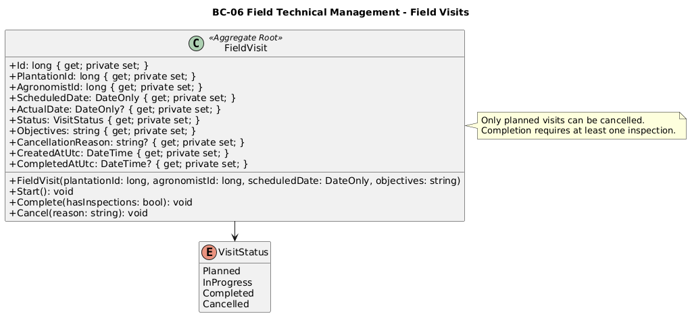
---
 

- Detalla `FieldInspection`, observaciones, enlaces a alertas, sincronización offline y las composiciones internas. 
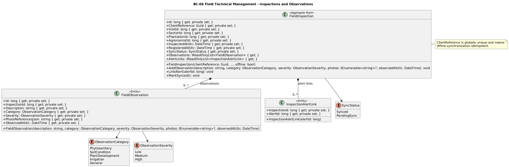
---
 

- Detalla `AgronomicIntervention`, tipos, estados, referencia opcional a la inspección originadora e invariantes de revisión. 
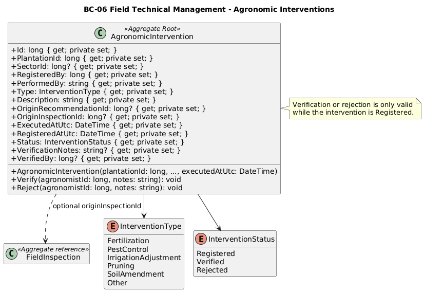
---
 

- Presenta proyecciones de usuarios, plantaciones, sectores y afiliaciones, la política de acceso y los puertos de visitas e inspecciones.
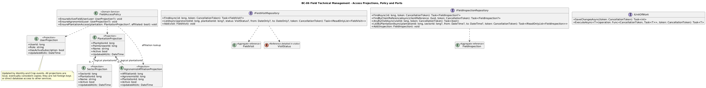
---
 

- Presenta proyecciones de alertas y recomendaciones, validación de trazabilidad y los puertos de intervenciones y proyecciones.
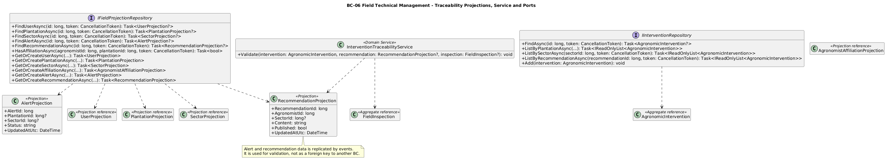
---
 

- Presenta contratos de planificación, inicio, finalización, cancelación y consulta de visitas.
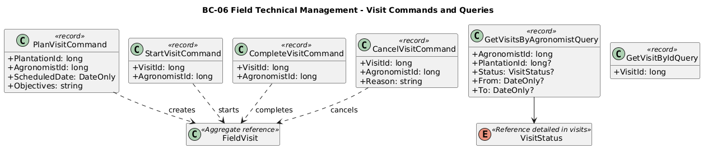
---
 

- Presenta contratos de registro, observaciones, enlace a alertas, consulta e idempotencia de sincronización offline. 
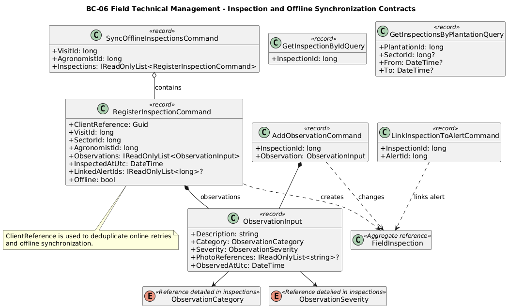
---
 

- Presenta contratos de intervención, revisión y consultas de historial y cadena de trazabilidad.
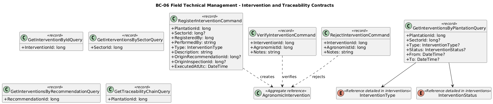
---
 

- Presenta los cinco eventos emitidos por Field mediante Outbox. 
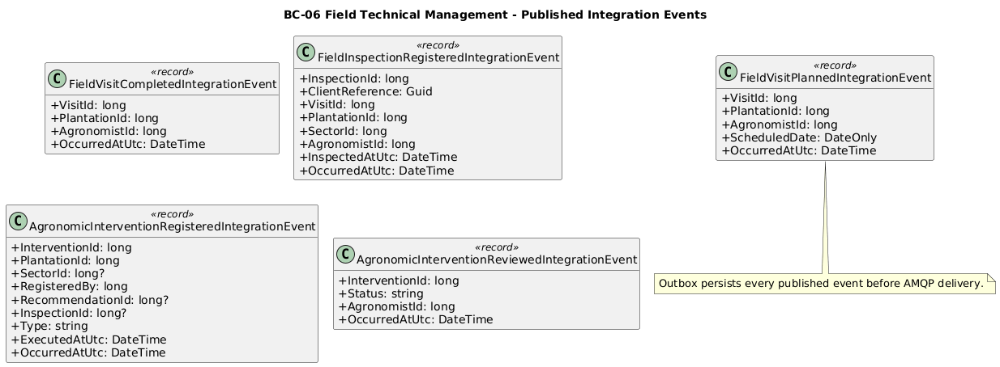
---
 

- Presenta los nueve eventos que forman las proyecciones locales de identidad, suscripción, plantación, sector y afiliación.
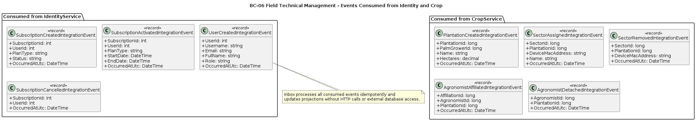
---
 

- Presenta los eventos de alerta y recomendación publicados que enriquecen la trazabilidad local.
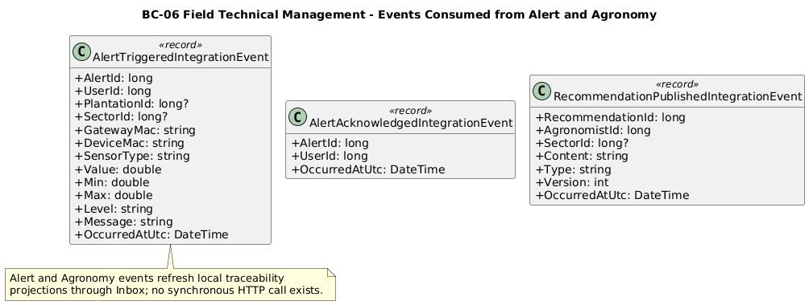
---
 

### 5.3.6.2. Bounded Context Database Design Diagram

El diagrama presenta el esquema físico PostgreSQL de FieldService: visitas, inspecciones, observaciones, enlaces con alertas, intervenciones, proyecciones locales, Inbox y Outbox. Las FKs internas preservan la consistencia entre visitas, inspecciones, observaciones e intervenciones. Los datos de usuarios, plantaciones, sectores, alertas y recomendaciones se mantienen como proyecciones o identificadores locales actualizados por eventos.

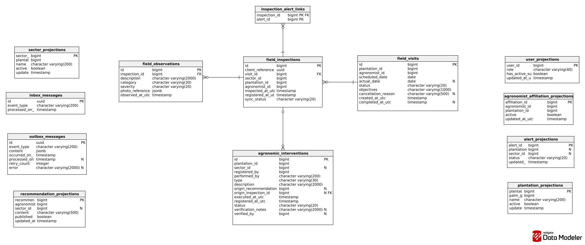