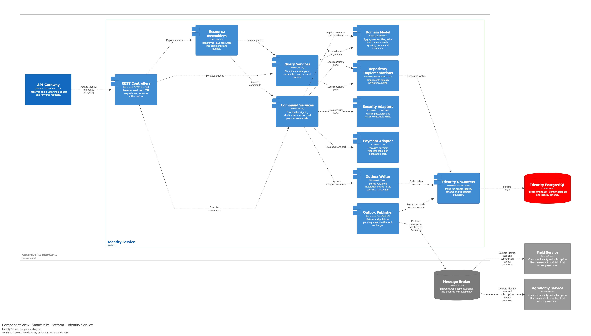
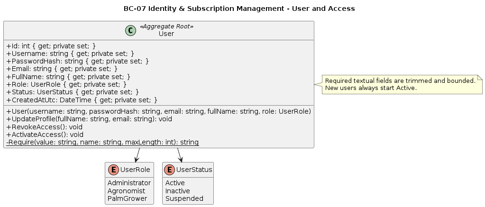
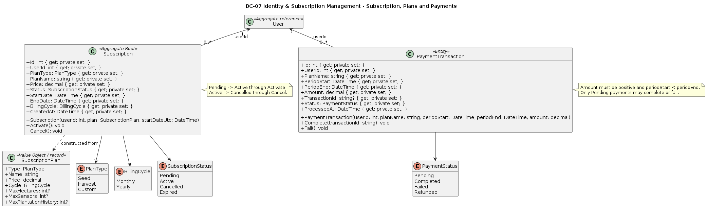
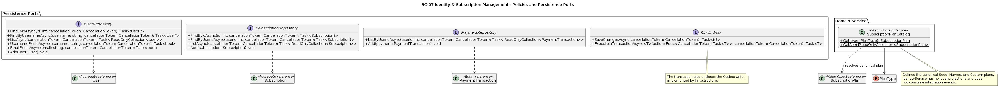
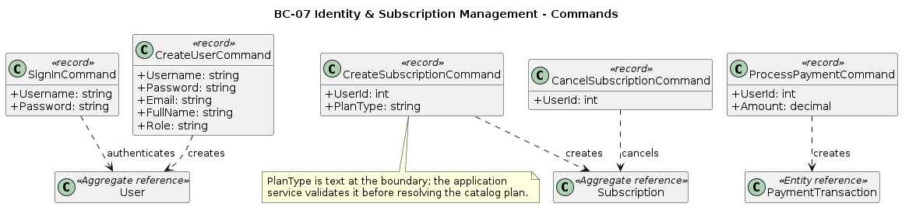
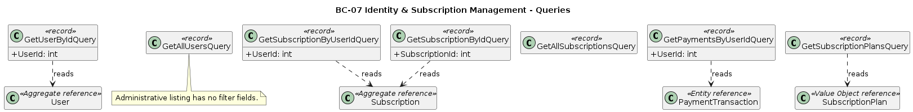
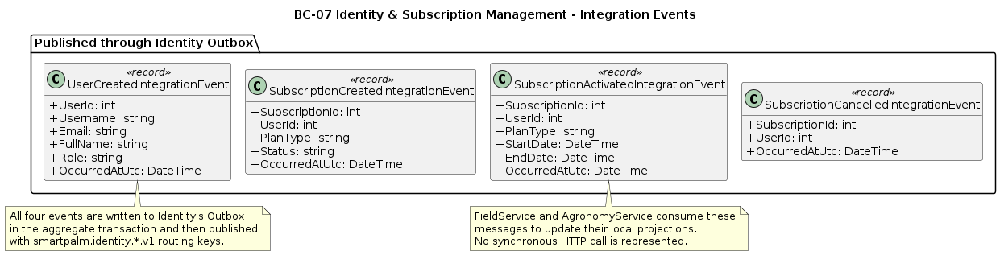
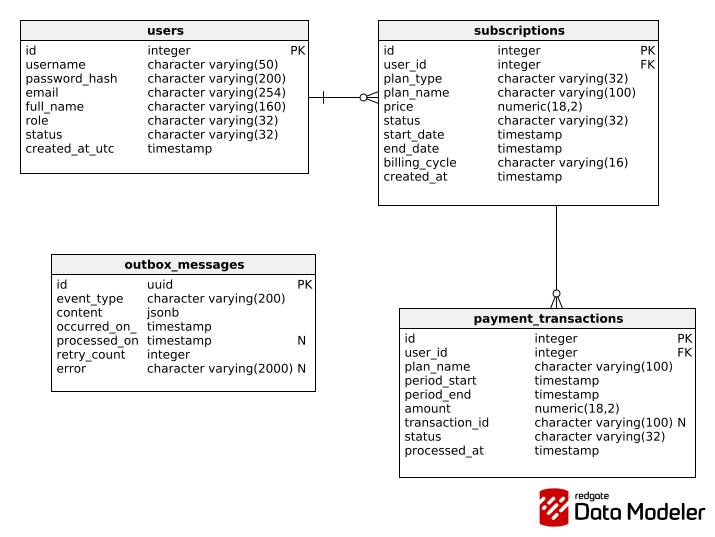

## 5.7. Bounded Context: Identity & Subscription Management

El bounded context **Identity & Subscription Management** es la autoridad de usuarios, autenticación, roles, planes, suscripciones y pagos de SmartPalm. `SmartPalm.IdentityService` es propietario del esquema PostgreSQL `identity`, preserva los claims JWT y contratos HTTP existentes, y publica hechos versionados mediante Outbox hacia el **Message Broker** implementado con RabbitMQ. Ningún bounded context consulta directamente su base de datos.

IdentityService no consume eventos ni mantiene proyecciones locales. FieldService y AgronomyService consumen de forma asíncrona los eventos de usuario y suscripción para materializar sus propias proyecciones de acceso.

## 5.7.1. Domain Layer

La **Domain Layer** no depende de ASP.NET Core, EF Core, RabbitMQ, BCrypt, JWT ni del procesador de pagos. Sus agregados encapsulan las transiciones de identidad, suscripción y pago; los repositorios y la unidad de trabajo son abstracciones que implementa la infraestructura.

### 1. User

| Campo | Detalle |
|---|---|
| **Nombre** | `User` |
| **Categoría** | Aggregate Root |
| **Propósito** | Representar identidad, credenciales hasheadas, rol y estado de acceso de un usuario SmartPalm. |

**Atributos**

| Nombre | Tipo de dato | Visibilidad | Descripción |
|---|---|---|---|
| `Id` | `int` | public get, private set | Identificador persistente. |
| `Username`, `PasswordHash` | `string` | public get, private set | Nombre único y hash BCrypt de la credencial. |
| `Email`, `FullName` | `string` | public get, private set | Datos de perfil validados. |
| `Role`, `Status` | `UserRole`, `UserStatus` | public get, private set | Rol de autorización y estado de acceso. |
| `CreatedAtUtc` | `DateTime` | public get, private set | Instante de creación UTC. |

**Métodos**

| Nombre | Parámetros | Retorno | Descripción e invariantes |
|---|---|---|---|
| `User` | username, password hash, email, nombre, rol | — | Exige textos no vacíos y límites de longitud; los usuarios nuevos empiezan `Active`. |
| `UpdateProfile` | nombre completo, email | `void` | Actualiza datos tras la misma validación de campos requeridos. |
| `RevokeAccess` | — | `void` | Transita el estado a `Inactive`. |
| `ActivateAccess` | — | `void` | Transita el estado a `Active`. |
| `Require` | valor, nombre, longitud máxima | `string` | Método privado estático que normaliza y valida texto. |

### 2. Subscription

| Campo | Detalle |
|---|---|
| **Nombre** | `Subscription` |
| **Categoría** | Aggregate Root |
| **Propósito** | Representar el plan contratado, su periodo de vigencia y el ciclo de estado de una suscripción. |

**Atributos**

| Nombre | Tipo de dato | Visibilidad | Descripción |
|---|---|---|---|
| `Id`, `UserId` | `int` | public get, private set | Identificador y referencia interna hacia `User`. |
| `PlanType`, `PlanName`, `Price`, `BillingCycle` | enum, `string`, `decimal`, enum | public get, private set | Instantánea del plan canónico contratado. |
| `Status` | `SubscriptionStatus` | public get, private set | Estado pendiente, activo, cancelado o expirado. |
| `StartDate`, `EndDate`, `CreatedAt` | `DateTime` | public get, private set | Vigencia normalizada en UTC y auditoría de creación. |

**Métodos**

| Nombre | Parámetros | Retorno | Descripción e invariantes |
|---|---|---|---|
| `Subscription` | usuario, `SubscriptionPlan`, fecha de inicio | — | Requiere usuario positivo; copia el plan, calcula un mes o año de vigencia y empieza `Pending`. |
| `Activate` | — | `void` | Solo permite la transición `Pending → Active`. |
| `Cancel` | — | `void` | Solo permite la transición `Active → Cancelled`. |

### 3. PaymentTransaction y SubscriptionPlan

| Nombre | Categoría | Atributos | Métodos y propósito |
|---|---|---|---|
| `PaymentTransaction` | Entity | `Id`, `UserId`, `PlanName`, periodo, monto, `TransactionId`, `Status`, `ProcessedAt`. | El constructor exige usuario válido, monto positivo y periodo ordenado. `Complete(transactionId)` y `Fail()` solo operan si el pago está `Pending`. |
| `SubscriptionPlan` | Value Object / record | `Type`, nombre, precio, ciclo y límites opcionales de hectáreas, sensores e historial. | Es inmutable; es una descripción canónica de oferta y no una entidad persistente. |
| `SubscriptionPlanCatalog` | Static Domain Service | No mantiene estado. | `Get(type)` resuelve los planes Seed, Harvest o Custom; `GetAll()` devuelve el catálogo completo. |

### 4. Enumeraciones, repositorios y Unit of Work

| Nombre | Categoría | Valores o métodos | Propósito |
|---|---|---|---|
| `UserRole` | Enum | `Administrator`, `Agronomist`, `PalmGrower` | Define autorización de usuario. |
| `UserStatus` | Enum | `Active`, `Inactive`, `Suspended` | Restringe acceso y autenticación. |
| `PlanType`, `BillingCycle` | Enums | Seed/Harvest/Custom; mensual/anual | Definen la oferta y la vigencia. |
| `SubscriptionStatus`, `PaymentStatus` | Enums | Estados de suscripción y pago | Restringen transiciones de negocio. |
| `IUserRepository` | Repository port | búsquedas por ID/nombre, existencias, lista y `Add` | Persistencia de `User`. |
| `ISubscriptionRepository` | Repository port | búsquedas por ID/usuario, lista y `Add` | Persistencia de `Subscription`. |
| `IPaymentRepository` | Repository port | lista por usuario y `Add` | Persistencia de `PaymentTransaction`. |
| `IUnitOfWork` | Transaction port | `SaveChangesAsync`, `ExecuteInTransactionAsync<T>` | Agrupa cambios de agregado y escritura Outbox. |

### 5. Commands, queries y eventos de integración

| Tipo | Campos | Propósito |
|---|---|---|
| `SignInCommand` | usuario, contraseña | Expresa autenticación con credenciales. |
| `CreateUserCommand` | usuario, contraseña, email, nombre, rol | Solicita el alta de una identidad. |
| `CreateSubscriptionCommand` | usuario, tipo de plan como texto | Solicita una suscripción y permite validar el plan en aplicación. |
| `CancelSubscriptionCommand` | usuario | Solicita la cancelación de la suscripción vigente. |
| `ProcessPaymentCommand` | usuario, monto | Solicita pagar y activar una suscripción pendiente. |
| `GetUserByIdQuery`, `GetAllUsersQuery` | ID; sin campos | Consultan perfiles de usuarios. |
| `GetSubscriptionByUserIdQuery`, `GetSubscriptionByIdQuery`, `GetAllSubscriptionsQuery` | usuario, suscripción; sin campos | Consultan estado de suscripciones. |
| `GetPaymentsByUserIdQuery`, `GetSubscriptionPlansQuery` | usuario; sin campos | Consultan pagos y catálogo de planes. |
| `UserCreatedIntegrationEvent` | usuario, nombre, email, nombre completo, rol, hora | Hecho publicado al registrar usuario. |
| `SubscriptionCreatedIntegrationEvent` | suscripción, usuario, plan, estado, hora | Hecho publicado al crear una suscripción pendiente. |
| `SubscriptionActivatedIntegrationEvent` | suscripción, usuario, plan, inicio, fin, hora | Hecho publicado tras un pago exitoso y activación. |
| `SubscriptionCancelledIntegrationEvent` | suscripción, usuario, hora | Hecho publicado al cancelar una suscripción activa. |

Los cuatro eventos se registran en Outbox dentro de la transacción de negocio y se publican con claves `smartpalm.identity.*.v1`; no son llamadas HTTP directas.

## 5.7.2. Interface Layer

La **Interface Layer** recibe solicitudes HTTP, aplica las políticas de autorización declaradas en los controllers y transforma *resources* en commands o queries. Las respuestas son contratos de aplicación, por lo que las entidades del dominio y persistencia no se exponen a los clientes.

### 1. AuthenticationController

| Campo | Detalle |
|---|---|
| **Nombre** | `AuthenticationController` |
| **Categoría** | Controller REST |
| **Ruta base** | `api/v1/Authentication` |
| **Autorización** | `AllowAnonymous` en inicio de sesión |
| **Propósito** | Validar credenciales y emitir un JWT compatible con los clientes existentes. |

| Atributo | Tipo | Visibilidad | Descripción |
|---|---|---|---|
| `service` | `IdentityCommandService` | private primary-constructor parameter | Ejecuta el caso de uso de autenticación. |

| Método | Verbo HTTP | Ruta | Retorno | Descripción |
|---|---|---|---|---|
| `SignIn` | POST | `/api/v1/Authentication/sign-in` | `IActionResult` (`200/401`) | Convierte `SignInResource` en command y devuelve `AuthenticatedUserResponse` con JWT. |

### 2. UsersController y AdminUsersController

| Controller | Ruta base / autorización | Dependencias | Métodos HTTP |
|---|---|---|---|
| `UsersController` | `api/v1/users`; `Administrator` | `IdentityQueryService` | `GetAllUsers` — GET `/`; `GetUserById` — GET `/{id}` (`200/404`). |
| `AdminUsersController` | `api/v1/admin/users`; `Administrator` | `IdentityCommandService`, `IdentityQueryService` | `CreateUser` — POST `/` (`201/400`); `ListUsers` — GET `/`; `GetUserById` — GET `/{userId}` (`200/404`). |

Ambos controllers devuelven `UserResponse`. `CreateUser` usa `CreateUserResource` y su assembler; los listados construyen `GetAllUsersQuery` y las búsquedas `GetUserByIdQuery`.

### 3. SubscriptionsController

| Campo | Detalle |
|---|---|
| **Nombre** | `SubscriptionsController` |
| **Categoría** | Controller REST |
| **Ruta base** | `api/v1/subscriptions` |
| **Propósito** | Consultar planes, suscripción y pagos del usuario autenticado, y cancelar la suscripción vigente. |

| Atributo | Tipo | Visibilidad | Descripción |
|---|---|---|---|
| `commandService` | `SubscriptionCommandService` | private primary-constructor parameter | Cancela suscripciones. |
| `queryService` | `SubscriptionQueryService` | private primary-constructor parameter | Obtiene planes, suscripciones y pagos. |

| Método | Verbo HTTP | Ruta | Autorización / respuesta | Descripción |
|---|---|---|---|---|
| `ListPlans` | GET | `/api/v1/subscriptions/plans` | `AllowAnonymous`, `200` | Devuelve el catálogo de `PlanResponse`. |
| `GetSubscription` | GET | `/api/v1/subscriptions` | `Authorize`, `200/404` | Usa el claim `sid` o `sub` para recuperar la suscripción actual. |
| `CancelSubscription` | DELETE | `/api/v1/subscriptions` | `Authorize`, `200/400/404` | Cancela la suscripción del usuario autenticado. |
| `ListPayments` | GET | `/api/v1/subscriptions/payments` | `Authorize`, `200` | Lista los pagos del usuario autenticado. |

### 4. AdminSubscriptionsController

| Campo | Detalle |
|---|---|
| **Nombre** | `AdminSubscriptionsController` |
| **Categoría** | Controller REST administrativo |
| **Ruta base** | `api/v1/admin/subscriptions` |
| **Autorización** | `Administrator` |
| **Propósito** | Crear, consultar y cobrar suscripciones en representación de un usuario. |

| Atributo | Tipo | Visibilidad | Descripción |
|---|---|---|---|
| `commandService` | `SubscriptionCommandService` | private primary-constructor parameter | Crea suscripciones y procesa pagos. |
| `queryService` | `SubscriptionQueryService` | private primary-constructor parameter | Consulta suscripciones. |

| Método | Verbo HTTP | Ruta | Retorno | Descripción |
|---|---|---|---|---|
| `CreateSubscription` | POST | `/api/v1/admin/subscriptions` | `201/400/404` | Transforma `CreateSubscriptionResource` en command. |
| `ListSubscriptions` | GET | `/api/v1/admin/subscriptions` | `200` | Lista las suscripciones. |
| `GetSubscriptionById` | GET | `/api/v1/admin/subscriptions/{subscriptionId}` | `200/404` | Obtiene una suscripción por ID. |
| `ProcessPayment` | POST | `/api/v1/admin/subscriptions/users/{userId}/payments` | `201/400/404` | Transforma `ProcessPaymentResource` en command y procesa el pago. |

### 5. Resources, assemblers y health checks

| Nombre | Categoría | Propósito |
|---|---|---|
| `SignInResource`, `CreateUserResource`, `CreateSubscriptionResource`, `ProcessPaymentResource` | Request resources | Contienen solamente los datos de transporte de cada comando. |
| `IdentityResourceAssemblers` | Static assembler | Convierte resources a commands y mantiene el contrato HTTP separado de Domain. |
| `AuthenticatedUserResponse`, `UserResponse`, `PlanResponse`, `SubscriptionResponse`, `InactiveSubscriptionResponse`, `PaymentResponse` | Application response contracts | Evitan exponer agregados y entidades directamente. |
| `DatabaseHealthCheck` | Health check | Comprueba PostgreSQL para `/health/ready`; `/health/live` es verificación de proceso. |

## 5.7.3. Application Layer

La **Application Layer** orquesta los capabilities de autenticación, alta de usuario, administración de suscripciones y cobro. Valida datos de frontera, llama a los agregados y repositorios, y escribe el evento de integración en la misma transacción que el cambio de estado.

| Nombre | Categoría | Dependencias y métodos | Responsabilidad |
|---|---|---|---|
| `IdentityCommandService` | Command Service | `IUserRepository`, password/token ports, Outbox y UoW; `SignInAsync`, `CreateAsync`. | Autentica, comprueba estado `Active`, valida duplicados, hashea contraseña, crea usuario y publica `user-created`. |
| `IdentityQueryService` | Query Service | `IUserRepository`; dos sobrecargas `HandleAsync`. | Devuelve usuario por ID o listado como `UserResponse`. |
| `SubscriptionCommandService` | Command Service | repositorios, `IPaymentProcessor`, Outbox y UoW; `CreateAsync`, `CancelAsync`, `ProcessPaymentAsync`. | Crea pendiente, cancela activa o procesa pago, completa transacción y activa la suscripción. |
| `SubscriptionQueryService` | Query Service | repositorios de suscripción/pago; catálogo. | Devuelve planes, suscripciones activas/inactivas, listados y pagos. |
| `IPasswordHasher` | Security port | `Hash`, `Verify`. | Desacopla BCrypt del caso de uso. |
| `ITokenIssuer` | Security port | `Create(User)`. | Emite JWT con `sub`, `sid`, `name`, `role` y `jti`. |
| `IPaymentProcessor` | External-service port | `ProcessAsync(payment, token)`. | Aísla el proveedor de cobros. |
| `IIntegrationEventWriter` | Messaging port | `Enqueue(eventType, payload)`. | Aísla la escritura de Outbox. |

## 5.7.4. Infrastructure Layer

La **Infrastructure Layer** implementa los puertos con EF Core, PostgreSQL, BCrypt, JWT, un adaptador de pago local y RabbitMQ. IdentityService solo publica mensajes, por lo que no requiere consumer ni Inbox.

| Nombre | Categoría | Implementación y responsabilidad |
|---|---|---|
| `IdentityDbContext` | EF Core DbContext / `IUnitOfWork` | Mapea usuarios, suscripciones, pagos y Outbox en el esquema `identity`; ejecuta transacciones con estrategia de reintento. |
| `UserRepository`, `SubscriptionRepository`, `PaymentRepository` | EF repositories | Implementan los tres puertos de persistencia. |
| `PasswordHasher` | Security adapter | Usa BCrypt con factor 12 para hash y verificación. |
| `JwtTokenIssuer` | Security adapter | Firma JWT HMAC-SHA256 y conserva los claims requeridos por los clientes. |
| `LocalPaymentProcessor` | Payment adapter | Implementa el puerto de cobro de forma reemplazable para entorno local. |
| `IntegrationEventWriter`, `OutboxMessage`, `OutboxPublisher` | Outbox adapter, entity y hosted service | Persisten JSONB en la transacción y publican lotes de 50 mensajes pendientes con reintentos. |
| `JwtOptions`, `RabbitMqOptions`, `SeedOptions` | Configuration options | Enlazan las opciones de JWT, broker y datos semilla. |
| `IdentityDbContextFactory`, `IdentityDatabaseInitializer` | Design-time factory / initializer | Habilitan migraciones y las aplican al arranque. |
| `DependencyInjection` | Composition root | Registra DbContext con `UseSnakeCaseNamingConvention`, puertos, servicios y publisher. |

Las relaciones físicas privadas son `subscriptions.user_id → users.id` y `payment_transactions.user_id → users.id`. `username` y `email` son únicos; el contenido del Outbox es JSONB. No hay FK o acceso de datos hacia FieldService o AgronomyService.

## 5.7.6. Bounded Context Software Architecture Component Level Diagrams

El diagrama C4 de componentes del container IdentityService presenta la entrada HTTP por API Gateway, controllers, assemblers, command/query services, modelo de dominio, repositorios, `IdentityDbContext`, seguridad, pago y Outbox.

**Comunicación externa.** IdentityService publica `smartpalm.identity.*.v1` hacia el **Message Broker**. FieldService y AgronomyService consumen esos eventos para sus proyecciones locales; las flechas representan AMQP asíncrono, no llamadas HTTP ni acceso directo a `smartpalm_identity`.

## 5.7.7. Bounded Context Software Architecture Code Level Diagrams

### 5.7.7.1. Bounded Context Domain Layer Class Diagrams

Las seis fuentes PlantUML son perspectivas complementarias del mismo Domain Layer, no modelos separados. Se distribuyen por responsabilidad de negocio y contratos para conservar el detalle de miembros y relaciones sin producir una única imagen ilegible.

- Detalla el agregado `User`, sus credenciales, rol, estado de acceso, operaciones de perfil y la invariante de creación activa. 

---
 

- Detalla `Subscription`, `PaymentTransaction`, `SubscriptionPlan` y sus estados, además de sus asociaciones lógicas con el usuario de la lámina anterior. 

---
 

- Presenta `SubscriptionPlanCatalog`, los tres repositorios y `IUnitOfWork`; aclara que Identity no tiene proyecciones ni consume eventos. 

---
 

- Presenta los cinco commands de autenticación, creación de usuarios, suscripción, cancelación y pago, junto con sus agregados de destino. 

---
 

- Presenta las siete queries de usuarios, suscripciones, pagos y catálogo de planes con sus tipos de lectura. 

---
 

- Presenta los cuatro eventos publicados mediante Outbox y sus consumidores conceptuales Field/Agronomy. 

---
 

### 5.7.7.2. Bounded Context Database Design Diagram

El diagrama representa el esquema físico PostgreSQL de IdentityService, compuesto por usuarios, suscripciones, transacciones de pago y Outbox. Las relaciones subscriptions.user_id y payment_transactions.user_id son FKs internas hacia users.id, mientras los índices únicos de usuario y correo garantizan la identidad única. El Outbox conserva los eventos de usuarios y suscripciones antes de su publicación asíncrona.

