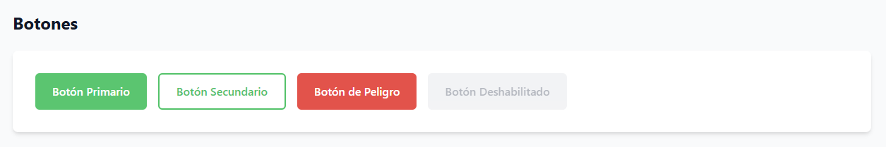
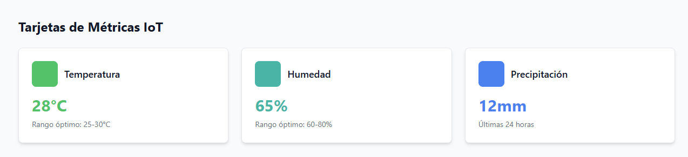
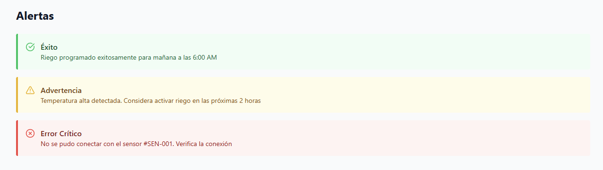
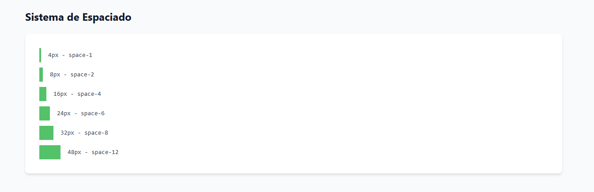

### 6.1.1. General Style Guidelines

La identidad gráfica de SmartPalm se concibió bajo una línea estética agro-tecnológica, fusionando un enfoque contemporáneo y digital con la esencia del entorno agrícola de la Amazonía. El diseño de la interfaz tomó inspiración en la fauna regional, garantizando una marcada homogeneidad visual y narrativa entre el portal web, la app móvil y el hardware IoT.

Durante el proceso de diseño se dio prioridad a la legibilidad en zonas rurales, la estructuración clara de la información y la comprensión inmediata de métricas agronómicas clave. Bajo una filosofía minimalista orientada a paneles de control, se eliminó cualquier elemento secundario prescindible para resaltar de manera directa la información de mayor valor para el usuario.

Se estableció un sistema integral de diseño —que abarca fuentes, código cromático, márgenes y componentes reutilizables— para asegurar la fluidez y coherencia visual en todos los puntos de contacto de la solución. De esta forma se garantiza una interacción intuitiva tanto para agricultores como para especialistas en agronomía.

Estas directrices estéticas sentaron las bases gráficas de SmartPalm, logrando proyectar una imagen sólida, uniforme y fácilmente reconocible a lo largo de todo el ecosistema digital del proyecto.

#### Paleta de colores
La selección cromática se articula en torno a matices de verde, turquesa y azul profundo, tonos que evocan el sector agrícola, la naturaleza y las plataformas tecnológicas de monitoreo. Para la representación de estados del sistema —como notificaciones, avisos y confirmaciones— se incorporó una paleta secundaria específica.

| Elemento | Color | Uso |
|---|---|---|
| Verde principal | `#22C55E` | Botones principales y elementos activos |
| Verde oscuro | `#166534` | Encabezados y navegación |
| Azul oscuro | `#0F172A` | Fondos de dashboard |
| Turquesa | `#14B8A6` | Indicadores IoT y métricas |
| Amarillo | `#EAB308` | Advertencias |
| Rojo | `#EF4444` | Alertas críticas |

#### Tipografía
Se seleccionó una familia tipográfica sans-serif de carácter moderno y optimizada para pantallas, con el fin de asegurar una lectura cómoda tanto en terminales móviles como en monitores de supervisión.

| Elemento | Tamaño |
|---|---|
| Títulos principales | 32px |
| Subtítulos | 24px |
| Texto general | 16px |
| Información secundaria | 14px |

## Componentes visuales
Se estandarizó una biblioteca de elementos modulares para tarjetas, paneles de métricas, notificaciones, diagramas y botones. La implementación de esquinas redondeadas, sombras sutiles y márgenes holgados contribuye a una experiencia visual limpia, fluida y equilibrada.
### Botones

### Metricas

### Alertas

## Iconografía
La línea iconográfica se seleccionó en función de las actividades de supervisión del campo y hardware IoT, empleando símbolos asociados a la red de sensores, variaciones climáticas, niveles de humedad, temperatura, estados de alerta y gestión de cultivos.

## Espaciados

El esquema de espaciados permite estructurar los contenidos de forma ordenada y proporcional, aportando armonía al conjunto visual. Este sistema regula las distancias entre componentes, las separaciones respecto a los bloques de texto y los márgenes interiores y exteriores de cada elemento.

---