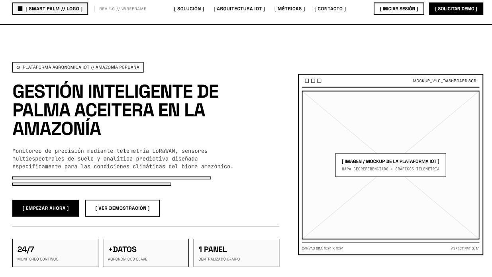
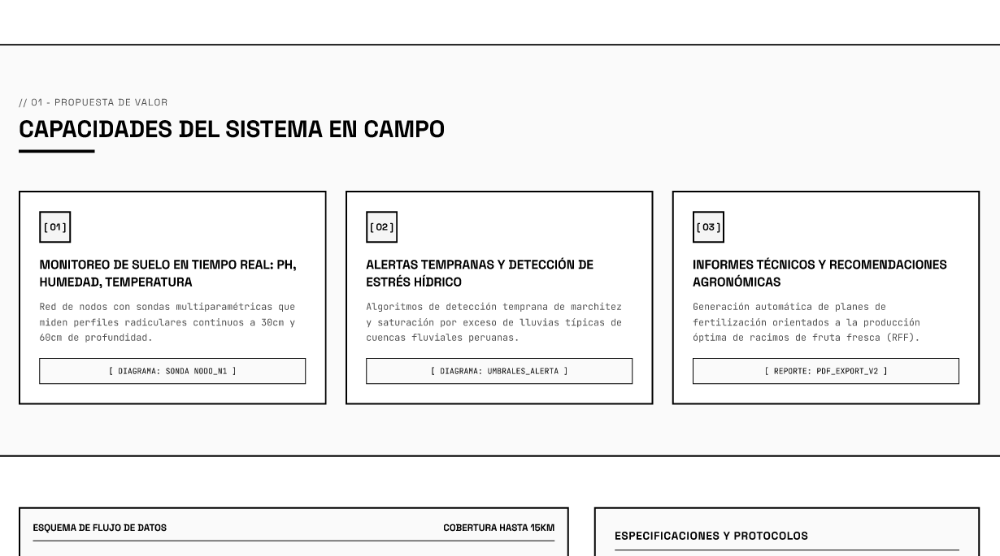
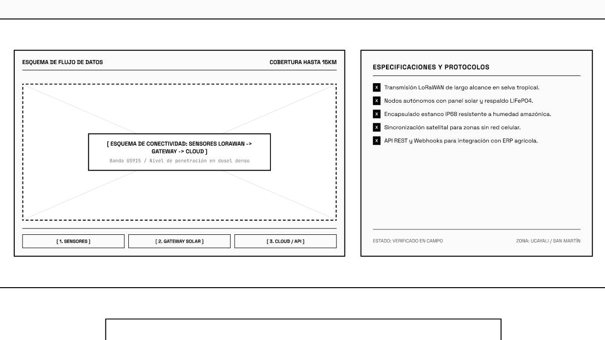
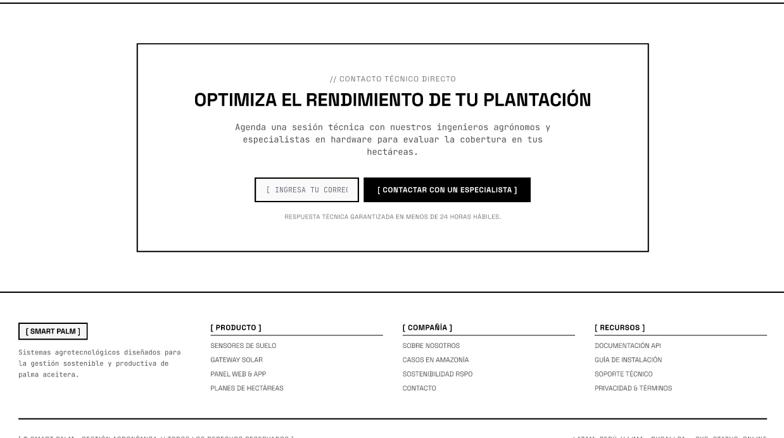
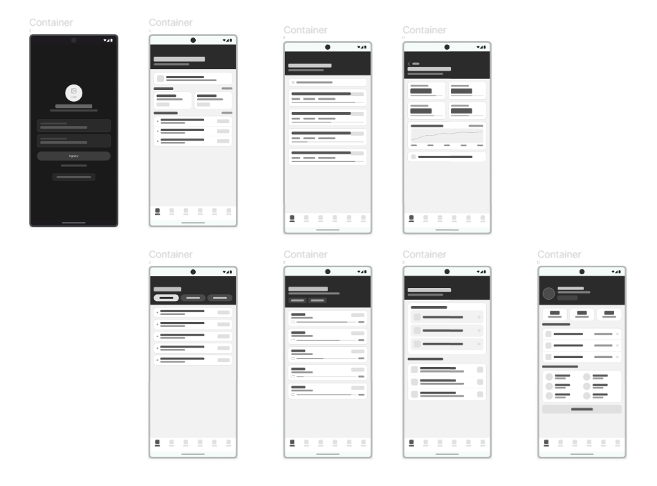

## 6.3 Landing Page UI Design 

Durante la fase inicial del diseño de la interfaz de la página de inicio (landing page), un paso fundamental es la elaboración de un wireframe. Este funciona como un esquema preliminar que representa la disposición y organización de los elementos esenciales de la página. En este caso, se contemplan apartados como la barra de navegación en el área principal, el encabezado o Hero, la sección de servicios, la información corporativa, los testimonios, la opción de descarga y el pie de página.

### 6.3.1 Landing Page Wireframe

Web view 

Mobile view

