# 6.4. Diseño UX/UI de las aplicaciones

SmartPalm ofrece una aplicación web orientada principalmente al agrónomo y una aplicación móvil dirigida al palmicultor. Ambas experiencias comparten el mismo lenguaje visual y presentan la información producida por los microservicios de dispositivos IoT, procesamiento de sensores, alertas, recomendaciones, monitoreo de cultivos, gestión técnica de campo y suscripciones. La interfaz hace visibles los estados de carga, error, falta de permisos, trabajo sin conexión y sincronización pendiente para que el usuario comprenda el estado real de sus operaciones.

## 6.4.1. Wireframes de las aplicaciones

Los wireframes definen la jerarquía, navegación y distribución inicial de los elementos antes de aplicar el estilo visual final. Su organización responde a los objetivos y user stories definidos para los dos segmentos del producto.

### Wireframes de la aplicación web

La aplicación web permite al agrónomo revisar varias plantaciones, interpretar datos y alertas, preparar recomendaciones, registrar inspecciones y consultar reportes.

#### Inicio de sesión

El acceso solicita las credenciales del usuario y conduce al espacio de trabajo asociado a su organización. También contempla la recuperación de contraseña y la comunicación de errores de autenticación.

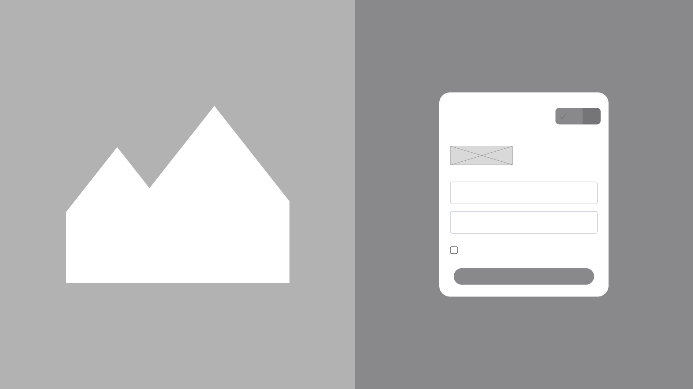

#### Registro

El registro recopila los datos básicos de la cuenta y valida la información antes de crear el usuario. Después del registro, el acceso a plantaciones y dispositivos depende de la organización y del rol asignado.

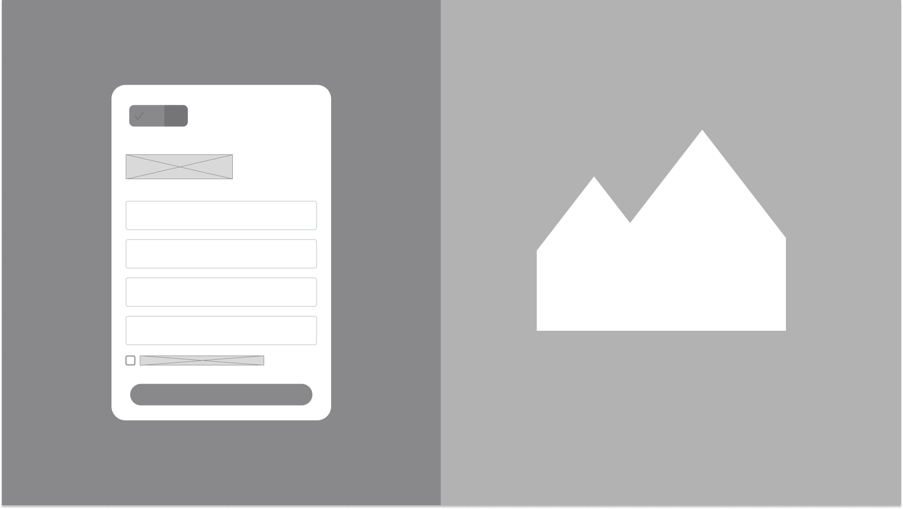

#### Panel principal

El dashboard reúne indicadores de las plantaciones, alertas recientes y accesos a las tareas más frecuentes. Los datos muestran su última fecha de actualización para representar la consistencia eventual entre los servicios.

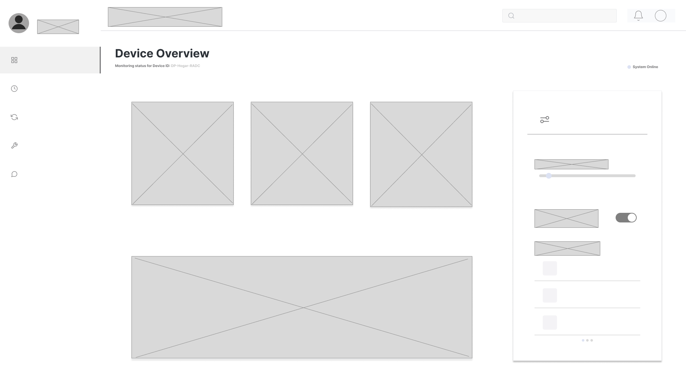

#### Programación del trabajo de campo

La vista de programación se adapta a la gestión de inspecciones y actividades técnicas de campo. Permite identificar una plantación, fijar una fecha, asignar responsables y consultar el estado de cada actividad.

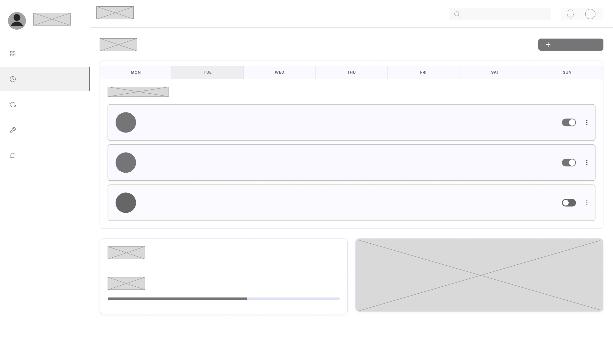

#### Reportes e historial

El historial concentra mediciones, inspecciones, alertas y reportes generados. Los filtros por plantación, rango de fechas y tipo de evento ayudan a localizar información sin mezclar datos de otras organizaciones.

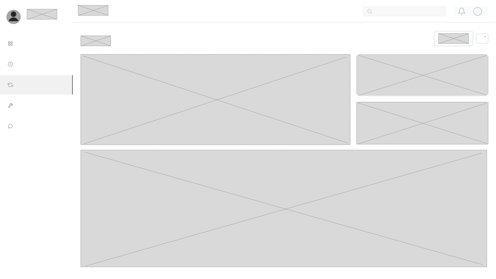

#### Configuración

La configuración permite administrar preferencias de idioma, notificaciones, perfil y parámetros disponibles según el rol. Las acciones restringidas muestran claramente que requieren permisos adicionales.

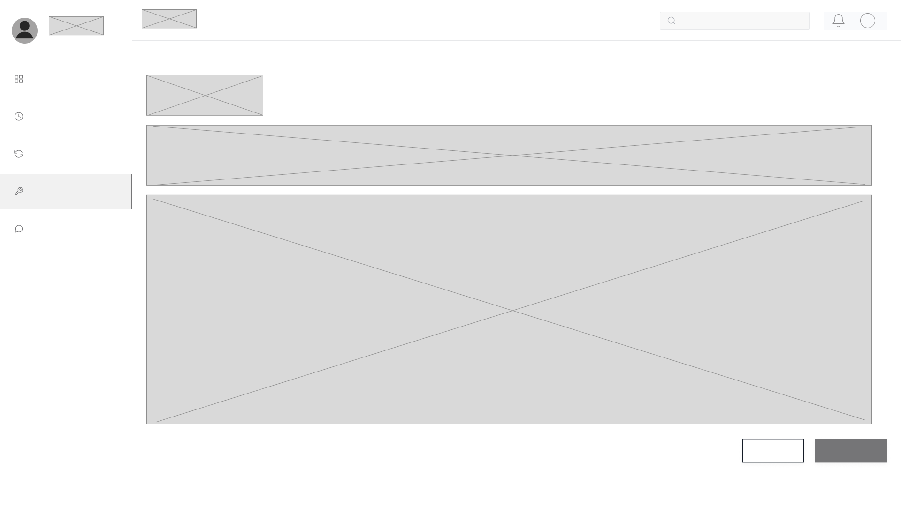

#### Soporte

La sección de soporte reúne preguntas frecuentes y canales para reportar incidencias relacionadas con la cuenta, sensores o sincronización de información.

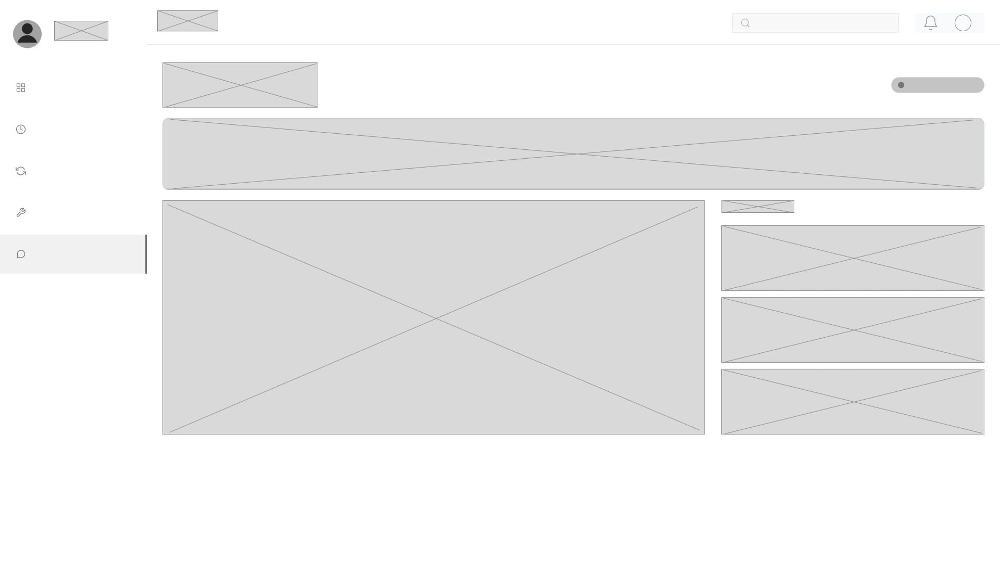

### Wireframes de la aplicación móvil

La aplicación móvil prioriza consultas rápidas en campo, lectura de alertas y acceso a información aun cuando la conectividad sea limitada.

#### Inicio de sesión y acceso sin conexión

El usuario puede iniciar sesión o continuar con los datos previamente sincronizados cuando no dispone de conexión. Las operaciones realizadas sin conexión quedan identificadas como pendientes de sincronización.

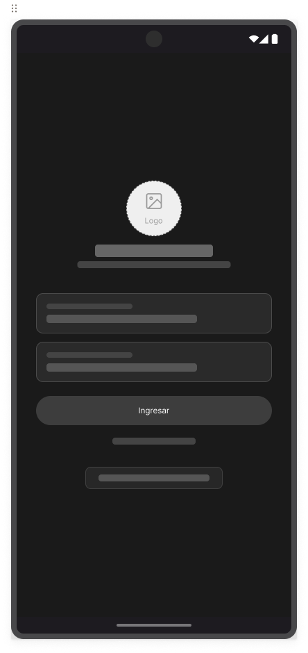

#### Panel principal

La pantalla inicial resume el estado del cultivo, alertas prioritarias y accesos a parcelas, sensores y reportes.

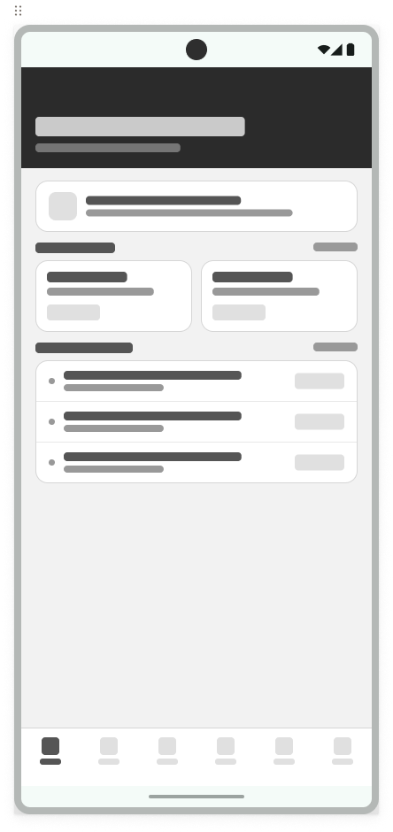

#### Plantaciones

La cartera de plantaciones permite seleccionar la unidad productiva que se desea monitorear y reconocer rápidamente su estado general.

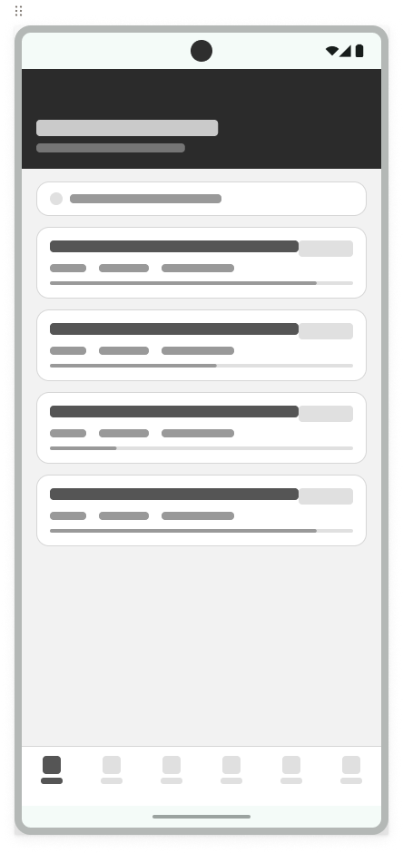

#### Detalle de la plantación

El detalle presenta indicadores de la plantación, zonas, tendencias y fecha de la última medición disponible.

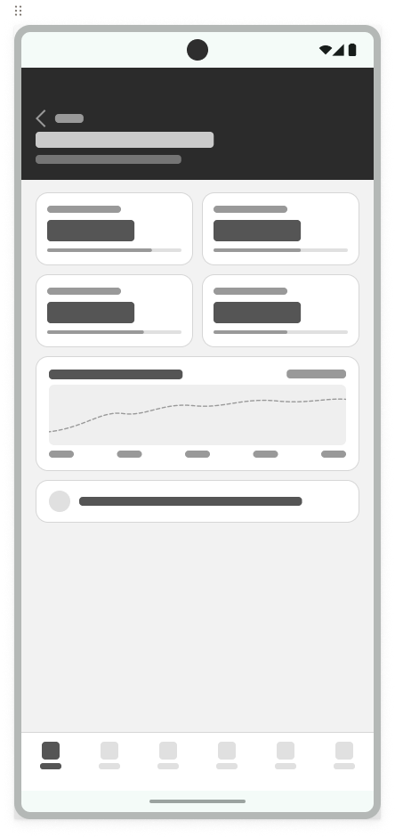

#### Alertas

Las alertas se ordenan por severidad y fecha. Cada elemento conduce al detalle, la evidencia disponible y la recomendación relacionada.

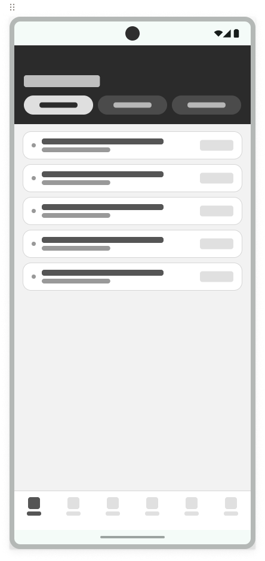

#### Sensores

La vista de sensores muestra estado, conectividad, batería y última lectura de los dispositivos asociados a la plantación.

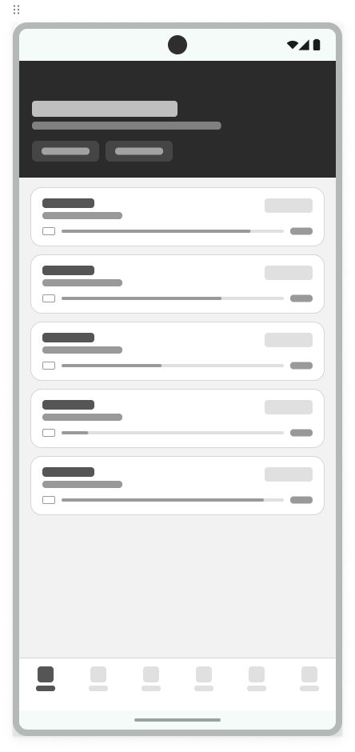

#### Reportes

El usuario puede consultar reportes resumidos por periodo y plantación, con mensajes claros cuando todavía no existen datos suficientes.

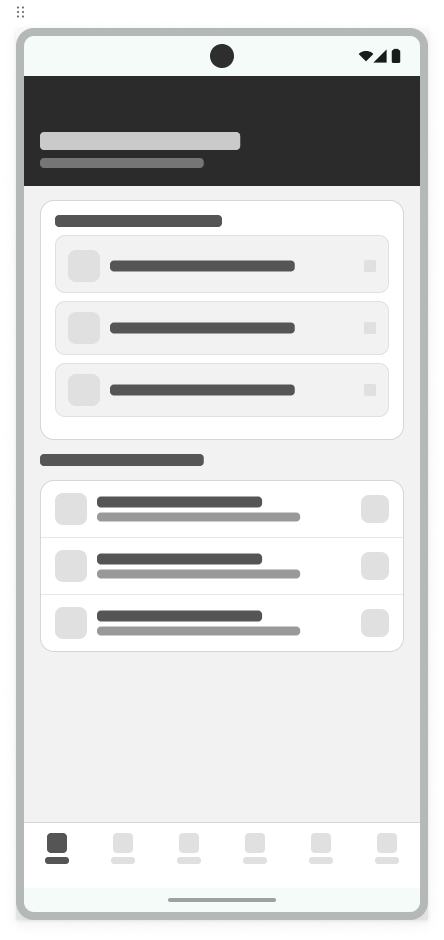

#### Perfil

El perfil reúne datos personales, organización, preferencias de idioma y cierre de sesión.

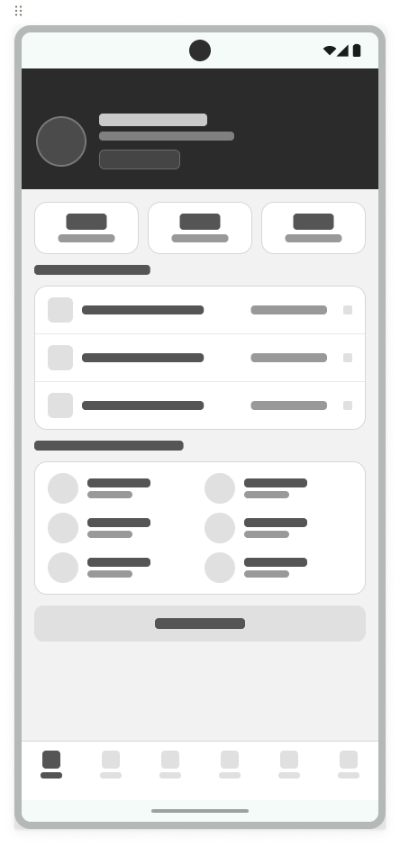

### Criterios transversales de interacción

- La navegación mantiene nombres y posiciones consistentes entre las vistas.
- Los datos sensibles se presentan de acuerdo con el rol y la organización del usuario.
- Toda consulta contempla estados de carga, vacío, error y reintento.
- Las mediciones indican cuándo fueron actualizadas por última vez.
- La aplicación móvil diferencia el contenido sincronizado de las acciones pendientes.
- Las alertas no dependen únicamente del color: incluyen severidad, texto e iconografía.
