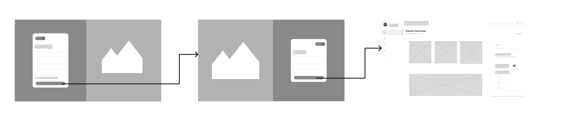
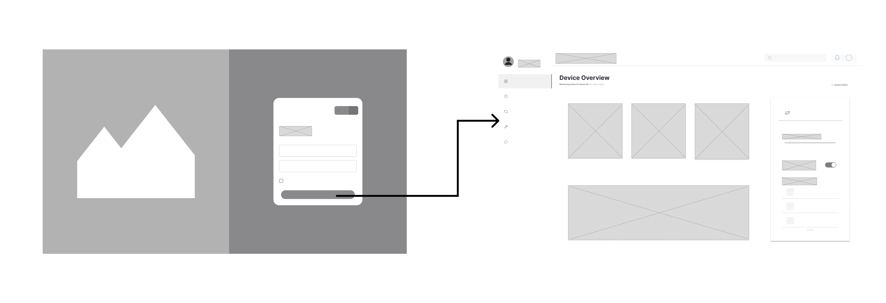
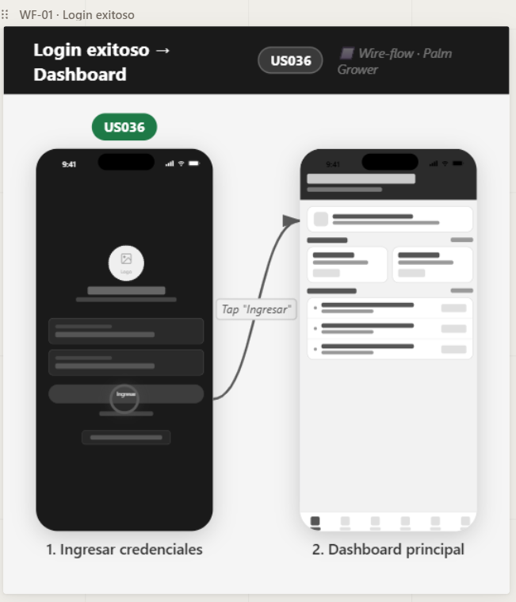
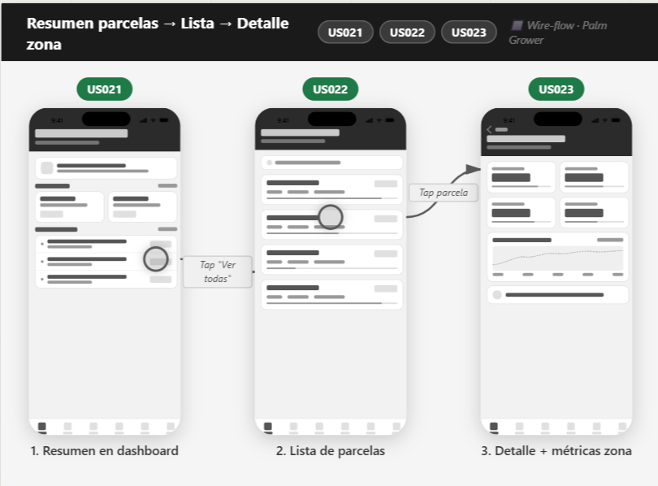
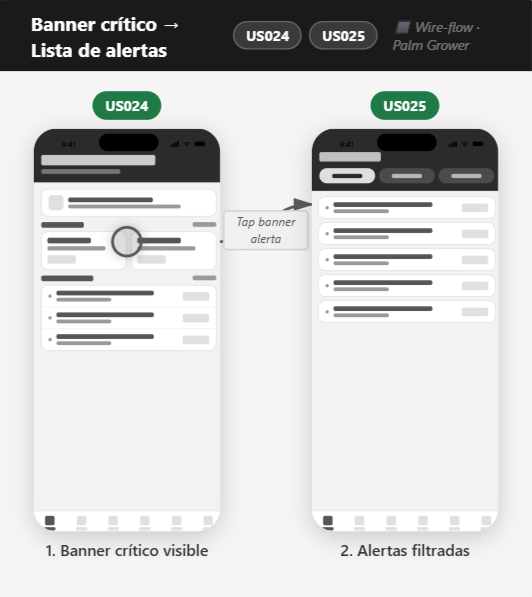
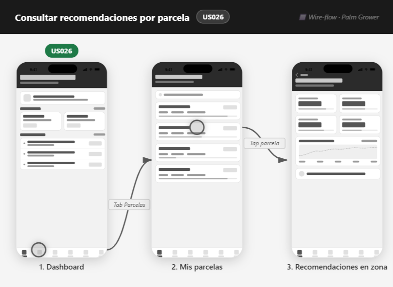

# 6.4. Diseño UX/UI de las aplicaciones

## 6.4.2. Diagramas de wireflow de las aplicaciones

Los wireflows relacionan las pantallas de baja fidelidad con los principales objetivos del usuario. Cada recorrido considera el camino esperado y los estados alternativos que pueden presentarse por validaciones, permisos, ausencia de información o conectividad limitada.

### Wireflows de la aplicación web

#### Crear una cuenta

**Objetivo del usuario:** crear una cuenta para acceder a SmartPalm.

El usuario abre el formulario de registro, ingresa sus datos y confirma la operación. Si existen campos inválidos o una cuenta duplicada, la interfaz conserva los datos válidos y señala qué debe corregirse. Un registro satisfactorio conduce al inicio de sesión.

#### Iniciar sesión

**Objetivo del usuario:** ingresar de forma segura al espacio de trabajo de su organización.

Las credenciales válidas conducen al dashboard correspondiente al rol. Ante credenciales incorrectas se muestra un error recuperable; si la cuenta no tiene permisos para una organización o está inactiva, se evita el acceso y se ofrece el canal de soporte.

#### Programar una inspección de campo

**Objetivo del usuario:** programar una actividad técnica sobre una plantación.

Desde la gestión de campo, el agrónomo selecciona la plantación, define fecha y responsable, revisa la información y confirma. Los conflictos de horario, campos incompletos o falta de permisos devuelven al formulario con una explicación y sin perder la información ingresada.

#### Consultar reportes e historial

**Objetivo del usuario:** revisar la evolución de una plantación y sus actividades.

El usuario selecciona una plantación y aplica filtros de fecha o categoría. Si existen resultados, puede examinar el detalle y generar un reporte; si no existen, se muestra un estado vacío con opciones para modificar los filtros.

#### Actualizar preferencias

**Objetivo del usuario:** configurar idioma, notificaciones y datos de perfil.

La aplicación valida los cambios antes de guardarlos. Si el servicio no está disponible, conserva la edición localmente durante la sesión y permite reintentar. Las opciones administrativas solo aparecen para roles autorizados.

#### Solicitar soporte

**Objetivo del usuario:** resolver una duda o reportar una incidencia.

El usuario consulta las preguntas frecuentes o completa una solicitud. El formulario valida la categoría, descripción y evidencia; al enviarse correctamente presenta un identificador de seguimiento, y ante un error permite reintentar.

### Wireflows de la aplicación móvil

#### Iniciar sesión o continuar sin conexión

**Objetivo del usuario:** acceder a la información del cultivo desde el campo.

Con conexión, el usuario inicia sesión y sincroniza sus datos. Sin conexión, puede consultar la última información almacenada en el dispositivo si previamente autenticó su cuenta; la interfaz indica la antigüedad de esos datos.

#### Revisar el detalle de una plantación

**Objetivo del usuario:** conocer el estado actual de una plantación.

Desde el dashboard se selecciona una plantación para revisar sus indicadores, zonas y tendencias. Si alguna medición aún no fue procesada, se muestra el último valor disponible y su fecha, sin presentarlo como información en tiempo real.

#### Atender una alerta

**Objetivo del usuario:** comprender una condición de riesgo y decidir qué acción tomar.

El usuario filtra las alertas, abre el detalle y revisa severidad, ubicación, evidencia y recomendación asociada. Cuando el detalle no está disponible, puede actualizar la información o conservar la alerta para revisarla después.

#### Revisar recomendaciones

**Objetivo del usuario:** consultar acciones agronómicas propuestas para su cultivo.

El usuario accede a una recomendación desde el dashboard, la plantación o una alerta. Puede revisar su fundamento y estado; cuando está sin conexión, la aplicación presenta la última versión sincronizada y evita confirmar acciones que requieran validación en línea.

### Cobertura de objetivos y servicios

| Objetivo del usuario | Vista principal | Contextos delimitados de soporte |
|---|---|---|
| Crear una cuenta e iniciar sesión | Web y móvil | Gestión de suscripciones y usuarios |
| Monitorear una plantación | Web y móvil | Panel de monitoreo de cultivos, procesamiento de datos de sensores |
| Revisar dispositivos y mediciones | Web y móvil | Gestión de dispositivos IoT, procesamiento de datos de sensores |
| Atender una alerta | Web y móvil | Alertas y notificaciones, panel de monitoreo de cultivos |
| Revisar o publicar una recomendación | Web y móvil | Recomendaciones agronómicas, alertas y notificaciones |
| Programar una inspección | Web | Gestión técnica de campo |
| Generar un reporte | Web y móvil | Panel de monitoreo de cultivos, gestión técnica de campo |
