# 6.4. Diseño UX/UI de las aplicaciones

## 6.4.3. Mock-ups de las aplicaciones

Los mock-ups aplican la identidad visual de SmartPalm a la estructura validada en los wireframes. El uso de jerarquía tipográfica, iconografía, contrastes y estados semánticos facilita la lectura de información agronómica tanto en oficina como en campo. El diseño también conserva espacio para indicar la última actualización, la sincronización pendiente y las restricciones por rol.

### Mock-ups de la aplicación web

#### Inicio de sesión

La pantalla concentra la autenticación y recuperación de acceso sin distraer al usuario del objetivo principal.

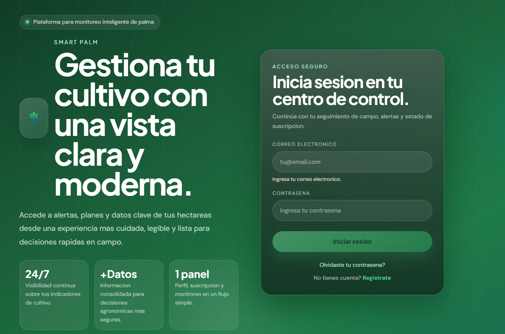

#### Panel principal

El dashboard presenta indicadores resumidos, evolución de variables y alertas recientes para priorizar la atención del agrónomo.

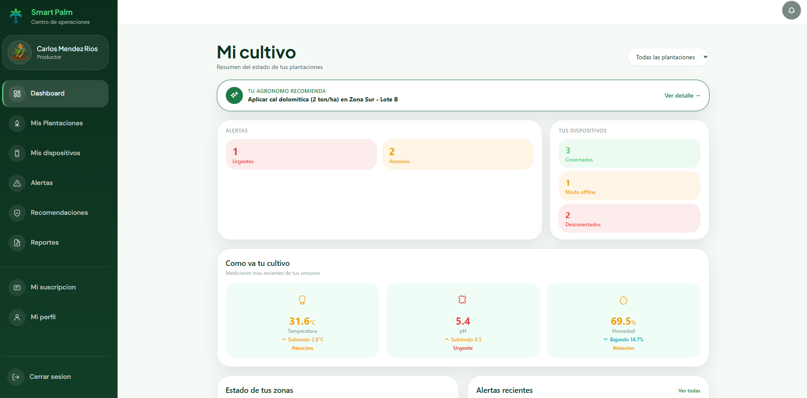

#### Cartera de plantaciones

La cartera permite comparar plantaciones, reconocer su estado y acceder a sus detalles sin mezclar información entre organizaciones.

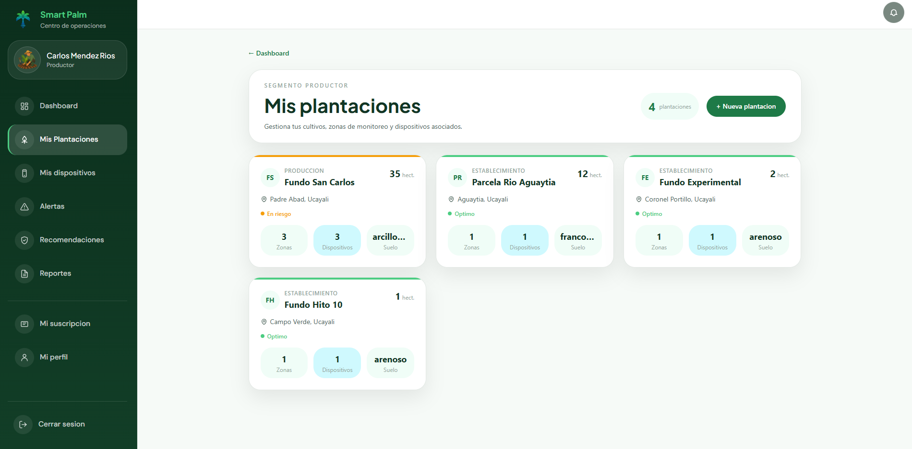

#### Alertas

La vista destaca severidad, estado, fecha y plantación afectada. Los filtros ayudan a concentrarse en incidencias pendientes o críticas.

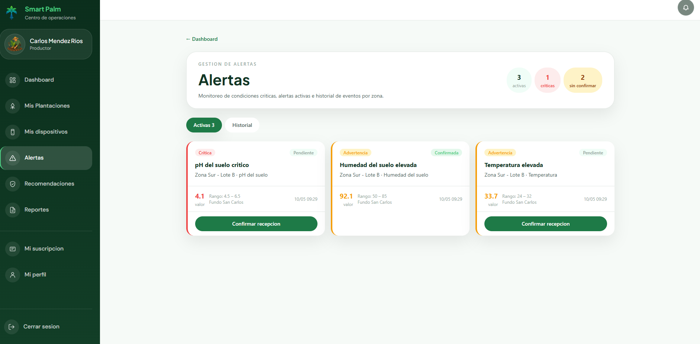

#### Dispositivos

El inventario de dispositivos resume conectividad, batería y última lectura para facilitar el mantenimiento del sistema IoT.

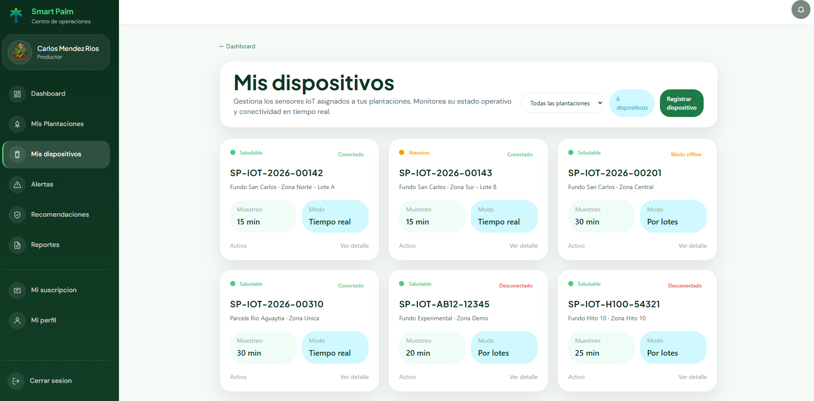

#### Recomendaciones

Las recomendaciones muestran su relación con una plantación o alerta, su fundamento agronómico y el estado de revisión o publicación.

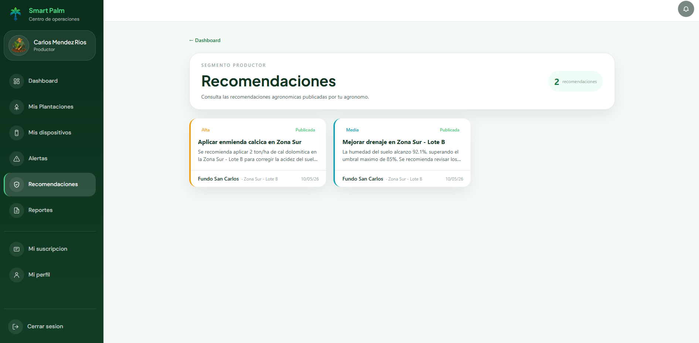

#### Reportes

El módulo de reportes combina filtros, indicadores y resultados exportables para apoyar decisiones y seguimiento histórico.

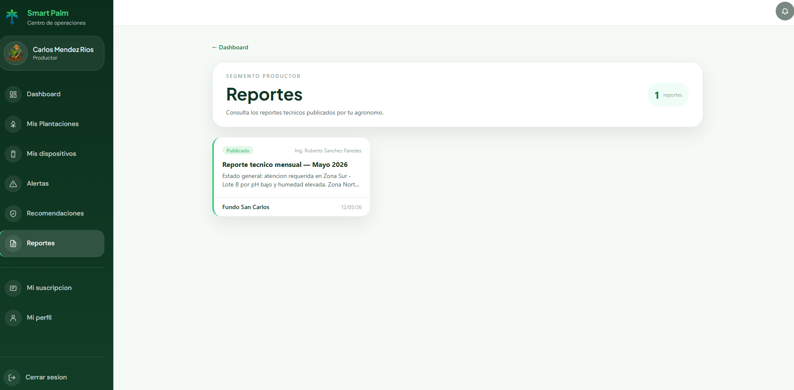

#### Suscripción

La suscripción presenta el plan activo, sus condiciones y las acciones disponibles para mantener la continuidad del servicio.

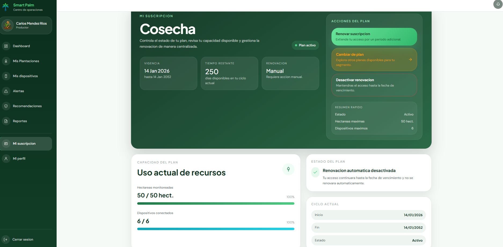

### Mock-ups de la aplicación móvil

#### Inicio de sesión

El acceso móvil permite autenticarse o continuar con información previamente sincronizada cuando la conexión no está disponible.

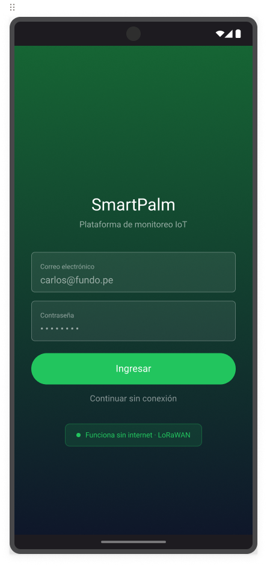

#### Panel principal

La pantalla inicial prioriza estado del cultivo, alertas y accesos frecuentes en un formato adecuado para consultas rápidas.

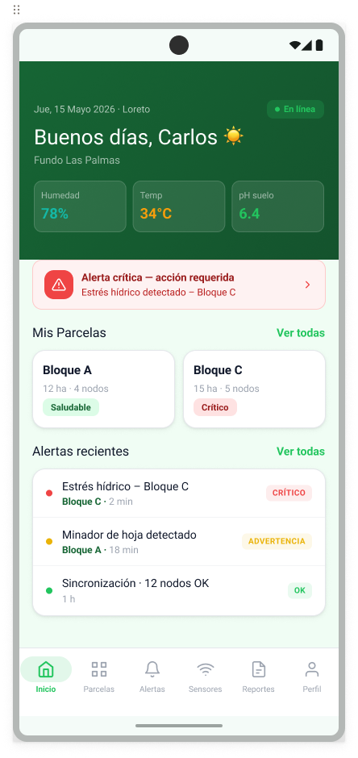

#### Plantaciones

El listado identifica cada plantación y resume su condición antes de abrir información detallada.

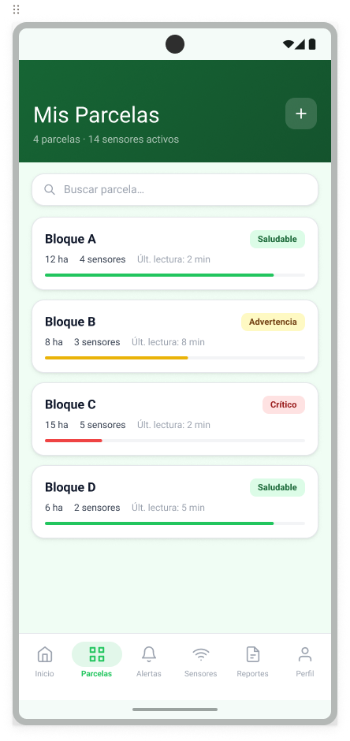

#### Detalle de la plantación

El detalle ordena indicadores, zonas y tendencias, e informa la fecha de actualización de las mediciones.

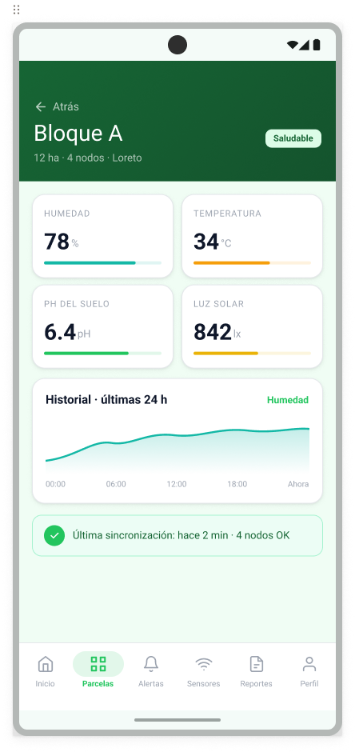

#### Alertas

Las alertas se presentan con prioridad visual, texto descriptivo y acceso directo a su contexto y recomendación.

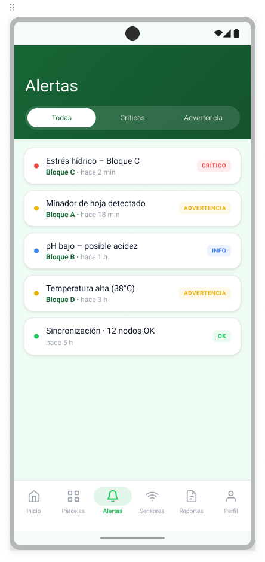

#### Sensores

La vista de sensores permite identificar dispositivos desconectados o con batería baja y consultar su última lectura.

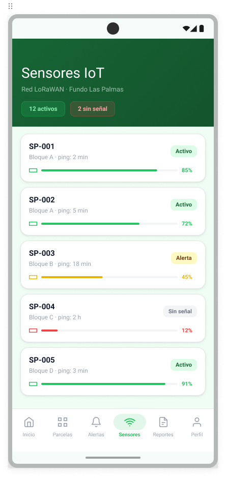

#### Reportes

Los reportes móviles resumen el periodo seleccionado y permiten revisar resultados sin sobrecargar la pantalla.

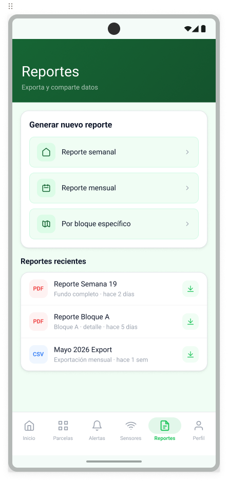

#### Perfil

El perfil reúne identidad, organización, idioma y controles de sesión.

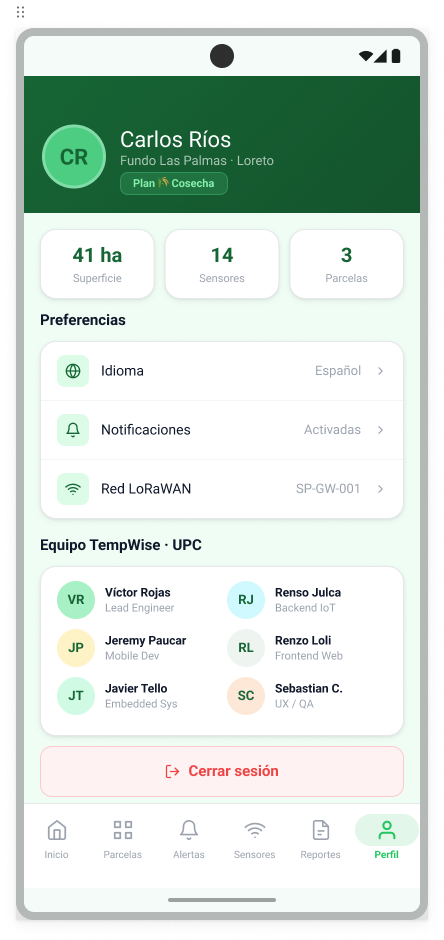

Los mock-ups editables y sus variantes se encuentran en el [archivo de diseño de SmartPalm en Figma](https://www.figma.com/design/bFDv7p60jPElSFuoSRZF1H/WebApp?node-id=0-1&p=f).
