# 6.4. Diseño UX/UI de las aplicaciones

## 6.4.4. Diagramas de flujo de usuario de las aplicaciones

Los siguientes diagramas completan los recorridos principales de SmartPalm. Cada flujo se vincula con las pantallas de alta fidelidad e incluye el camino satisfactorio y las respuestas ante credenciales inválidas, permisos insuficientes, falta de datos, errores de servicio o trabajo sin conexión.

### Flujos de usuario de la aplicación web

#### Autenticarse y acceder al panel principal

**Objetivo del usuario:** acceder de forma segura a la información permitida por su rol y organización.

| Inicio de sesión | Panel principal |
|---|---|
|  |  |

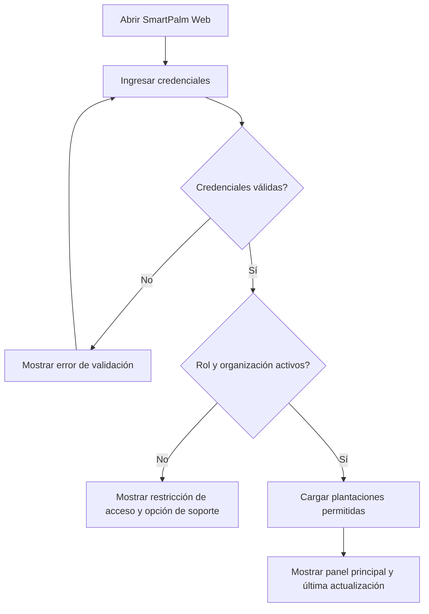

El recorrido esperado termina en el panel principal. Las credenciales inválidas devuelven al formulario, mientras que una cuenta inactiva o una asignación incorrecta de organización impide el acceso sin exponer datos ajenos.

#### Monitorear y priorizar una plantación

**Objetivo del usuario:** identificar la plantación que requiere atención y revisar su condición.

| Panel principal | Cartera de plantaciones | Alertas |
|---|---|---|
|  |  |  |

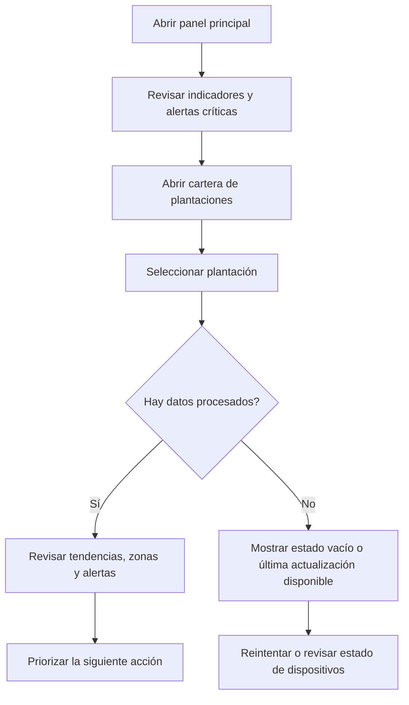

El usuario puede distinguir la información actual del último valor procesado. La ausencia de información no se presenta como un valor cero; en su lugar, la interfaz ofrece revisar el estado del dispositivo o volver a intentar la consulta.

#### Resolver una alerta mediante una recomendación

**Objetivo del usuario:** analizar una condición de riesgo y convertirla en una acción agronómica.

| Alertas | Recomendaciones |
|---|---|
|  |  |

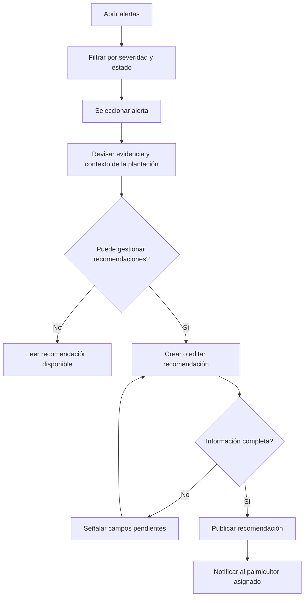

El agrónomo puede crear y publicar una recomendación cuando está autorizado. Los demás roles mantienen acceso de solo lectura y conservan la misma evidencia y contexto.

#### Registrar una inspección y generar un reporte

**Objetivo del usuario:** registrar el trabajo de campo e incorporar sus resultados al historial de la plantación.

| Cartera de plantaciones | Reportes |
|---|---|
|  |  |

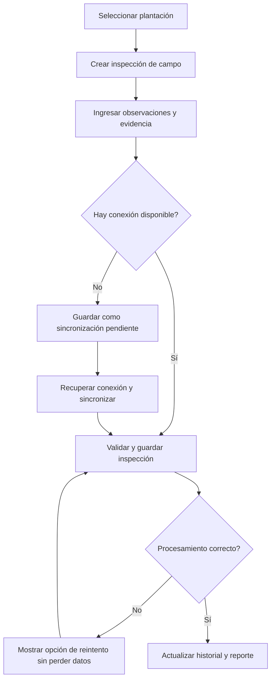

El flujo protege la información capturada cuando se interrumpe la conectividad e identifica claramente la inspección como pendiente hasta que el servicio de gestión técnica de campo la confirme.

#### Activar una suscripción y registrar un dispositivo

**Objetivo del usuario:** habilitar el servicio y asociar un dispositivo IoT con la plantación correcta.

| Suscripción | Dispositivos |
|---|---|
|  |  |

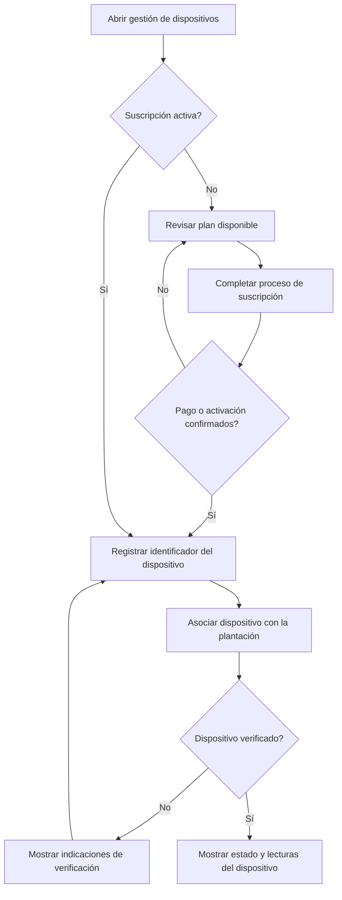

Este recorrido evita asociar dispositivos con cuentas inactivas y confirma tanto la organización como la plantación antes de presentar la telemetría.

### Flujos de usuario de la aplicación móvil

#### Iniciar sesión o continuar sin conexión

**Objetivo del usuario:** ingresar a la aplicación desde el campo con o sin conectividad.

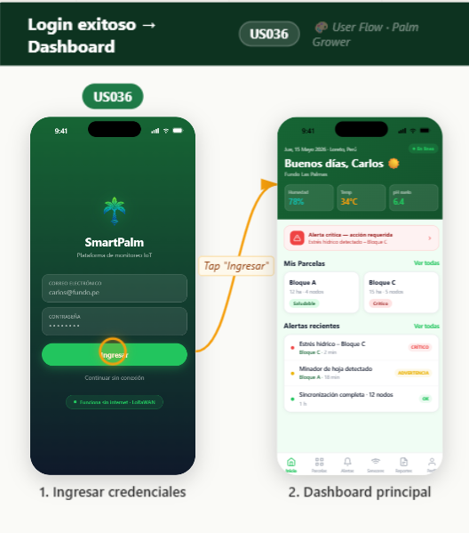

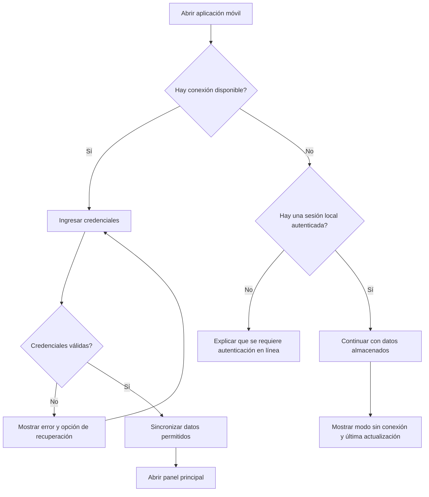

El acceso sin conexión solo está disponible para una sesión autenticada previamente y nunca amplía los permisos que el usuario ya tiene asignados.

#### Revisar el detalle de una plantación

**Objetivo del usuario:** consultar la condición y las tendencias de una plantación seleccionada.

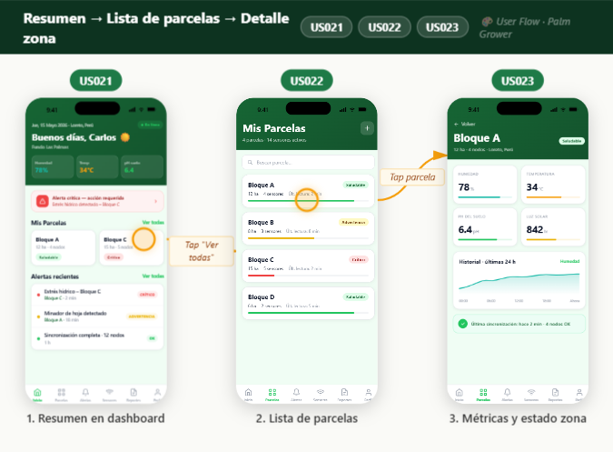

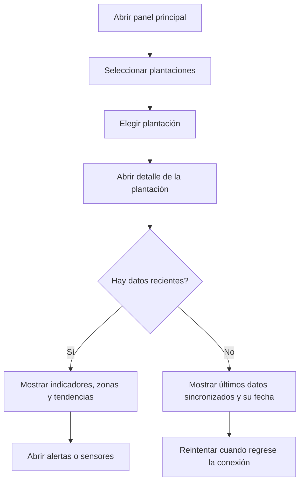

La interfaz hace explícita la vigencia de los datos para que el palmicultor no confunda la información almacenada con una lectura en tiempo real.

#### Atender una alerta y revisar su recomendación

**Objetivo del usuario:** comprender una advertencia y seguir la acción agronómica propuesta.

| Alertas | Detalle de la plantación |
|---|---|
|  |  |

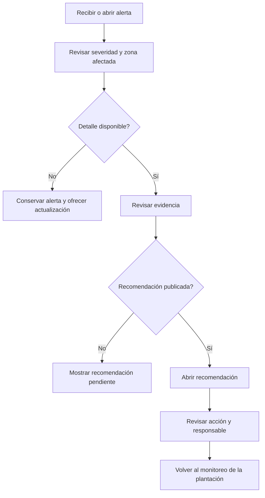

La alerta permanece disponible cuando su detalle o recomendación todavía se está procesando, reflejando la comunicación asíncrona entre los servicios.

#### Revisar sensores y sincronizar acciones pendientes

**Objetivo del usuario:** verificar el estado de los dispositivos y conservar las acciones de campo cuando la red es inestable.

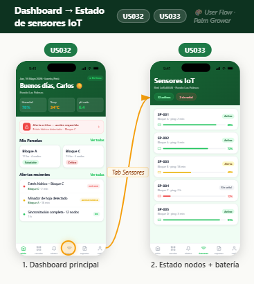

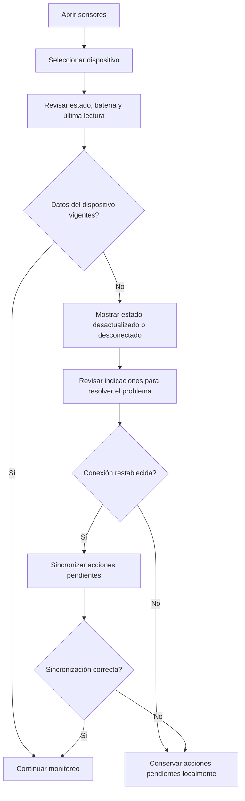

Las acciones pendientes permanecen visibles hasta que la sincronización finaliza correctamente, evitando que el usuario asuma que una operación ya llegó al backend.

### Cobertura de los flujos de usuario

| Perfil de usuario | Objetivos principales representados | Contextos delimitados relacionados |
|---|---|---|
| Agrónomo | Monitorear plantaciones, resolver alertas, publicar recomendaciones, registrar inspecciones y generar reportes | Panel de monitoreo de cultivos, alertas y notificaciones, recomendaciones agronómicas, gestión técnica de campo |
| Palmicultor | Consultar el estado del cultivo, revisar alertas y recomendaciones, verificar sensores y trabajar sin conexión | Procesamiento de datos de sensores, panel de monitoreo de cultivos, alertas y notificaciones, gestión de dispositivos IoT |
| Administrador de la organización | Gestionar acceso, suscripción y asociación de dispositivos | Gestión de suscripciones y usuarios, gestión de dispositivos IoT |
