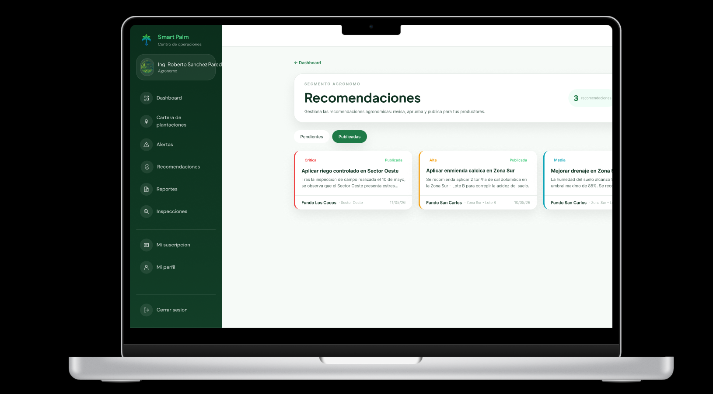
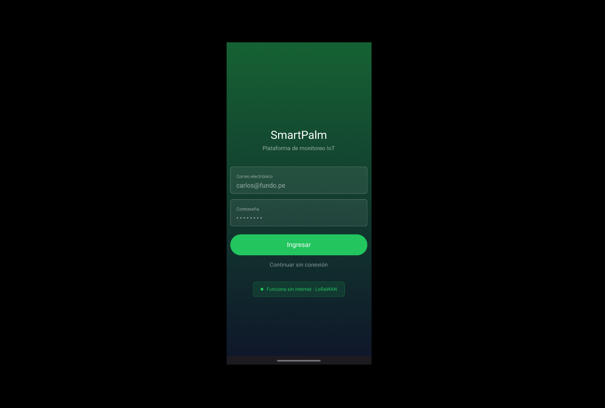

# 6.5. Prototipado de las aplicaciones

Los prototipos de SmartPalm conectan los mock-ups mediante la navegación y las interacciones definidas en la arquitectura de información, los wireflows y los flujos de usuario. Proporcionan una representación comprobable de las aplicaciones web y móvil antes de su implementación y permiten validar el orden de las tareas, las transiciones entre pantallas y los estados de respuesta.

La fuente editable se encuentra en el [archivo de diseño de SmartPalm en Figma](https://www.figma.com/design/bFDv7p60jPElSFuoSRZF1H/WebApp?node-id=0-1&p=f).

## Prototipo de la aplicación web

El prototipo web representa el espacio de trabajo del agrónomo. Comprende el acceso, la navegación por el panel principal, la cartera de plantaciones, las alertas, las recomendaciones, los reportes, los dispositivos y la gestión de la suscripción. La navegación conserva la organización seleccionada y los permisos del usuario como contexto de cada tarea.

[Abrir el prototipo interactivo de la aplicación web](https://www.figma.com/proto/bFDv7p60jPElSFuoSRZF1H/WebApp?node-id=2072-1742&p=f&t=c8TbbdnJ2ZNXnFD4-1&scaling=scale-down&content-scaling=fixed&page-id=0%3A1&starting-point-node-id=2072%3A75)

El prototipo permite validar las siguientes tareas representativas:

- Acceder al panel principal y revisar los indicadores de las plantaciones.
- Recorrer la cartera de plantaciones y abrir su información contextual.
- Revisar alertas y sus recomendaciones agronómicas asociadas.
- Consultar reportes, dispositivos e información de la suscripción.

## Prototipo de la aplicación móvil

El prototipo móvil prioriza el trabajo del palmicultor en el campo. Incluye inicio de sesión, acceso sin conexión, panel principal, plantaciones, alertas, recomendaciones, sensores, reportes y perfil. El diseño indica cuál fue la última información sincronizada cuando la conectividad es limitada.

[Abrir el prototipo interactivo de la aplicación móvil](https://www.figma.com/proto/bFDv7p60jPElSFuoSRZF1H/WebApp?node-id=2130-1315&t=xzRfPwco60kkRz7v-1&scaling=scale-down&content-scaling=fixed&page-id=1%3A2)

El prototipo permite validar las siguientes tareas representativas:

- Iniciar sesión o continuar con información sincronizada previamente.
- Revisar el detalle, las zonas y los indicadores de una plantación.
- Abrir una alerta y consultar la recomendación relacionada.
- Comprobar el estado de los sensores, los reportes y las preferencias del perfil.

## Criterios de validación de los prototipos

- Las etiquetas y opciones de navegación coinciden con la arquitectura de información.
- Cada control interactivo proporciona una respuesta visible después de su activación.
- Las tareas críticas permiten regresar a una pantalla conocida sin reiniciar el recorrido.
- Los estados vacíos, de error, acceso restringido y falta de conexión explican la siguiente acción disponible.
- Las experiencias web y móvil emplean conceptos consistentes y priorizan a sus respectivos usuarios.
- Los datos obtenidos de diferentes microservicios muestran su estado y última actualización cuando corresponde.

## Evidencias en video

Para la entrega actual se grabará un recorrido por cada aplicación. Cada grabación mostrará el prototipo desde su pantalla inicial, completará por lo menos una tarea principal e incluirá un estado alternativo, como un error de validación, datos no disponibles o acceso sin conexión. Las evidencias finales se publicarán en Microsoft Stream y sus enlaces se incorporarán en esta sección.

| Aplicación | Recorrido requerido | Evidencia de la entrega actual |
|---|---|---|
| Aplicación web | Inicio de sesión, panel principal, monitoreo de una plantación, alerta y recomendación | Pendiente de grabación y publicación en Microsoft Stream |
| Aplicación móvil | Inicio de sesión o acceso sin conexión, detalle de una plantación, alerta y estado de sensores | Pendiente de grabación y publicación en Microsoft Stream |
